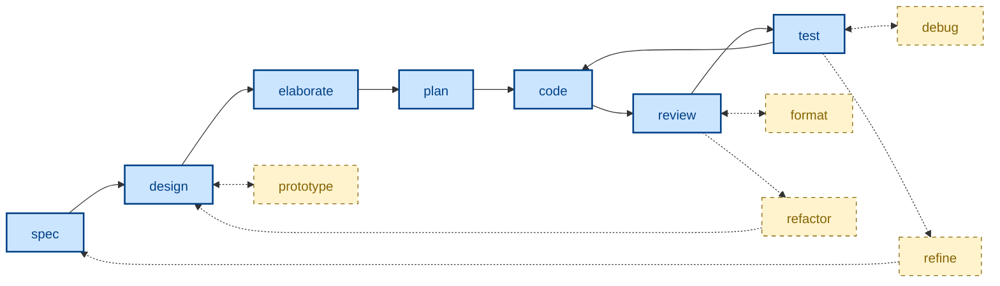
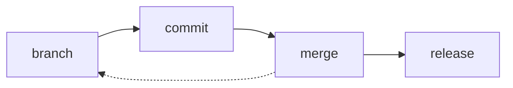

# ✨ Skills [](https://skills.sh/kieranpotts/skills)

**A collection of agentic workflow skills** – also known as rules, instructions, commands, and custom prompts… depending on which agent harness you use.

## 📓 Overview

This repository encapsulates a minimal suite of agent skills to support AI-assisted and agentic software development workflows. The primary goal of this project is to encode development workflow practices and version control conventions into high-quality, reusable prompts that produce consistent, predictable outputs from all mainstream coding agents and models – allowing for easy portability between development environments with different tooling.

The source files conform to the [Agent Skills](https://agentskills.io/) standard, making them compatible with any agent that supports this format – including Claude Code and Pi. The [built-in installer](./run/install) transforms the source files into the proprietary formats used by Copilot (`.github/instructions/*.instructions.md`) and Cursor (`.cursor/rules/*.mdc`). All other mainstream agents are supported via Vercel's [skills.sh installer](https://github.com/vercel-labs/skills). See the installation steps, below, for more details.

These skills focus on universal phases of the software development lifecycle – specifying, designing, planning, branching, coding, committing, testing, reviewing, merging, releasing – plus a small number of cross-cutting skills that support these steps, like issue triage and agent handoff.

Because these skills are common to all software projects, and because they are agnostic of technology stacks or business domains, these skills work best when they are installed at a global level. The skills are intended to be installed in the user's home directory or a workspace root, so they become available to all projects. Of course, per-project installation works perfectly well, too.

These skills are no grab-bag of isolated tasks that the author once did manually. Rather, this is a carefully-curated collection of skills that together compose a coherent end-to-end agentic development workflow. Each skill cross-references others, reflecting how the phases of development feed into one another.

The skills are unashamedly opinionated. Each skill enforces the use of methods and tools that reflect the author's preferred – and somewhat idiosyncratic – ways of working within each lifecycle phase. Examples: Gherkin for acceptance criteria, ADRs for design decisions, trunk-based source control with rare use of `temp/*` and `epic/*` branches, and so on. These choices are documented more extensively in the author's [technical standards](https://github.com/kieranpotts/standards) and [software development playbook](https://github.com/kieranpotts/playbook).

You are encouraged to treat this collection of skills as a baseline, not a readymade framework. Use them to iterate on the design of your own agent skills that encode your particular workflow choices.

## 🧩 Skills

These skills span three categories:

- **Workflow skills**, one for each discrete step in the software development lifecycle.
- **Version control skills**, for managing revisions and versions using Git.
- **Supporting skills** that cut across the workflow and version control processes.

### Workflow skills

The workflow skills cover distinct phases of the software development lifecycle (SDLC). The role of each skill within the SDLC is illustrated by the flow diagram, below. The solid blue boxes, connected by the solid lines, represent the main workflow sequence. The yellow boxes and dotted lines represent feedback loops and iterative cycles.



| Skill name | Description |
| ---------- | ----------- |
| [`spec`](./skills/spec/) | Specify requirements – both functional and performance – as testable acceptance criteria. |
| [`design`](./skills/design/) | Explore architectural design options and their trade-offs. |
| [`prototype`](./skills/prototype/) | Develop throwaway code to answer design questions. |
| [`elaborate`](./skills/elaborate/) | Validate and refine a proposed solution by interrogating its design. |
| [`plan`](./skills/plan/) | Decompose delivery into small, incremental, stable revisions. |
| [`code`](./skills/code/) | Write code, verified by tests, for one discrete increment. |
| [`review`](./skills/review/) | Audit code for style conventions and pattern consistency. Focuses on static qualities. |
| [`format`](./skills/format/) | Improve the presentation of code – whitespace, style, ordering – without changing its structure. |
| [`refactor`](./skills/refactor/) | Iterate the design of logic and data structures via direct code changes, maintaining stability through system testing. |
| [`test`](./skills/test/) | Conduct incremental acceptance testing of the evolving solution. Focuses on functionality and dynamic qualities. |
| [`debug`](./skills/debug/) | Diagnose and fix unexpected behaviors or performance issues observed during acceptance testing. |
| [`refine`](./skills/refine/) | Revise the requirements specification in response to feedback from acceptance testing. |

### Version control skills

The version control skills describe how revisions are committed to source control, and how stable, versioned releases are cut.



| Skill name | Description |
| ---------- | ----------- |
| [`branch`](./skills/branch/) | Git branching strategy. |
| [`commit`](./skills/commit/) | Commit message conventions. |
| [`merge`](./skills/merge/) | Consolidate divergence between branches. |
| [`release`](./skills/release/) | Release trunks and branches. Version tags. |

### Supporting skills

The remaining skills cut across the workflow and version control processes.

| Skill name | Description |
| ---------- | ----------- |
| [`triage`](./skills/triage/) | Move issues through a category × state machine. |
| [`handoff`](./skills/handoff/) | Compact a conversation for the next session to pick up. |
| [`create-skill`](./skills/create-skill/) | A skill to create new skills. |

## 📦 Installation

There are two ways to install these skills:

- Use Vercel's [skills.sh CLI](https://www.skills.sh/) – RECOMMENDED.
- Use this repository's own custom installer script.

### skills.sh CLI

Change to the root directory of the project in which you want to install these skills. Then use Vercel's [skills CLI](https://www.skills.sh/), which fetches the skills directly from GitHub and installs them in the paths supported by your target agents, relative to the current working directory.

Examples:

```sh
# Use interactive picker to choose which skills to install.
npx skills add kieranpotts/skills

# Install all skills from this repository.
npx skills add kieranpotts/skills --all

# Install one specific skill.
npx skills add kieranpotts/skills --skill commit

# Target a specific agent.
npx skills add kieranpotts/skills -a claude-code

# Preview available skills without installing.
npx skills add kieranpotts/skills --list
```

The CLI's `add` command installs the skills files into the local project, into paths that are detected by your target agents. Re-run the command periodically to pick up upstream changes.

Every mainstream agent is supported – [see the list here](https://www.skills.sh/agent).

Whenever you install skills using this CLI, anonymous telemetry data will be collected that will feed into the leaderboards on the [skills.sh website](https://www.skills.sh/), helping others to discover popular skills.

### Custom installer

Alternatively, you can run this repository's own [`./run/install`](./run/install) script. This supports fewer agents, but it allows installation at the user/global level, as an alternative to per-project installation. This is the intended use case for these skills, which are designed to enforce consistent development workflows across multiple, diverse software projects.

To run the custom installer, clone this repository to your computer, then execute `./run/install` from the repository's root directory, with parameters as described below.

```sh
# Claude only, installed at the user-level.
./run/install --claude

# Pi only, installed at the user-level.
./run/install --pi

# All four agents installed at the user-level.
./run/install --all

# Claude and Cursor, installed into cwd.
./run/install --claude --cursor --dir .

# All four agents, into a project in another directory.
./run/install --all --dir ~/dev/my-project

# All four agents, installed as user-level symlinks.
./run/install --all --symlinks

# Remove Claude's user-level install.
./run/install --uninstall --claude

# Remove Pi's install from a particular project.
./run/install --uninstall --pi --dir ~/dev/my-project
```

At least one agent flag is required: `--claude`, `--pi`, `--copilot`, and/or `--cursor`. Alternatively, use `--all` to install the skills in formats suported by all four agents.

By default, the installer will place the skills files in a subdirectory of your home directory. For example, the Copilot skills will be installed at `$HOME/.github/instructions/<skill-name>.instructions.md`.

Not all agents auto-detect skills installed in the user's home directory. As of May 2026, Claude Code and Pi do, but Copilot and Cursor do not. However, you can configure most agents to detect skills at specific paths. So, if you install the skills globally, you should review your agents' configurations to ensure the skills are discoverable by them.

To install the skills on a per-project basis, supply the path to the root of the target project via the `--dir` parameter.

By default, the source files are transpiled to artifacts understood by each target agent, and it is those built artifacts that are copied into the target installation directories. The installed skills are thereby decoupled from the source skills in this repository, so you are free to modify the install skills, and to commit them to your own projects – make them your own!

> [!NOTE]
> When installed via the custom installer, every skill is generated with Cursor's `alwaysApply` set to `true` and Copilot's `applyTo` set to `"**"` – which means all the skills will always be in scope in those agents. You may need to tune the targeting per-project, which you can do by modifying the installed skills files.
>
> Skills installed via the skills.sh CLI follow that tool's own defaults.

If you pass the `--symlinks` parameter, instead of installing hard copies of the skills files, symlinks will be put in your projects that references the built artifacts in this repository. This is useful when developing and evaluating these skills, because it means changes made to the skills in this repository will be immediately detected by new agent sessions – no new install step is required.

You will probably want to configure Git to ignore any symlinked skills in your projects.

You can also use the `--uninstall` flag, in combination with the other targeting flags, to remove particular skills installed at particular locations. For example, the parameters `--claude --copilot --dir ~/dev/project` will remove the skills files installed in your home directory for Claude, and the skill files installed in one project for Copilot.

The `--uninstall` options will delete only those skills that were installed by the `./run/install` script in the first place. Skills installed by other tools – including the skills.sh CLI – will be left alone.

Use `./run/install --help` for more guidance.

## 🛠️ Developer documentation

For contributors and maintainers, see the [developer docs](./docs/).

-----

Copyright © 2026-present Kieran Potts, [MIT license](./LICENSE.txt)
