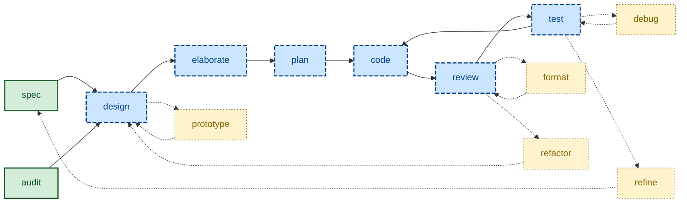

# ✨ Skills [](https://skills.sh/kieranpotts/skills)

**A collection of agentic workflow skills** – also known as rules, instructions, commands, or custom prompts, depending on your agent!

**🚧 Under construction.**

## 📓 Overview

These skills cover universal phases of the software development lifecycle – specifying, designing, planning, branching, coding, committing, reviewing, testing, merging, releasing – plus supporting activities like customer discovery and issue triage, and agent-optimization techniques like session reflection and handoff. The goal: consistent, predictable outputs from any mainstream coding agent and model, regardless of technology stack or business domain.

This is not a grab-bag of isolated tasks. These skills form a coherent end-to-end workflow that encodes the author's [software development playbook](https://github.com/kieranpotts/playbook) and high-level [technical standards](https://github.com/kieranpotts/standards). The conventions are unashamedly opinionated: Gherkin acceptance criteria, ADRs for design decisions, trunk-based source control with `dev` as the default branch, sparing use of `temp/*` and `epic/*` branches… and so on.

Treat this collection as a baseline from which you can iterate your own agent skills that encode _your_ chosen methods and tools.

The source files conform to the [Agent Skills](https://agentskills.io/) standard – natively compatible with Claude Code, Pi, and other agents. The [built-in installer](./run/install) transpiles the source to Copilot instructions (`.github/instructions/*.instructions.md`) and Cursor rules (`.cursor/rules/*.mdc`). All other mainstream agents are supported via Vercel's [skills.sh installer](https://github.com/vercel-labs/skills).

A user-level install is RECOMMENDED, but per-project installs work just as well. See the installation steps, below, for details.

## 🧩 Skills

These skills span three categories:

- **Workflow skills**, one for each discrete step in the software development lifecycle.
- **Version control skills**, for managing revisions and triggering releases via Git.
- **Supporting skills** that cut across the workflow and version control processes.

### Workflow skills

The workflow skills cover distinct phases of the software development lifecycle (SDLC). The diagram below models the workflow enabled by these skills. It shows the user-initiated entry points (solid green), the main workflow sequence (dashed blue), and optional iterative loops (dotted yellow).



| Skill name | Description |
| ---------- | ----------- |
| [`spec`](./skills/spec/) | Specify functional and performance requirements as testable acceptance criteria. |
| [`audit`](./skills/audit/) | Proactively survey a codebase for potential design improvements. |
| [`design`](./skills/design/) | Explore architectural options and their trade-offs. Update design docs. |
| [`prototype`](./skills/prototype/) | Develop throwaway code to answer design questions. |
| [`elaborate`](./skills/elaborate/) | Validate and refine a proposed solution by interrogating its design. |
| [`plan`](./skills/plan/) | Decompose delivery into stable increments – supporting continuous integration. |
| [`code`](./skills/code/) | Write code, verified by tests, for one discrete increment. |
| [`review`](./skills/review/) | Evaluate code for style conventions and pattern consistency. Focus on static qualities. |
| [`format`](./skills/format/) | Improve code presentation – whitespace, style, ordering – without changing structure. |
| [`refactor`](./skills/refactor/) | Iterate the design – logic and data structures – via experiments directly in code. Maintain stability through system testing. Update design docs. |
| [`test`](./skills/test/) | Conduct incremental acceptance testing of the evolving solution. Focus on functional correctness and dynamic performance qualities. |
| [`debug`](./skills/debug/) | Diagnose and fix unexpected behaviors and performance issues observed during acceptance testing. |
| [`refine`](./skills/refine/) | Revise the requirements specification in response to feedback from continuous acceptance testing. |

### Version control skills

The version control skills describe how revisions are committed to source control, and how stable points in the revision history are prepared for release.

| Skill name | Description |
| ---------- | ----------- |
| [`branch`](./skills/branch/) | Git branching strategy. |
| [`commit`](./skills/commit/) | Commit message conventions. |
| [`merge`](./skills/merge/) | Consolidate divergence between branches. |
| [`release`](./skills/release/) | Release trunks and branches. Version tags. |

### Supporting skills

The remaining skills cut across the workflow and version control processes.

| Skill name | Description |
| ---------- | ----------- |
| [`triage`](./skills/triage/) | Move issues through a category × state machine. |
| [`handoff`](./skills/handoff/) | Compact a conversation for the next session to pick up. |
| [`reflect`](./skills/reflect/) | Distil durable lessons from the session into memory and convention files. Companion to `handoff`. |
| [`discover`](./skills/discover/) | Run a discovery session with the customer to elicit business requirements. |
| [`create-skill`](./skills/create-skill/) | Author a new skill in a downstream project that has installed this collection. (For new skills in *this* repo, use [`docs/creating-skills.md`](./docs/creating-skills.md) instead.) |

## 📦 Installation

To use these skills, you need to install them in a format and location supported by your target agents. There are two ways to do this:

- Use Vercel's [skills.sh CLI](https://github.com/vercel-labs/skills).
- Use the [custom installer script](./run/install) included in this repository.

### skills.sh CLI

Change to the root directory of the project in which you want to install these skills. Then use Vercel's [skills CLI](https://www.skills.sh/), which fetches the skills directly from GitHub and installs them in the paths supported by your target agents, relative to the current working directory.

```sh
# Use an interactive picker to choose which skills to install.
npx skills add kieranpotts/skills

# Install all skills from this repository.
npx skills add kieranpotts/skills --all

# Install one specific skill.
npx skills add kieranpotts/skills --skill commit

# Target a specific agent.
npx skills add kieranpotts/skills -a claude-code

# Preview available skills without installing them.
npx skills add kieranpotts/skills --list
```

Re-run the `skills add` command periodically to pick up upstream changes.

Every mainstream agent harness is supported – [see the list here](https://www.skills.sh/agent).

Whenever you install skills using this CLI, anonymous telemetry data will be collected that will feed into the leaderboards on the [skills.sh website](https://www.skills.sh/), helping others to discover popular skills.

### Custom installer

The custom [`./run/install`](./run/install) script supports fewer agents than skills.sh, but it can install at the user level. Clone this repository, then execute `./run/install` from its root.

```sh
# Claude only, installed at the user-level.
./run/install --claude

# Pi only, installed at the user-level.
./run/install --pi

# All four agents installed at the user-level.
./run/install --all

# Claude and Cursor, installed into cwd.
./run/install --claude --cursor --dir .

# All four agents, into a project in another directory.
./run/install --all --dir ~/dev/my-project

# All four agents, installed as user-level symlinks.
./run/install --all --symlinks

# Remove Claude's user-level install.
./run/install --uninstall --claude

# Remove Pi's install from a particular project.
./run/install --uninstall --pi --dir ~/dev/my-project
```

At least one agent flag is required: `--claude`, `--pi`, `--copilot`, and/or `--cursor`. Alternatively, use `--all` to install the skills in formats supported by all four agents.

By default, the installer will place the skills in a subdirectory of your home directory. For example, the Copilot skills will be installed at `$HOME/.github/instructions/<skill-name>.instructions.md`. Pass the `--dir` parameter to install into a specific project instead. For example, `--dir ~/dev/my-project` will install the Copilot skills at `$HOME/dev/my-project/.github/instructions/<skill-name>.instructions.md`.

Not all agents auto-detect skills installed in the user's home directory. As of May 2026, Claude Code and Pi do, but Copilot and Cursor do not. However, you can configure most agents to detect skills at specific paths. So, if you install the skills globally, you should review your agents' configurations to ensure the skills are discoverable by them.

By default, the source files are transpiled to artifacts understood by each target agent, and it is those built artifacts that are copied into the target installation directories. The installed skills are thereby decoupled from the source skills in this repository, so you are free to modify the installed skills, and to commit them to your own projects – make them your own!

> [!NOTE]
> When installed via the custom installer, every skill is generated with Cursor's `alwaysApply` set to `true` and Copilot's `applyTo` set to `"**"` – which means all the skills will always be in scope in those agents. You may need to tune the targeting per-project, which you can do by modifying the installed skills.

If you pass the `--symlinks` parameter, instead of installing hard copies of the skills, symlinks will be put in your target locations. These symlinks will reference the built artifacts in this repository. This is a useful "dev mode" when iterating and evaluating these skills. Changes made to the skills in this repository will be immediately detected by new agent sessions, providing fast feedback. Symlinked files don't port well between environments via version control, so you should configure Git to ignore any symlinked skills you put inside your local code repositories.

You can also use the `--uninstall` flag, in combination with the other targeting flags, to remove particular skills installed at particular locations. For example, the parameters `--claude --copilot --dir ~/dev/project` will remove the skills for Claude and Copilot from a particular project. The `--uninstall` option will delete only those skills that were installed by the `./run/install` script in the first place. Skills installed by other tools – including the skills.sh CLI – will be unharmed.

Use `./run/install --help` for more guidance.

## 🛠️ Developer documentation

For contributors and maintainers, see the [developer docs](./docs/).

-----

Copyright © 2026-present Kieran Potts, [MIT license](./LICENSE.txt)
