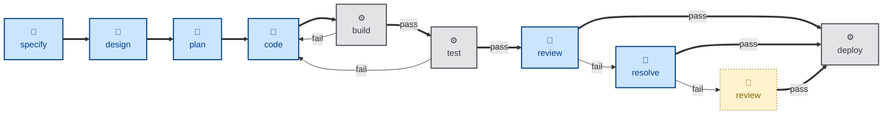
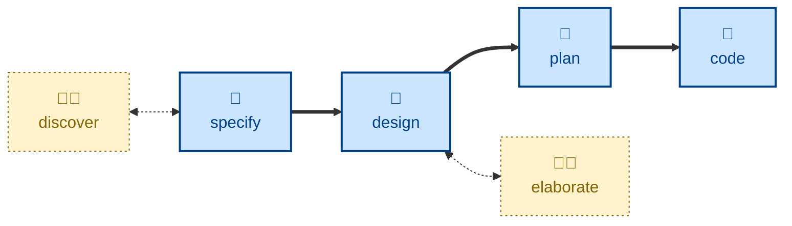

# ✨Skills [](https://skills.sh/kieranpotts/skills)

**🚧 UNDER CONSTRUCTION 🚧**

**A collection of agentic workflow skills** — also known as rules or
instructions — covering universal phases of the software development lifecycle
(specifying, designing, planning, branching, coding, committing…), plus
supporting activities like business discovery, issue triage, and session
reflection.

This is no grab-bag of random skills. It's a cohesive collection, designed to be
composable into all sorts of agentic workflows, and intended to be installed
globally for reuse across multiple code repositories and software projects.

The goal is predictable, consistent outcomes from any mainstream coding model —
regardless of the technology stack or business domain.

The skills in this collection are loosely coupled from one another, to support
their composability. But they can't just be dropped into any software project.
They encode strong opinions and depend on a broader ecosystem of development
tools and methods being in place. Specifically, these skills depend on
version-controlled stores for software requirements, technical decisions,
system designs, and delivery plans. The skills instruct agents to read and write
to these stores, which serve as the external persistence layers between discrete
agentic steps in a workflow. An agent working on an upstream task will write
artifacts to one of these stores, which a downstream agent will read as context
for its own task.

The following repositories are templates for these external dependencies:

- [**📋 Software Requirements Specification (SRS)**](https://github.com/kieranpotts/specs) \
  Captures what the system does, in business terms.

- [**💬 Requests for Comments (RFC)**](https://github.com/kieranpotts/rfc) \
  Records how significant technical decisions were made, and why.

- [**📐 Design Docs**](https://github.com/kieranpotts/design) \
  Documents what the system looks like in production.

- [**🔍 Architecture Audits**](https://github.com/kieranpotts/audits) \
  Logs historical evaluations of the as-built system's structural integrity.

- [**🗺️ Delivery Plans**](https://github.com/kieranpotts/plans) \
  Tracks when, and in what order, the work gets done.

- [**⚠️ Risk Register**](https://github.com/kieranpotts/risks) \
  Records the inherent security and privacy risks the system carries.

Running the whole ecosystem on version control means requirements, decisions,
designs, plans, and code all coexist in the same system. All the artifacts that
are read and written by agents are branched, committed, reviewed, and merged the
same way. Auditability and rollback are built-in for free.

**👉 [Read more about the design principles](./docs/design/)** that underpin
these agent skills.

The source files conform to the [Agent Skills](https://agentskills.io/) standard
— natively compatible with Claude Code, Pi, and other agents. The [built-in
installer](./run/install) transpiles the source files to GitHub Copilot
instructions (`.github/instructions/*.instructions.md`) and Cursor rules
(`.cursor/rules/*.mdc`). All other mainstream agent harnesses are supported via
Vercel's [skills.sh installer](https://github.com/vercel-labs/skills). See the
installation steps, below, for more details.

## 🧩 Skills

The skills in this collection span four categories:

- **Workflow skills** provide instructions for agents running discrete phases of
  the software development lifecycle.

- **Version control skills** for managing revisions and triggering software
  builds and releases via Git.

- **Auxiliary skills** for peripheral tasks like the proofreading of technical
  documentation.

- **Agentic workflow-optimization skills**, like agent handoff and session
  reflection.

Each skill operates in one of two possible modes:

- Most of the skills in this collection instruct the agent to run
  **non-interactively (🤖)**. The agent is instructed to discover all the
  information it needs from its context and the environment. If it cannot
  complete the task without prompting, the agent is instructed instead to stop
  and alert with an error message. These skills are intended to be used in
  away-from-keyboard contexts.

- A small number of skills are necessarily **interactive (🤖🧑)**. The value in
  these skills is in discovery of requirements in collaboration with the user.
  These skills are NOT designed to be used in automated specs-to-code delivery
  pipelines, though they may serve as triggers for such workflows.

### ➡️ Workflow skills

| Skill | Description |Mode|
|-------|-------------|----|
| **[audit](./skills/audit/)** | Evaluate the evolving architecture — modularity, consistency, coupling, etc. | 🤖 |
| **[code](./skills/code/)** | Write code, verified by tests, for one small increment. | 🤖 |
| **[debug](./skills/debug/)** | Diagnose and fix unexpected behaviors and runtime issues. | 🤖 |
| **[design](./skills/design/)** | Explore architectural options and their trade-offs. | 🤖 |
| **[discover](./skills/discover/)** | Run a discovery workshop with the customer to elicit product requirements. |🤖🧑|
| **[elaborate](./skills/elaborate/)** | Refine a proposed solution by interrogating the design docs. |🤖🧑|
| **[fix](./skills/fix/)** | Fix anything generally broken — failing builds, lint, type-checks, etc. | 🤖 |
| **[plan](./skills/plan/)** | Decompose delivery into small, stable increments. | 🤖 |
| **[probe](./skills/probe/)** | Run an interactive threat-modeling session. Record security risks. |🤖🧑|
| **[refactor](./skills/refactor/)** | Iterate the design while maintaining stability through system testing. | 🤖 |
| **[refine](./skills/refine/)** | Produce new business requirements in response to acceptance testing feedback. |🤖🧑|
| **[resolve](./skills/resolve/)** | Action open review comments. Mark them as resolved. | 🤖 |
| **[review](./skills/review/)** | Evaluate code for style conventions and pattern consistency. | 🤖 |
| **[specify](./skills/specify/)** | Specify functional and non-functional requirements as testable acceptance criteria. | 🤖 |
| **[spike](./skills/spike/)** | Develop throwaway code to answer design questions. | 🤖 |
| **[style](./skills/style/)** | Improve code presentation — whitespace, style, ordering — without changing structure. | 🤖 |
| **[test](./skills/test/)** | Check the evolving software for both functional correctness and runtime qualities. | 🤖 |
| **[triage](./skills/triage/)** | Verify that a reported bug or incident is real and reproducible. | 🤖 |
| **[validate](./skills/validate/)** | Ask, "did we build the right thing?" | 🤖 |

### 🔀 Version control skills

<!-- TODO: Add push, merge request, etc. -->

| Skill | Description |Mode|
|-------|-------------|----|
| **[branch](./skills/branch/)** | Git branching strategy. | 🤖 |
| **[commit](./skills/commit/)** | Commit message conventions. | 🤖 |
| **[merge](./skills/merge/)** | Consolidate divergence between branches. | 🤖 |
| **[release](./skills/release/)** | Manage release branches, apply version tags. | 🤖 |

### 📎 Auxiliary skills

| Skill | Description |Mode|
|-------|-------------|----|
| **[research](./skills/research/)** | Gather external sources on a topic and produce a cited research report. | 🤖 |
| **[proof](./skills/proof/)** | Proofread, then conservatively edit, text for spelling, grammar, and consistency. | 🤖 |

### 🤖 Agentic workflow-optimization skills

| Skill | Description |Mode|
|-------|-------------|----|
| **[handoff](./skills/handoff/)** | Compact a conversation for the next session to pick up. | 🤖 |
| **[reflect](./skills/reflect/)** | Distill durable lessons from the session into memory. | 🤖 |
| **[create-skill](./skills/create-skill/)** | Author a new skill, or improve an existing one. |🤖🧑|

## ⌨️ Usage

### 🪟 Context management

It is strongly RECOMMENDED that each skill be invoked in a fresh context window,
for two reasons:

- **Contamination.** Skills like **review**, **audit**, and **validate** are
  meant to interrogate work already done. If the agent still holds the
  conversation that produced that prior art, its behavior will be influenced
  by that background context. It will carry its own justifications forward,
  making it less effective in its adversarial role.

- **Lossy summarization.** Long-running sessions are subject to context
  summarization, which can drop important detail. Starting each skill in a
  fresh agent session can help to avoid the loss of important context.

### 🪡 Workflow composition

None of the skills in this collection explicitly handoff to other skills. No
skill invokes, or even knows about, another skill. Each does its one job,
reports the result, and stops.

Instead, skills are connected by contracts. One skill's output is another
skill's input, and that input/output is always a durable artifact persisted to
disk — eg. a requirements spec, a design doc, or a delivery plan — never state
held in a conversation thread or context window. This decouples skills both
temporally and structurally: a downstream skill doesn't need to be loaded into
the same agent session as the upstream skill that produced its input.

These design constraints are what allow these skills to be composed into all
sorts of different agentic workflows.

The below flow diagram represents one possible workflow composition. It shows
agentic steps (🤖) and traditional automation scripts (⚙️) being used in
combination. Humans are brought into the loop (🧑) where failure modes in the
pipeline cannot be fully handled by only the agentic and automated steps.



Agentic workflows like this may themselves be orchestrated by a supervisor agent
(🤖), a script (⚙️), or a human (🧑) — or a combination of all three.

To allow for fully agentic workflows, in which no human checkpoints are needed
at all, most of the workflow skills are designed to be run non-interactively.
Most skills instruct the agents to take everything they need from the context
window and the environment. The agents either complete their tasks autonomously,
or they fail with a specific account of what input is missing. They're
instructed not to prompt users for input beyond the initial prompt.

But a small number of skills will prompt the user to make decisions as the agent
explores options to move forward. For example, the **[discover](./skills/discover/)**
skill asks questions to elicit product requirements, while the
**[elaborate](./skills/elaborate/)** skill interrogates a proposed architectural
design. These interactive skills are intended to be invoked directly by humans
and are not intended to be incorporated into automated delivery pipelines.

However, these interactive steps tend to happen upstream in the software
development lifecycle, so the outcomes from these steps may be configured to
kick off downstream agentic workflows.



## 📦 Installation

To use these skills, you need to install them in a format and location supported
by your agent harnesses. There are two ways to do this:

- Use Vercel's [skills.sh CLI](https://github.com/vercel-labs/skills).
- Use the [custom installer script](./run/install) included in this repository.

### skills.sh CLI

Change to the root directory of the project in which you want to install these
skills. Use Vercel's [skills CLI](https://www.skills.sh/) to download the skills
directly from GitHub and install them in the paths supported by your target
agent harnesses, relative to the current working directory.

```sh
# Use an interactive picker to choose which skills to install.
npx skills add kieranpotts/skills

# Install all skills from this repository.
npx skills add kieranpotts/skills --all

# Install one specific skill.
npx skills add kieranpotts/skills --skill commit

# Target a specific agent harness.
npx skills add kieranpotts/skills -a claude-code

# Preview available skills without installing them.
npx skills add kieranpotts/skills --list
```

Re-run the `skills add` command periodically to pick up upstream changes.

Every mainstream agent harness is supported — [see the list
here](https://www.skills.sh/agent).

Whenever you install skills using this CLI, anonymous telemetry data will be
collected that will feed into the leaderboards on the [skills.sh
website](https://www.skills.sh/), helping others to discover popular skills.

### Custom installer

Since these skills are intended to be used globally across multiple code
repositories, it is recommended to install these skills in the user's home
directory or in a workspace root, rather than in individual code repositories.
Unfortunately, the skills.sh installer supports only project-level skills.

The custom [`./run/install`](./run/install) script supports fewer agents than
the skills.sh CLI does, but it installs the skills into the user's home
directory by default, rather than into the current project directory.

Clone this repository anywhere on your machine, then execute `./run/install`
from its root.

```sh
# Claude only, installed in the user's home directory.
./run/install --claude

# Pi only, installed at the user level.
./run/install --pi

# Install into the harness-agnostic ~/.agents/skills location.
./run/install --agents

# Target all supported harnesses, installed at the user level.
./run/install --all

# The standard path, plus Claude's proprietary `.claude/skills` path.
./run/install --agents --claude

# Claude and Cursor, installed into cwd.
./run/install --claude --cursor --dir .

# All harnesses, into a project in another directory.
./run/install --all --dir ~/dev/my-project

# All harnesses, installed as user level symlinks.
./run/install --all --symlinks

# Remove Claude's user level install.
./run/install --uninstall --claude

# Remove Pi's install from a particular project.
./run/install --uninstall --pi --dir ~/dev/my-project

# Print usage docs.
./run/install --help
```

At least one harnesses flag is required: `--claude`, `--pi`, `--copilot`,
`--cursor`, and/or `--agents`. Alternatively, use `--all` to install the skills
into multiple locations so that every supported agent harness will auto-discover
them.

Claude Code and Pi support the [Agent Skills](https://agentskills.io/) format in
which the source files are written. So, to target these harnesses, the source
files are simply copied verbatim into the paths where the harnesses will
auto-discover them.

For Copilot and Cursor, the source files are transpiled to instructions
(`.github/instructions/*.instructions.md`) and rules (`.cursor/rules/*.mdc`)
respectively.

The `--agents` flag installs into `.agents/skills/` — a vendor-neutral location
that a growing number of harnesses auto-discover — as of May 2026 the list
includes Pi and Copilot, plus OpenCode, OpenAI Codex, and Gemini CLI, but not
Claude Code or Cursor. The skills are installed in their native [Agent
Skills](https://agentskills.io/) format — no transpilation from the source
files. It is RECOMMENDED to use `--agents` on its own for a single
harness-agnostic install, but combine this with other flags to target other
harnesses that you know you will be using, to ensure consistent behavior across
all your agents.

By default, the custom installer will place the skills in a subdirectory of your
home directory. But not all agent harnesses auto-detect skills installed in the
user's home directory. As of May 2026, Claude Code and Pi do, but Copilot and
Cursor do not. However, you can configure most agent harnesses to detect skills
at specific paths. So, if you install the skills globally, you should review
your harness configurations to ensure the skills are discoverable.

#### Per-project installation

By default, the custom installer will place the skills in a subdirectory of your
home directory. For example, the Copilot skills will be installed at
`$HOME/.github/instructions/<skill-name>.instructions.md`.

Pass the `--dir` parameter to install into a specific project instead. For
example, `--dir ~/dev/my-project` will install the Copilot skills at
`$HOME/dev/my-project/.github/instructions/<skill-name>.instructions.md`.

#### Dev mode (symlinks)

By default, the source files are transpiled to artifacts understood by each
target agent harness, and it is those built artifacts that are copied into the
target installation directories. The installed skills are thereby decoupled from
the source skills in this repository. So you are free to modify the installed
skills, and to commit them to your own projects — make them your own!

> [!NOTE]
> One thing you might want to modify in the installed skills files are Cursor's
> `alwaysApply` setting and Copilot's `applyTo` setting. These are set to `true`
> and `"**"` respectively, which means the skills will always be in scope in those
> agent harnesses. You might want to tune these settings so the skills are brought
> into context only under specific conditions.

If you pass the `--symlinks` parameter, instead of installing hard copies of the
skills, symlinks will be put into the target auto-discovery locations. These
symlinks will reference the built artifacts in this repository.

This offers a useful "dev mode" when iterating and evaluating these skills.
Changes made to the skills in this repository will be immediately detected by
new agent sessions, providing you with fast feedback on the effectiveness of the
changes.

Symlinked files don't port well between environments via version control, so you
should configure Git to ignore any symlinked skills you put inside your local
code repositories.

#### Uninstalling skills

You can also use the `--uninstall` flag, in combination with the other targeting
flags, to remove particular skills installed at particular locations.

For example, the parameters `--uninstall --claude --copilot --dir ~/dev/project`
will remove the skills for Claude and Copilot from a particular project.

The `--uninstall` option will delete only those skills that were installed by
the `./run/install` script in the first place. Skills installed by other tools —
including the skills.sh CLI — will be unharmed.

> [!TIP]
> Use `./run/install --help` for more guidance.

## 🛠️ Developer documentation

For contributors and maintainers, see the [developer docs](./docs/).

-----

Copyright © 2026-present Kieran Potts, [CC0 license](./LICENSE.txt)
