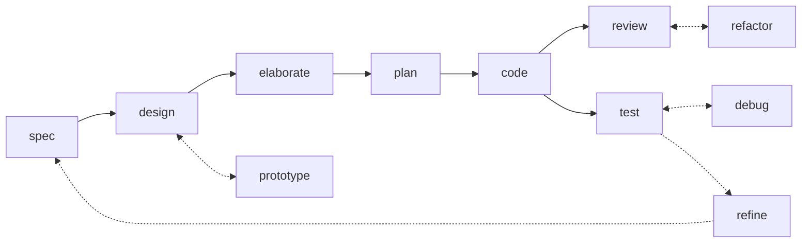
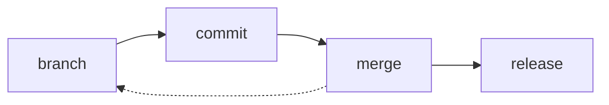

# ✨ Skills [](https://skills.sh/kieranpotts/skills)

A carefully-curated collection of agentic workflow skills – also known as rules, instructions, commands, and custom prompts, depending on the agent harness.

## 📓 Overview

This repository encapsulates a minimal suite of agent skills to support AI-assisted and agentic software development processes. The primary goal of this project is to transform external context – development workflow practices, version control conventions, etc. – into high-quality, reliable prompts that produce consistent, predictable outputs from all mainstream coding agents and models.

These skills cover universal phases of the software development lifecycle – specifying, designing, planning, coding, testing, reviewing, branching, committing, releasing – plus a small number of cross-cutting skills that support those phases – eg. issue triage and agent handoff. Because these workflow steps recur in every software project, regardless of the business domain or technology stack, these skills are designed to be installed at a global level – either in the user's home directory or a workspace root.

The skills are designed to form a coherent system. They're not a grab-bag of independent tasks. Each skill cross-references others, reflecting how the phases of development naturally hand off to one another.

The skills are unashamedly opinionated. Each skill enforces the use of methods and tools that reflect the author's preferred – and somewhat idiosyncratic – ways of working within each lifecycle phase. Examples: Gherkin for acceptance criteria, ADRs for design decisions, trunk-based source control with occasional `temp/*` and `epic/*` branches, and so on. These choices are documented more existensively in the author's [technical standards](https://github.com/kieranpotts/standards) and [software development playbook](https://github.com/kieranpotts/playbook).

You are encouraged to treat this collection of skills as a baseline, not a framework, on which you can iterate your own agent skills that encode you particular methods and tools.

These skills are intended to be used with specialist agents tailored for software development workflows, and with models trained for computer programming tasks. Claude, Copilot, Cursor, and Pi are supported out-of-the-box. The [built-in installer](./run/install) transforms the source files, which are written to conform to the [Agent Skills](https://agentskills.io/) standard, into the proprietary formats used by Copilot (`.github/instructions/*.instructions.md`) and Cursor (`.cursor/rules/*.mdc`). All other mainstream agents are supported by using Vercel's [skills.sh installer](https://github.com/vercel-labs/skills).

## 🧩 Skills

These skills span three categories:

- **Workflow skills**, one for each discrete phase of the software development life cycle.
- **Version control skills**, for managing revisions and versions using Git.
- And **supporting skills** that cut across the workflow and version control processes.

### Workflow skills

The workflow skills cover distinct phases of the software development life cycle (SDLC). The role of each skill within the SDLC is illustrated by the following flow diagram. The solid lines represent the main wokflow sequence. The dotted lines represent feedback loops and iterative cycles.



| Skill name | Description |
| ---------- | ----------- |
| [`spec`](./skills/spec/) | Specify requirements – both functional and performance – as testable acceptance criteria. |
| [`design`](./skills/design/) | Explore architectural design options and their trade-offs. |
| [`prototype`](./skills/prototype/) | Develop throwaway code to answer design questions. |
| [`elaborate`](./skills/elaborate/) | Validate and refine a proposed solution by interrogating its design. |
| [`plan`](./skills/plan/) | Decompose delivery into small, incremental, stable revisions. |
| [`code`](./skills/code/) | Write code, verified by tests, for one discrete increment. |
| [`test`](./skills/test/) | Conduct incremental acceptance testing of the evolving solution. Focus on dynamic qualities. |
| [`debug`](./skills/debug/) | Diagnose and fix unexpected behaviors observed during acceptance testing. |
| [`review`](./skills/review/) | Audit code for style conventions, pattern consistency, and other static qualities. |
| [`refactor`](./skills/refactor/) | Iterate the solution design via direct code changes, maintaining stabilty through system testing. |
| [`refine`](./skills/refine/) | Revise the requirements specification in response to feedback from acceptance testing of working software. |

### Version control skills

The version control skills describe how revisions are committed to source control, and how stable, versioned releases are cut.



| Skill name | Description |
| ---------- | ----------- |
| [`branch`](./skills/branch/) | Git branching strategy. |
| [`commit`](./skills/commit/) | Commit message conventions. |
| [`merge`](./skills/merge/) | Consolidate divergence between branches. |
| [`release`](./skills/release/) | Release trunks and branches, plus tagged versions. |

### Supporting skills

The remaining skills cut across the workflow and version control processes.

| Skill name | Description |
| ---------- | ----------- |
| [`triage`](./skills/triage/) | Move issues through a category × state machine. |
| [`handoff`](./skills/handoff/) | Compact a conversation for the next session to pick up. |
| [`create-skill`](./skills/create-skill/) | A skill to create new skills. |

## 📦 Installation

There are two ways to install these skills:

- Use Vercel's [skills.sh CLI](https://www.skills.sh/) - RECOMMENDED.
- Use this repository's own custom installer script.

### skills.sh CLI

Change to the root directory of the project in which you want to install these skills. Then use Vercel's [skills CLI](https://www.skills.sh/), which fetches the skills directly from GitHub and installs them in the paths supported by your target agents, relative to the current working directory.

Examples:

```sh
# Use interactive picker to choose which skills to install.
npx skills add kieranpotts/skills

# Install all skills from this repository.
npx skills add kieranpotts/skills --all

# Install one specific skill.
npx skills add kieranpotts/skills --skill commit

# Target a specific agent.
npx skills add kieranpotts/skills -a claude-code

# Preview available skills without installing.
npx skills add kieranpotts/skills --list
```

The CLI's `add` command installs the skills files into the local project, into paths that are detected by your target agents. Re-run the command periodically to pick up upstream changes.

Every mainstream agent is supported – [see the list here](https://www.skills.sh/agent).

Whenever you install skills using this CLI, anonymous telemetry data will be collected that will feed into the leaderboards on the [skills.sh website](https://www.skills.sh/), helping others to discover popular skills.

### Custom installer

Alternatively, you can run this repository's own [`./run/install`](./run/install) script. This supports fewer agents, but it supports installation of skills at the user/global level, as an alternative to per-project installation.

Not all agents currently auto-detect skills installed in the user's home directory. As of May 2026, Claude Code and Pi do, but Copilot and Cursor do not. However, you can configure most agents to detect skills at specific paths. So, if you install these skills globally, you may need to review your agents' configuration to ensure the skills are discoverable by them.

User-level installation is particularly useful because this repository's skills are focused on universal development workflow steps like "plan", "branch", "commit", and "release".

To run the custom installer, clone this repository to your computer, then run `./run/install` from the repository's root directory. At least one agent flag is required: `--claude`, `--pi`, `--copilot`, and/or `--cursor`. Alternatively, use `--all` to install the skills in a format that is recognized by all four agents.

By default, the installer will place the skills files in a subdirectory of the current user's home directory (ie. the default install directory is "~"). For example, the Copilot skills will be installed at `~/.github/instructions/<skill-name>.instructions.md`.

To install the skills on a per project basis, supply the path to the root of the target project via the `--dir` parameter.

By default, the skills files are transpiled to artifacts understood by each target agent, and those artifacts are copied into the target installation directories. The installed skills files are decoupled from the source skills in this repository, so you are free to commit and modify the installed skills – make them your own!

But if you pass the `--symlinks` parameter, symlinks targetting the built artifacts in the cloned repository will be installed instead. This is useful when developing and evaluating these skills, as your changes will be immediately detected by new agent sessions.

You can also use the `--uninstall` flag, in combination with the other targetting flags, to remove particular skills installed at particular locations – eg. `--claude --copilot --dir ~/dev/project`. Only skills installed by the `./run/install` script will be deleted; skills installed by other tools will not be.

Use `./run/install --help` for detailed guidance. Here are some examples:

```sh
# Claude only, installed at the user-level.
./run/install --claude

# Pi only, installed at the user-level.
./run/install --pi

# All four agents installed at the user-level.
./run/install --all

# Claude and Cursor, installed into cwd.
./run/install --claude --cursor --dir .

# All four agents, into a project in another directory.
./run/install --all --dir ~/dev/my-project

# All four agents, installed as user-level symlinks.
./run/install --all --symlinks

# Remove Claude's user-level install.
./run/install --uninstall --claude

# Remove Pi's install from a particular project.
./run/install --uninstall --pi --dir ~/dev/my-project
```

> [!NOTE]
> When installed via the custom installer, every skill is generated with Cursor's `alwaysApply` set to `true` and Copilot's `applyTo` set to `"**"` – which means all the skills will always be in scope in those agents. You may need to tune the targeting per-project, which you can do by modifying the installed skills files.
>
> Skills installed via the skills.sh CLI follow that tool's own defaults.

## 🛠️ Developer documentation

For contributors and maintainers, see the [developer docs](./docs/).

-----

Copyright © 2026-present Kieran Potts, [MIT license](./LICENSE.txt)
