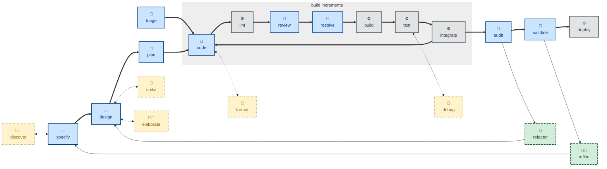

# ✨Skills [](https://skills.sh/kieranpotts/skills)

**🚧 UNDER CONSTRUCTION 🚧**

**A collection of agentic workflow skills** — also known as rules or instructions.

These skills cover universal phases of the software development lifecycle: specifying, designing, planning, branching, coding, committing, reviewing, testing, merging, releasing…

They also cover supporting activities such as business discovery and issue triage, and agentic workflow-optimization techniques such as session reflection and agent handoff.

This is no grab-bag of random skills. It's a cohesive collection that forms a complete end-to-end development workflow. That workflow is highly opinionated, and it assumes a broader, structured environment of development methods and tools to enable agentic workflows.

The goal: consistent, predictable outcomes from any mainstream coding agent and model, regardless of the technology stack or business domain of the software under development.

**[Read more about the design principles](./docs/design-notes.md) that underpin these skills.**

The source files conform to the [Agent Skills](https://agentskills.io/) standard — natively compatible with Claude Code, Pi, and other agents. The [built-in installer](./run/install) transpiles the source to Copilot instructions (`.github/instructions/*.instructions.md`) and Cursor rules (`.cursor/rules/*.mdc`). All other mainstream agents are supported via Vercel's [skills.sh installer](https://github.com/vercel-labs/skills).

<!--

## Global skills

The skills in this collection are optimized for the development of application software that spans multiple code repositories — and potentially multiple teams — where requirements, decisions, designs, and plans are shared concerns that sit above any single codebase.

For skills to be truly global, reusable across multiple projects, they must be technology-agnostic and domain-agnostic. Skills may, however, instruct agents to extract things like coding conventions and domain language from local artifacts — these are reference resources bundled in the code repositories on which the agent is operating, independent of the skills files. The agent can thus extract the information it needs on-demand.

Skills should specialize in the definition of individual steps of the software development _workflow_, not the encoding of _knowledge_.

For a standalone code repository — a small utility library, say — it is recommended instead to encapsulate bespoke skills and supporting reference artifacts directly in that repository. These skills do not serve that use case.

## Cohesive ecosystem

The overriding objective of this project is to produce predictable, consistent, reliable outcomes from every mainstream coding model. But you can't achieve that from agent skills alone.

To achieve predictable outcomes, you need to base your agentic workflow on concrete, verifiable success criteria. The strongest guardrails are automated acceptance tests, ie. success criteria written in an executable form. A passing acceptance test is the strongest signal an agent can have that it is on the right track. And the same tests can be rerun by a subsequent deterministic gate to verify an agent's output.

While these skills are loosely coupled to one another, they are tightly coupled to external development tools. This has proven to be necessary to encode clear, unambiguous instructions that produce predictable outcomes.

Specifically, these skills depend on version-controlled systems for tracking software requirements, technical decisions, design documentation, and implementation plans. The following are reference implementations of those dependencies:

- [**📋 Software Requirements Specification (SRS)**](https://github.com/kieranpotts/specs): Captures what the system does, in business terms.

- [**💬 Requests for Comments (RFC)**](https://github.com/kieranpotts/rfc): Records how significant technical decisions were made, and why.

- [**📐 Design Docs**](https://github.com/kieranpotts/design): Documents what the system looks like in production, and manages proposed architectural changes.

- [**🗺️ Implementation Plans**](https://github.com/kieranpotts/plans): Tracks when, and in what order, the work gets done.

The whole ecosystem runs on version control. Everything the workflow produces is kept there — not just the code, but the requirements, decisions, designs, and plans too.

This has numerous benefits:

- **One consistent process for everything.** Code, requirements, decisions, designs, and plans are all branched, committed, reviewed, and merged using the same version control workflow. There are no separate methods and tools for "the spec" and "the code," for example.

- **Everything stays together.** Related artifacts are not scattered across different systems — wikis, trackers, a shared filesystem, and so on. All development artifacts — specs, decisions, designs, plans, and code — coexist in the same version control system.

- **Audit trails and undo operations are built-in.** Because every agent-generated artifact is kept under version control, you get auditability and rollback for free.

- **Integration with existing automation.** Continuous integration systems can apply deterministic verification to agent output.

The workflow skills in this repository have dependencies on lower-level skills defined in each repository for specifications, technical decisions, design docs, and implementation plans. The `specify` skill, for example, drives the SRS repository's `draft-spec` → `write-spec` → `propose-spec` workflow. This produces a hierarchy of skills. Reusable workflow skills drive the project-specific processes defined in lower-level skills files.

The end result is that these skills fit into a broader, structured environment of tools and methods that, together, form a unified end-to-end development workflow. The trade-off is that these skills can't be easily dropped into any project — they encode a strongly opinionated workflow and are dependent on specific devtools.

-->

## 🧩 Skills

These skills span four categories:

- **Workflow skills**, one for each discrete step in the software development lifecycle.
- **Version control skills**, for managing revisions and triggering releases via Git.
- **Auxiliary skills** for peripheral tasks, eg. proofreading technical documentation.
- **Agentic workflow-optimization skills**, eg. agent handoff and session reflection.

### ➡️ Workflow skills

The workflow skills cover distinct phases of the software development lifecycle (SDLC). They available workflow skills are:

| Skill name | Description | Interactive? |
| ---------- | ----------- | ------------ |
| 🚀 [`audit`](./skills/audit/) | Evaluate the evolving architecture — modularity, consistency, security, etc. | 🤖 No |
| 🚀 [`code`](./skills/code/) | Write code, verified by tests, for one discrete increment. | 🤖 No |
| 🚀 [`debug`](./skills/debug/) | Diagnose and fix unexpected behaviors and runtime issues observed in testing. | 🤖 No |
| 🚀 [`design`](./skills/design/) | Explore architectural options and their trade-offs. | 🤖 Maybe |
| ✅ [`discover`](./skills/discover/) | Run a discovery workshop with the customer to elicit product requirements. | 🧑 Yes |
| 🚀 [`elaborate`](./skills/elaborate/) | Refine a proposed solution by interrogating its design docs. | 🧑 Yes |
| 🚀 [`format`](./skills/format/) | Improve code presentation — whitespace, style, ordering — without changing structure. | 🤖 No |
| 🚀 [`plan`](./skills/plan/) | Decompose delivery into stable increments — supporting continuous integration. | 🤖 No |
| 🚀 [`refactor`](./skills/refactor/) | Iterate the design while maintaining stability through system testing. | 🤖 No |
| 🚧 [`refine`](./skills/refine/) | Produce new business requirements in response to acceptance testing feedback. | 🧑 Yes |
| 🚀 [`resolve`](./skills/resolve/) | Action open review comments, then mark as resolved. | 🤖 No |
| 🚀 [`review`](./skills/review/) | Evaluate code for style conventions and pattern consistency. Focus on static qualities. | 🤖 No |
| 🚀 [`specify`](./skills/specify/) | Specify functional and non-functional requirements as testable acceptance criteria. | 🤖 No |
| 🚧 [`spike`](./skills/spike/) | Develop throwaway code (or other artifacts) to answer design questions. | 🤖 No |
| 🚧 [`test`](./skills/test/) | Conduct incremental acceptance testing of the evolving software. Focus on functional correctness and runtime qualities. | 🤖 No |
| 🚀 [`triage`](./skills/triage/) | Verify a reported bug or incident is real and reproducible. | 🤖 No |
| 🚧 [`validate`](./skills/validate/) | Evaluate the correctness and completeness of the requirements by road testing the current implementation. | 🤖 No |

Most workflow skills run non-interactively. They take everything they need from the context window and the environment. They either complete their task autonomously, or they fail with a specific account of what input is missing. They never prompt users for input beyond the initial prompt. This means the users of these skills can be autonomous agents (🤖) or scripts (⚙️).

A small number of skills will prompt the user to make decisions as the agent explores options to move forward. For example, the [`discover`](./skills/discover/) skill asks questions to elicit product requirements. These interactive skills are intended to be invoked directly by humans (🧑) and are not intended to be used in automated pipelines.

No skills in this collection explicitly handoff to other skills. They're loosely coupled by design. This means the skills can be composed into various workflows, orchestrated by a supervisor agent, a deterministic script, or a human.

The diagram below is just one such possible composition. It shows a proposed main sequence (solid blue/grey), its feedback loops (dashed green), and optional helper callouts (dotted yellow). Steps are labelled as human (🧑), human-agent interactive (🤖🧑), autonomous-agentic (🤖), or scripted (⚙️) — no skills exist in this collection for the last category.



### 🔀 Version control skills

The version control skills describe how revisions are committed to source control, and how stable points in the revision history are prepared for release.

<!-- TODO: Add push, merge request, etc. -->
<!-- TODO: Add a diagram showing how these skills may be knitted into the workflow skills. -->

| Skill name | Description |
| ---------- | ----------- |
| 🚧 [`branch`](./skills/branch/) | Git branching strategy. |
| 🚧 [`commit`](./skills/commit/) | Commit message conventions. |
| 🚧 [`merge`](./skills/merge/) | Consolidate divergence between branches. |
| 🚧 [`release`](./skills/release/) | Release trunks and branches. Version tags. |

### 📎 Auxiliary skills

These skills support peripheral activities in the software development life cycle, such as the proofreading of technical documentation.

| Skill name | Description |
| ---------- | ----------- |
| 🚧 [`research`](./skills/research/) | Gather external sources on a topic and produce a cited research report. |
| 🚧 [`proof`](./skills/proof/) | Proofread, then conservatively edit text content for spelling, grammar, and consistency. |

### 🤖 Agentic workflow-optimization skills

These skills support agentic development workflows.

| Skill name | Description |
| ---------- | ----------- |
| 🚧 [`handoff`](./skills/handoff/) | Compact a conversation for the next session to pick up. |
| 🚧 [`reflect`](./skills/reflect/) | Distill durable lessons from the session into memory and convention files. Companion to [`handoff`](./skills/handoff/). |
| ✅ [`create-skill`](./skills/create-skill/) | Author or improve a skill — in this collection or a downstream project. |

## 📦 Installation

To use these skills, you need to install them in a format and location supported by your target agents. There are two ways to do this:

- Use Vercel's [skills.sh CLI](https://github.com/vercel-labs/skills).
- Use the [custom installer script](./run/install) included in this repository.

### skills.sh CLI

Change to the root directory of the project in which you want to install these skills. Then use Vercel's [skills CLI](https://www.skills.sh/), which fetches the skills directly from GitHub and installs them in the paths supported by your target agents, relative to the current working directory.

```sh
# Use an interactive picker to choose which skills to install.
npx skills add kieranpotts/skills

# Install all skills from this repository.
npx skills add kieranpotts/skills --all

# Install one specific skill.
npx skills add kieranpotts/skills --skill commit

# Target a specific agent.
npx skills add kieranpotts/skills -a claude-code

# Preview available skills without installing them.
npx skills add kieranpotts/skills --list
```

Re-run the `skills add` command periodically to pick up upstream changes.

Every mainstream agent harness is supported — [see the list here](https://www.skills.sh/agent).

Whenever you install skills using this CLI, anonymous telemetry data will be collected that will feed into the leaderboards on the [skills.sh website](https://www.skills.sh/), helping others to discover popular skills.

### Custom installer

Since these skills are intended to be used globally across multiple code repositories, it is recommended to install these skills in the user's home directory or in a workspace root, rather than in individual code repositories. Unfortunately, the skills.sh installer supports only project-level skills.

The custom [`./run/install`](./run/install) script supports fewer agents than skills.sh, but it can install at the user level as an alternative to installing on a per-project basis.

Clone this repository, then execute `./run/install` from its root.

```sh
# Claude only, installed at the user-level.
./run/install --claude

# Pi only, installed at the user-level.
./run/install --pi

# The agent-agnostic .agents/skills location, at the user-level.
./run/install --agents

# All targets installed at the user-level.
./run/install --all

# Claude and Cursor, installed into cwd.
./run/install --claude --cursor --dir .

# The agent-agnostic path, plus Claude's proprietary `.claude/skills` path.
./run/install --agents --claude

# All targets, into a project in another directory.
./run/install --all --dir ~/dev/my-project

# All targets, installed as user-level symlinks.
./run/install --all --symlinks

# Remove Claude's user-level install.
./run/install --uninstall --claude

# Remove Pi's install from a particular project.
./run/install --uninstall --pi --dir ~/dev/my-project
```

At least one agent flag is required: `--claude`, `--pi`, `--copilot`, `--cursor`, and/or `--agents`. Alternatively, use `--all` to install the skills in every supported location at once.

Claude Code and Pi support the [Agent Skills](https://agentskills.io/) format of the source files, so the source files are copied verbatim into the target directories for those agents. For Copilot and Cursor, the source files are transpiled to instructions (`.github/instructions/*.instructions.md`) and rules (`.cursor/rules/*.mdc`) respectively.

The `--agents` flag installs into `.agents/skills/` — a vendor-neutral location that a growing number of harnesses auto-discover — as of May 2026 the list includes Pi and Copilot, plus OpenCode, OpenAI Codex, and Gemini CLI, but not Claude Code or Cursor. The skills are installed in their native [Agent Skills](https://agentskills.io/) format — no transpilation from the source files. It is RECOMMENDED to use `--agents` on its own for a single agent-agnostic install, but combine this with flags to target other agent harnesses that you know you will be using, to ensure compatibility.

By default, the installer will place the skills in a subdirectory of your home directory. For example, the Copilot skills will be installed at `$HOME/.github/instructions/<skill-name>.instructions.md`. Pass the `--dir` parameter to install into a specific project instead. For example, `--dir ~/dev/my-project` will install the Copilot skills at `$HOME/dev/my-project/.github/instructions/<skill-name>.instructions.md`.

Not all agents auto-detect skills installed in the user's home directory. As of May 2026, Claude Code and Pi do, but Copilot and Cursor do not. However, you can configure most agents to detect skills at specific paths. So, if you install the skills globally, you should review your agents' configurations to ensure the skills are discoverable by them.

By default, the source files are transpiled to artifacts understood by each target agent, and it is those built artifacts that are copied into the target installation directories. The installed skills are thereby decoupled from the source skills in this repository. So you are free to modify the installed skills, and to commit them to your own projects — make them your own!

> [!NOTE]
> When installed via the custom installer, every skill is generated with Cursor's `alwaysApply` set to `true` and Copilot's `applyTo` set to `"**"` — which means all the skills will always be in scope in those agents. You may need to tune the targeting per-project, which you can do by modifying the installed skills.

If you pass the `--symlinks` parameter, instead of installing hard copies of the skills, symlinks will be put in your target locations. These symlinks will reference the built artifacts in this repository. This is a useful "dev mode" when iterating and evaluating these skills. Changes made to the skills in this repository will be immediately detected by new agent sessions, providing fast feedback. Symlinked files don't port well between environments via version control, so you should configure Git to ignore any symlinked skills you put inside your local code repositories.

You can also use the `--uninstall` flag, in combination with the other targeting flags, to remove particular skills installed at particular locations. For example, the parameters `--uninstall --claude --copilot --dir ~/dev/project` will remove the skills for Claude and Copilot from a particular project. The `--uninstall` option will delete only those skills that were installed by the `./run/install` script in the first place. Skills installed by other tools — including the skills.sh CLI — will be unharmed.

Use `./run/install --help` for more guidance.

## 🛠️ Developer documentation

For contributors and maintainers, see the [developer docs](./docs/).

-----

Copyright © 2026-present Kieran Potts, [CC0 license](./LICENSE.txt)
