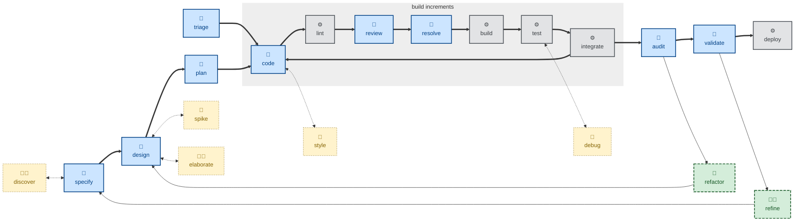

# ✨Skills [](https://skills.sh/kieranpotts/skills)

**🚧 UNDER CONSTRUCTION 🚧**

**A collection of agentic workflow skills** — also known as rules or instructions — covering universal phases of the software development lifecycle (specifying, designing, planning, branching, coding, committing, reviewing, testing, merging, releasing, etc.), plus supporting activities like business discovery, issue triage, and session reflection.

This is no grab-bag of random skills. It's a cohesive collection, designed to be composable into all sorts of agentic loops, and intended to be installed globally and invoked across multiple code repositories and software projects.

The goal is predictable, consistent outcomes from any mainstream coding model — regardless of model size, technology stack, or business domain. But skills alone can't guarantee that. To achieve predictable, consistent outcomes from agentic workflows you need concrete, unambiguous, testable success criteria, and you need deterministic gates independently verifying the output of agents against those criteria.

So, while these skills are loosely coupled to one another, to support composability, they are tightly coupled to a broader ecosystem of development tools — specifically, version-controlled stores for software requirements, technical decisions, system designs, and delivery plans. The following code repositories are templates for these external dependencies:

- [**📋 Software Requirements Specification (SRS)**](https://github.com/kieranpotts/specs): Captures what the system does, in business terms.
- [**💬 Requests for Comments (RFC)**](https://github.com/kieranpotts/rfc): Records how significant technical decisions were made, and why.
- [**📐 Design Docs**](https://github.com/kieranpotts/design): Documents what the system looks like in production, and manages proposed architectural changes.
- [**🗺️ Delivery Plans**](https://github.com/kieranpotts/plans): Tracks when, and in what order, the work gets done.

These repositories act as persistence layers between agents executing different skills. An agent working on an upstream task will write artifacts to one of these repositories, which a downstream agent will read as context for its own task.

Running the whole ecosystem on version control means requirements, decisions, designs, plans, and code all coexist in the same system. All the artifacts that are read and written by agents are branched, committed, reviewed, and merged the same way. Auditability and rollback is built in.

The trade-off is that these skills can't just be dropped into any project. They encode a strongly opinionated workflow and depend on this broader suite of development tools and methods being in place.

**👉 [Read more about the design principles](./docs/design-notes.md) that underpin these skills.**

The source files conform to the [Agent Skills](https://agentskills.io/) standard — natively compatible with Claude Code, Pi, and other agents. The [built-in installer](./run/install) transpiles the source to Copilot instructions (`.github/instructions/*.instructions.md`) and Cursor rules (`.cursor/rules/*.mdc`). All other mainstream agent harnesses are supported via Vercel's [skills.sh installer](https://github.com/vercel-labs/skills). See the installation steps, below, for more details.

## 🧩 Skills

These skills span four categories:

- **Workflow skills** provide instructions for agents running discrete phases of the software development lifecycle.

- **Version control skills** for managing revisions and triggering software builds and releases via Git.

- **Auxiliary skills** for peripheral tasks like proofreading technical documentation.

- **Agentic workflow-optimization skills**, like agent handoff and session reflection.

### ➡️ Workflow skills

| Skill name | Description |
| ---------- | ----------- |
| 🚀 [`audit`](./skills/audit/) | Evaluate the evolving architecture — modularity, consistency, security, etc. |
| 🚀 [`code`](./skills/code/) | Write code, verified by tests, for one discrete increment. |
| 🚀 [`debug`](./skills/debug/) | Diagnose and fix unexpected behaviors and runtime issues observed in testing. |
| 🚀 [`design`](./skills/design/) | Explore architectural options and their trade-offs. |
| ✅ [`discover`](./skills/discover/) | Run a discovery workshop with the customer to elicit product requirements. |
| 🚀 [`elaborate`](./skills/elaborate/) | Refine a proposed solution by interrogating the design docs. |
| 🚀 [`plan`](./skills/plan/) | Decompose delivery into stable increments — supporting continuous integration. |
| 🚀 [`refactor`](./skills/refactor/) | Iterate the design while maintaining stability through system testing. |
| 🚧 [`refine`](./skills/refine/) | Produce new business requirements in response to acceptance testing feedback. |
| 🚀 [`resolve`](./skills/resolve/) | Action open review comments, then mark as resolved. |
| 🚀 [`review`](./skills/review/) | Evaluate code for style conventions and pattern consistency. Focus on static qualities. |
| 🚀 [`specify`](./skills/specify/) | Specify functional and non-functional requirements as testable acceptance criteria. |
| 🚧 [`spike`](./skills/spike/) | Develop throwaway code (or other artifacts) to answer design questions. |
| 🚀 [`style`](./skills/style/) | Improve code presentation — whitespace, style, ordering — without changing structure. |
| 🚧 [`test`](./skills/test/) | Incrementally test the evolving software — for both functional correctness and runtime qualities. |
| 🚀 [`triage`](./skills/triage/) | Verify a reported bug or incident is real and reproducible. |
| 🚧 [`validate`](./skills/validate/) | Evaluate the correctness and completeness of the requirements by road testing the current system. |

### 🔀 Version control skills

<!-- TODO: Add push, merge request, etc. -->

| Skill name | Description |
| ---------- | ----------- |
| 🚧 [`branch`](./skills/branch/) | Git branching strategy. |
| 🚧 [`commit`](./skills/commit/) | Commit message conventions. |
| 🚧 [`merge`](./skills/merge/) | Consolidate divergence between branches. |
| 🚧 [`release`](./skills/release/) | Release trunks and branches. Version tags. |

### 📎 Auxiliary skills

| Skill name | Description |
| ---------- | ----------- |
| 🚧 [`research`](./skills/research/) | Gather external sources on a topic and produce a cited research report. |
| 🚧 [`proof`](./skills/proof/) | Proofread, then conservatively edit text content for spelling, grammar, and consistency. |

### 🤖 Agentic workflow-optimization skills

| Skill name | Description |
| ---------- | ----------- |
| 🚧 [`handoff`](./skills/handoff/) | Compact a conversation for the next session to pick up. |
| 🚧 [`reflect`](./skills/reflect/) | Distill durable lessons from the session into memory and convention files. Companion to [`handoff`](./skills/handoff/). |
| ✅ [`create-skill`](./skills/create-skill/) | Author or improve a skill — in this collection or a downstream project. |

## 🪡 Composition

<!-- TODO: Add a diagram showing how VCS skills may be knitted into the workflow skills. -->

Most workflow skills run non-interactively. They take everything they need from the context window and the environment. They either complete their task autonomously, or they fail with a specific account of what input is missing. They never prompt users for input beyond the initial prompt. This means the users of these skills can be autonomous agents (🤖) or scripts (⚙️).

A small number of skills will prompt the user to make decisions as the agent explores options to move forward. For example, the [`discover`](./skills/discover/) skill asks questions to elicit product requirements. These interactive skills are intended to be invoked directly by humans (🧑) and are not intended to be used in automated pipelines.

No skills in this collection explicitly handoff to other skills. They're loosely coupled by design. This means the skills can be composed into various workflows, orchestrated by a supervisor agent, a deterministic script, or a human.

The diagram below is just one such possible composition. It shows a proposed main sequence (solid blue/grey), its feedback loops (dashed green), and optional helper callouts (dotted yellow). Steps are labelled as human (🧑), human-agent interactive (🤖🧑), autonomous-agentic (🤖), or scripted (⚙️) — no skills exist in this collection for the last category.



## 📦 Installation

To use these skills, you need to install them in a format and location supported by your target agents. There are two ways to do this:

- Use Vercel's [skills.sh CLI](https://github.com/vercel-labs/skills).
- Use the [custom installer script](./run/install) included in this repository.

### skills.sh CLI

Change to the root directory of the project in which you want to install these skills. Then use Vercel's [skills CLI](https://www.skills.sh/), which fetches the skills directly from GitHub and installs them in the paths supported by your target agents, relative to the current working directory.

```sh
# Use an interactive picker to choose which skills to install.
npx skills add kieranpotts/skills

# Install all skills from this repository.
npx skills add kieranpotts/skills --all

# Install one specific skill.
npx skills add kieranpotts/skills --skill commit

# Target a specific agent.
npx skills add kieranpotts/skills -a claude-code

# Preview available skills without installing them.
npx skills add kieranpotts/skills --list
```

Re-run the `skills add` command periodically to pick up upstream changes.

Every mainstream agent harness is supported — [see the list here](https://www.skills.sh/agent).

Whenever you install skills using this CLI, anonymous telemetry data will be collected that will feed into the leaderboards on the [skills.sh website](https://www.skills.sh/), helping others to discover popular skills.

### Custom installer

Since these skills are intended to be used globally across multiple code repositories, it is recommended to install these skills in the user's home directory or in a workspace root, rather than in individual code repositories. Unfortunately, the skills.sh installer supports only project-level skills.

The custom [`./run/install`](./run/install) script supports fewer agents than skills.sh, but it can install at the user level as an alternative to installing on a per-project basis.

Clone this repository, then execute `./run/install` from its root.

```sh
# Claude only, installed at the user-level.
./run/install --claude

# Pi only, installed at the user-level.
./run/install --pi

# The agent-agnostic .agents/skills location, at the user-level.
./run/install --agents

# All targets installed at the user-level.
./run/install --all

# Claude and Cursor, installed into cwd.
./run/install --claude --cursor --dir .

# The agent-agnostic path, plus Claude's proprietary `.claude/skills` path.
./run/install --agents --claude

# All targets, into a project in another directory.
./run/install --all --dir ~/dev/my-project

# All targets, installed as user-level symlinks.
./run/install --all --symlinks

# Remove Claude's user-level install.
./run/install --uninstall --claude

# Remove Pi's install from a particular project.
./run/install --uninstall --pi --dir ~/dev/my-project
```

At least one agent flag is required: `--claude`, `--pi`, `--copilot`, `--cursor`, and/or `--agents`. Alternatively, use `--all` to install the skills in every supported location at once.

Claude Code and Pi support the [Agent Skills](https://agentskills.io/) format of the source files, so the source files are copied verbatim into the target directories for those agents. For Copilot and Cursor, the source files are transpiled to instructions (`.github/instructions/*.instructions.md`) and rules (`.cursor/rules/*.mdc`) respectively.

The `--agents` flag installs into `.agents/skills/` — a vendor-neutral location that a growing number of harnesses auto-discover — as of May 2026 the list includes Pi and Copilot, plus OpenCode, OpenAI Codex, and Gemini CLI, but not Claude Code or Cursor. The skills are installed in their native [Agent Skills](https://agentskills.io/) format — no transpilation from the source files. It is RECOMMENDED to use `--agents` on its own for a single agent-agnostic install, but combine this with flags to target other agent harnesses that you know you will be using, to ensure compatibility.

By default, the installer will place the skills in a subdirectory of your home directory. For example, the Copilot skills will be installed at `$HOME/.github/instructions/<skill-name>.instructions.md`. Pass the `--dir` parameter to install into a specific project instead. For example, `--dir ~/dev/my-project` will install the Copilot skills at `$HOME/dev/my-project/.github/instructions/<skill-name>.instructions.md`.

Not all agents auto-detect skills installed in the user's home directory. As of May 2026, Claude Code and Pi do, but Copilot and Cursor do not. However, you can configure most agents to detect skills at specific paths. So, if you install the skills globally, you should review your agents' configurations to ensure the skills are discoverable by them.

By default, the source files are transpiled to artifacts understood by each target agent, and it is those built artifacts that are copied into the target installation directories. The installed skills are thereby decoupled from the source skills in this repository. So you are free to modify the installed skills, and to commit them to your own projects — make them your own!

> [!NOTE]
> When installed via the custom installer, every skill is generated with Cursor's `alwaysApply` set to `true` and Copilot's `applyTo` set to `"**"` — which means all the skills will always be in scope in those agents. You may need to tune the targeting per-project, which you can do by modifying the installed skills.

If you pass the `--symlinks` parameter, instead of installing hard copies of the skills, symlinks will be put in your target locations. These symlinks will reference the built artifacts in this repository. This is a useful "dev mode" when iterating and evaluating these skills. Changes made to the skills in this repository will be immediately detected by new agent sessions, providing fast feedback. Symlinked files don't port well between environments via version control, so you should configure Git to ignore any symlinked skills you put inside your local code repositories.

You can also use the `--uninstall` flag, in combination with the other targeting flags, to remove particular skills installed at particular locations. For example, the parameters `--uninstall --claude --copilot --dir ~/dev/project` will remove the skills for Claude and Copilot from a particular project. The `--uninstall` option will delete only those skills that were installed by the `./run/install` script in the first place. Skills installed by other tools — including the skills.sh CLI — will be unharmed.

Use `./run/install --help` for more guidance.

## 🛠️ Developer documentation

For contributors and maintainers, see the [developer docs](./docs/).

-----

Copyright © 2026-present Kieran Potts, [CC0 license](./LICENSE.txt)
