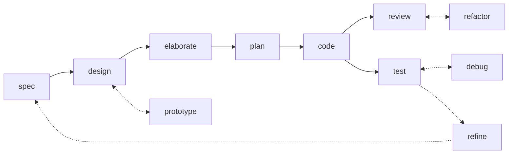
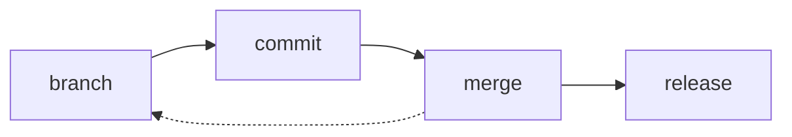

# ✨ Skills 

A carefully-curated collection of agentic workflow skills – also known as rules, instructions, commands, and custom prompts, depending on the agent harness.

## 📓 Overview

This repository encapsulates a minimal suite of agent skills to support AI-assisted and agentic software development processes. The skills focus on universal phases of the software development lifecycle – specifying, designing, planning, coding, testing, reviewing, branching, committing, releasing – plus a small number of cross-cutting skills that support those phases – eg. issue triage and agent handoff. Because these steps recur in every software project, regardless of the business domain or technology stack, these skills are designed to be installed at a global level – either in the user's home directory or a workspace root.

These skills are intended to be used with specialist agents tailored for software development workflows, and with models trained for computer programming tasks. Claude, Copilot, Cursor, and Pi are supported out-of-the-box. The [built-in installer](./run/install) transforms the source files, which are written to conform to the [Agent Skills](https://agentskills.io/) standard, into the proprietary formats used by Copilot (`.github/instructions/*.instructions.md`) and Cursor (`.cursor/rules/*.mdc`). All other mainstream agents are supported by using Vercel's [skills.sh installer](https://github.com/vercel-labs/skills).

The skills are designed to be small and composable, to optimise token consumption. A key design goal is to balance context size with achieving consistent outcomes across models and agents.

The skills are unashamedly opinionated. Each skill enforces the use of methods and tools that reflect the author's preferred – and somewhat idiosyncratic – ways of working. Examples: Gherkin for acceptance criteria, ADRs for design decisions, trunk-based source control with occasional `temp/*` and `epic/*` branches, and so on. These choices are documented more existensively in the author's [technical standards](https://github.com/kieranpotts/standards) and [software development playbook](https://github.com/kieranpotts/playbook).

You should treat this collection of skills as a baseline, not a framework. Fork the repository, copy individual skills, and use them as a starting point to write your own custom skills that encode your particular methods and tools.

## 🧩 Skills

These skills span three categories:

- **Workflow skills**, one for each discrete phase of the software development life cycle.
- **Version control skills**, for managing revisions and versions using Git.
- And **supporting skills** that cut across the workflow and version control processes.

### Workflow skills

The workflow skills cover distinct phases of the software development life cycle (SDLC). The role of each skill within the SDLC is illustrated by the following flow diagram. The solid lines represent the main wokflow sequence. The dotted lines represent feedback loops and iterative cycles.

| Skill name | Description |
| ---------- | ----------- |
| [`spec`](./skills/spec/) | Specify requirements – both functional and performance – as testable acceptance criteria. |
| [`design`](./skills/design/) | Explore architectural design options and their trade-offs. |
| [`prototype`](./skills/prototype/) | Develop throwaway code to answer design questions. |
| [`elaborate`](./skills/elaborate/) | Validate and refine a proposed solution by interrogating its design. |
| [`plan`](./skills/plan/) | Decompose delivery into small, incremental, stable revisions. |
| [`code`](./skills/code/) | Write code, verified by tests, for one discrete increment. |
| [`test`](./skills/test/) | Conduct incremental acceptance testing of the evolving solution. Focus on dynamic qualities. |
| [`debug`](./skills/debug/) | Diagnose and fix unexpected behaviors observed during acceptance testing. |
| [`review`](./skills/review/) | Audit code for style conventions, pattern consistency, and other static qualities. |
| [`refactor`](./skills/refactor/) | Iterate the solution design via direct code changes, maintaining stabilty through system testing. |
| [`refine`](./skills/refine/) | Revise the requirements specification in response to feedback from acceptance testing of working software. |

### Version control skills

The version control skills describe how revisions are committed to source control, and how stable, versioned releases are cut.

| Skill name | Description |
| ---------- | ----------- |
| [`branch`](./skills/branch/) | Git branching strategy. |
| [`merge`](./skills/merge/) | Consolidate divergence between branches. |
| [`commit`](./skills/commit/) | Commit message conventions. |
| [`release`](./skills/release/) | Release trunks and branches, plus tagged versions. |

### Supporting skills

The remaining skills cut across the workflow and version control processes.

| Skill name | Description |
| ---------- | ----------- |
| [`triage`](./skills/triage/) | Move issues through a category × state machine. |
| [`handoff`](./skills/handoff/) | Compact a conversation for the next session to pick up. |
| [`create-skill`](./skills/create-skill/) | A skill to create new skills. |

These skills are intended to be used with agents tailored for software development workflows, and models trained for computer programming tasks. Claude, Copilot, Cursor, and Pi are supported out-of-the-box. The [built-in installer](./run/install) transforms the source files, which are written to conform to the [Agent Skills](https://agentskills.io/) standard, into the proprietary formats used by Copilot (`.github/instructions/*.instructions.md`) and Cursor (`.cursor/rules/*.mdc`). All other mainstream agents are supported by using Vercel's [skills.sh installer](https://github.com/vercel-labs/skills).

The skills are designed to be small and composable to optimise token consumption. A key design goal is to balance context size with achieving consistent outcomes across models and agents.

The skills are unashamedly opinionated. Each skill enforces the use of methods and tools that reflect the author's preferred – and somewhat idiosyncratic – ways of working. Examples: Gherkin for acceptance criteria, ADRs for design decisions, trunk-based source control with occasional `temp/*` and `epic/*` branches, and so on. These choices are documented more existensively in the author's [technical standards](https://github.com/kieranpotts/standards) and [product development playbook](https://github.com/kieranpotts/playbook).

So you should treat this collection of skills as a baseline, not a framework. Fork the repository, copy individual skills, and use them as a starting point to write your own custom skills that encode your own workflow conventions.

A curated collection of skills – also known as rules, instructions, and custom prompts – for use by AI tools.

A bundled shell script automates installation for Claude Code, Cursor, GitHub Copilot, and Pi. All other agents are supported via Vercel's [skills.sh CLI](https://www.skills.sh/docs/cli).

<!--

## Skills

**Workflow skills**:

| Skill name     | Description                                 |
| -------------- | ------------------------------------------- |
| `spec`         | Specify requirements as acceptance criteria |
| `design`       | Explore architecture options and trade-offs |
| `plan`         | Break delivery into small increments        |
| `code`         | Write code and tests for one step           |
| `test`         | Verify the full solution againt the ACs     |
| `review`       | Audit code for security, consistency, etc.  |
| `refactor`     | Improve internal code quality               |

**Version control skills**:

| Skill name     | Description                                 |
| -------------- | ------------------------------------------- |
| `branch`       | Git branching strategy                      |
| `commit`       | Commit message conventions                  |
| `release`      | Release trunks and branches                 |
| `commit`       | Tagging version points                      |

**Other skills**:

| Skill name     | Description                                 |
| -------------- | ------------------------------------------- |
| `create-skill` | A skill to create new skills                |

-->

[**➡️ Browse the skills**](./skills/)

## 📓 Documentation

- [**Overview**](./docs/overview.md)
- [**Installation**](./docs/installation.md)
- [**Creating skills**](./docs/creating-skills.md)
- [**Publishing to skills.sh**](./docs/publishing.md)

-----

Copyright © 2026-present Kieran Potts, [MIT license](./LICENSE.txt)
