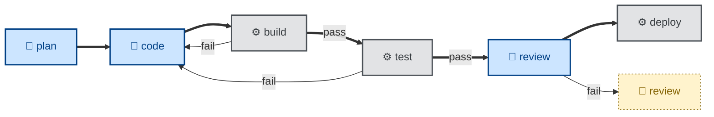
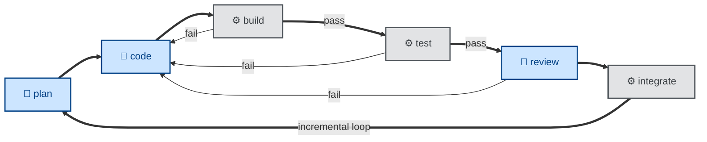

# Design notes

These notes cover the design principles and objectives that underpin this collection of agent skills. These notes also cover general best practices for designing and implementing agentic workflows (also known as agent loop engineering).

## Predictable outcomes

The overriding objective of this project is to produce predictable outcomes from agentic software development workflows, and for those outcomes to be highly consistent across all mainstream coding models.

To achieve predictable, consistent outcomes, you need to base your agentic workflows on concrete, verifiable success criteria. This means giving agents clear, self-verifiable criteria for what "done" and "correct" look like.

Vague guidance leaves outcomes determined primarily by the quality of the underlying model. Concrete success criteria produce more consistent outcomes across a wider range of models — frontier and mid-tier, closed-weight and open-weight.

The strongest guardrails are automated acceptance tests, ie. success criteria written in an executable form. A passing acceptance test is the strongest signal an agent can have that it is on the right track. And the same tests can be rerun by a subsequent deterministic gate to verify an agent's output.

## Strong opinions

Automated acceptance tests are the main feedback loop in agentic workflows. But for them to be effective, the success criteria need to be sufficiently concrete that an agent can evaluate its own work and course-correct if necessary.

This means imposing opinions. You can only computationally verify something against a definitive standard. So you need to pick one way to do something, and encode that opinion in the skill for that particular task.

Skills work best when they DO NOT offer agents a menu of options. Agent skills require a certain rigidity — clear, unambiguous, step-by-step instructions for the agent to follow, and success criteria that can be verified with a deterministic test. This rigidity is how we can steer non-deterministic models toward predictable outcomes.

## External enforcement

We steer agents with skills, and enforce their behaviors with deterministic checks.

It is good practice to encode in agent skills deterministic checks that the agent can invoke to evaluate its progress toward its goal. But there are no guarantees that agents will actually do this — no matter how well written the skill, and no matter how well the underlying model has been trained and fine-tuned for the task at hand.

A skill is just a prompt. It steers a model, but it cannot _guarantee_ what the model does. We can't rely on agents marking their own homework.

So the verification of an agent's output must be done independently of the agent. Real enforcement of agent behaviors comes from automated, deterministic checks — linters, type-checkers, and above all the test suite — run in external processes.

Wherever a skill states a rule that a machine can verify, there should be a deterministic check, run by an external process, that verifies the agent's conformance to the rule. This is particularly critical for the acceptance tests — the main quality gate in agentic workflows.

The less that validation of outcomes is dependent on judgment, and the more it is handled by deterministic checks, the more predictably your agentic workflows will behave. And, as your trust in your agentic workflows increases, you'll gain the confidence to have fewer humans in the loop.

## Agentic versus automated

An agentic workflow must consist of a mix of both agentic (🤖) and automated (⚙️) steps. Humans (🧑) enter the loop where steps cannot be reliably handled by some combination of agents and automation.

We should be clear about the definitions of automated versus agentic. **Automated** tasks are deterministic. They involve computation using the traditional, instructions-based programming model. Given a set of inputs, the outputs are entirely predictable. **Agentic** tasks, by contrast, apply judgement, make decisions, learn and adapt, and come up with novel ideas. Agents have _agency_. Give an agent the same set of inputs in different sessions, and you'll get different outputs every time.

Choosing which steps to automate, and which to hand off to agents, is a key design decision in agentic workflows.

Agents should not be used where regular computation will suffice. Use agents for tasks that only large-language models have the capability — open-ended problems that require judgment to weigh up trade-offs, experimentation to try different paths, and reflection to evaluate one's own progress toward a goal.

An agentic step, encoded in a skill file, is worth adding wherever judgement can't be reduced to a deterministic rule.

Linting, building, packaging, deploying, migrating… these steps in the software development lifecycle are best left scripted. This is why you won't find `build` or `deploy` skills in this collection. Those steps do not belong here. Agent skills are for the parts of the software development life cycle that resist automation by conventional tools.

## Entry points

An agentic workflow is not a single linear pipeline with one front door. Work can enter the lifecycle at different points, depending on what triggered it.

The two most common entry points are:

- The **proactive** path, triggered by a new product requirement. Work begins by specifying the requirement ([`specify`](../skills/specify/SKILL.md)), potentially supported by an interactive discovery workshop with the customer ([`discover`](../skills/discover/SKILL.md)). From there, the work flows through design, planning, construction, and multiple evaluation steps.

- The **reactive** path, triggered by an issue — typically a bug or incident — raised in the tracker. First, the issue is triaged ([`triage`](../skills/triage/SKILL.md)), which verifies the reported issue is real and reproducible. From there, the workflow goes straight into the build loop, until the issue is resolved.

A third, less obvious entry point is discovery work initiated by an agent rather than a human: an agent proactively looking for things to do, eg. scanning CI pipelines for recurring failures, triaging the open issue queue, or auditing the architecture for drift. This blurs the line between "triggered by a human requirement" and "triggered by an agent's own observation," but it still resolves into one of the two paths above — a self-discovered bug still goes through `triage`, and a self-discovered improvement still goes through `specify` or `design`.

Recognizing that a workflow has multiple entry points matters for composability: each skill must be able to slot into the pipeline at the point where its trigger condition is met, not only at the front of a single fixed sequence.

## Composable pipelines

An effective agentic workflow involves a pipeline of agents (🤖) and scripts (⚙️), each given a narrowly-scoped task. The output from one agent or script is the input to the next one in the pipeline.

The scripted steps are the critical deterministic checkpoints that verify the outputs of the agentic steps. They catch failure modes and either feed back to prior steps or trip circuit breakers. Humans (🧑) are brought into the loop when the pipeline fails, or wherever steps cannot be fully handled by a combination of agents and scripts.

To realize workflows like this, the skills that specify the agentic steps, and the scripts that are executed in the automated steps, must be designed to be composable.

Composability requires each skill and each script to be a small, sharp tool with well-defined input and output. This way, an orchestrator — which itself may be an agent, a script, or a human — can compose the skills into new, interesting workflows.

## Single responsibility

To achieve composable agentic workflows, each agent skill — which represents a single agentic step — should have only a single responsibility. It should do one job and stop at a well-defined boundary. A skill should not reach into adjacent work, even if doing so would be convenient.

An important design constraint on the skills in this collection is that no one skill does both _evaluation_ and _implementation_. A skill either analyzes and reports its findings, or it enacts a change — but never both. For example, a skill that proofreads a document (`proof`) does not also commit the changes it makes to the document (`commit`). The decision of whether, when, and how to commit belongs to the orchestrator.

The following pairs of skills represent other splits between these two responsibilities:

| Evaluates and reports | Enacts the change |
| --------------------- | ----------------- |
| `review` reviews code | `resolve` actions the review comments |
| `test` runs tests | `debug` diagnoses and fixes a failure |
| `audit` evaluates the architecture | `refactor` iterates in code |
| `validate` judges whether the right thing was built | `refine` updates the requirements specification |

Keeping these two concerns — evaluation and implementation — apart brings numerous benefits. Orchestrators have the option to review findings from evaluation steps before applying changes. Having a single responsibility gives each skill a clear trigger condition, too. And each skill becomes more useful on its own. For example, you could reuse an evaluator skill to report into a CI gate.

## Loose coupling

For skills to be composable into different workflows, they need to be loosely coupled from one another. And for skills to be loosely coupled, they must be connected by contracts, not by direct handoffs.

One skill's output is the input to the next skill in the pipeline. But no skill should directly refer to, invoke, or hand off to another skill. Each does its one job, reports the result, and stops.

This means the workflow definition lives externally to the skills files. The order in which skills are run, and the deterministic approval gates that are injected between the agentic steps, is the responsibility of the orchestrator — the person or thing that is running the workflow.

An orchestrator may be a human, manually invoking each skill via their agent harness. Or it might be a deterministic script, perhaps running the workflow in a continuous integration system. The orchestrator might even be a God-like agent that manages multiple subagents and executes the deterministic scripts that validate their output.

The critical design constraint is that skills, and the subagents that read them, are unaware of the workflow. The workflow becomes something the user puts together — whether that user be a human, a script, or another agent. Coupling through contracts rather than handoffs also makes individual skills easier to maintain and to reuse.

## Interface definitions

Achieving loose coupling requires each skill to have well-defined inputs and outputs. Each skill must be explicit in what it consumes, whether that input is optional or required, and whether the skill requires an interactive session in which the agent is free to prompt the user for further input.

Each skill must also be explicit about what output it produces, in what formats, and where the output is written.

Every output should also have corresponding success criteria against which it can be evaluated.

The input/output definitions are the contract the orchestrator reads to decide where a skill can fit into a workflow, how to connect it, and how to validate it.

## Interactive versus non-interactive

A key design decision in the interface definition of an agent skill is whether the skill can be executed non-interactively.

Non-interactive execution supports agentic workflows that run to completion without stopping to ask the user, taking only the initial prompt and what the environment provides for input. Non-interactive skills can be run unattended. And, depending on where they fit in a workflow, non-interactive instructions may be followed by parallel subagents, too.

But some skills are necessarily interactive. They may instruct the agent to block for user input: to ask questions, present options, and wait for answers.

Interactive skills should be used sparingly. They should be used only where human interaction *is* the value in the skill. An example is this collection's [`discover`](../skills/discover/SKILL.md) skill, which is a structured interview whose entire point is the dialogue.

The emerging goal of the specs-to-code movement is for all interactive sessions to happen upstream. Humans are in-the-loop only in the initial phases of the software development lifecycle. The objective is for predictable, production-grade code to be realized from requirements specifications inputted as executable acceptance criteria, with minimal human involvement further downstream.

## Human-in-the-loop

Choosing where a workflow pauses for input is a key design decision.

Interactive steps and human checkpoints should be inserted where decisions are genuinely the human's to make, or where the cost of an undetected error is unacceptably high.

If, in testing your agentic workflow, you fail to consistently achieve predictable outcomes, then you need more humans-in-the-loop.

How frequently humans need to enter the loop varies between domains and teams. High-integrity software — code with safety, financial, or regulatory consequences — will typically require a human checkpoint at every significant step. A personal project or a low-stakes website may need none at all, relying entirely on automated checks and agent judgment to reach a workable outcome.

There is no universal ratio of human checkpoints to automated and agentic steps. The right level of human involvement is a judgment call, tuned to the cost of failure in the domain you're working in, and revisited as your confidence in your pipeline's reliability grows or falls.

## Iterative and incremental

One of the risks of fully agentic/automated specs-to-code workflows is that you end up with a waterfall process. Large-scale code changes land at once.

This has numerous problems. If you have humans-in-the-loop downstream to review agent output, then those poor humans will have to contend with large diffs to review via pull requests — a big bottleneck in delivery. Worse still are all the risks associated with the resulting big bang releases.

This can be resolved by breaking down deliverables into an incremental development plan, enabling continuos integration.

This requires big up-front planning, which itself is dependent on a complete specification and design being in place from the start. The trade-off for this extra front-loaded effort is that incremental delivery catches mistakes early, allows for course-correction when it's still easy to do, and it substantially reduces the inherent risk in agentic programming.

An incremental build also accommodates iterative design, in which the solution is continuously refined throughout the development process, responding to feedback on the experience of using, reviewing, debugging, and maintaining real working software.

The following diagram represents one possible incremental agentic workflow. A `plan` step is responsible for decomposing deliverables into small increments of work, which are subsequently integrated in a piecemeal fashion while keeping the system stable.

## See also

- [Creating skills](./creating-skills.md)
