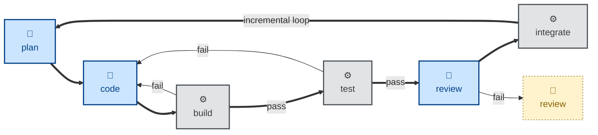

# Design notes

These notes cover design principles and best practices for agentic software development.

We should be clear, first, about what we mean by agentic software development.

For decades, the developer's primary interface with the machine has been syntax — curly braces, type annotations, and the grammar of programming languages. In the 2020s, a new paradigm has arrived in which software developers express what they want to build, rather than how to build it. The human programmer provides intent, architecture, and judgment. A machine writes the syntax.

Agentic software development is the deliberate change in emphasis in the software development lifecycle from writing code to expressing intent, and trusting intelligent systems to translate that intent into working software.

Our intent is captured in artifacts — instructions, rules, standards, specifications, designs, plans — written precisely enough for an agent to act on, and for a human, a script, or another agent to verify against.

Agentic software development is distinct from vibe coding, which is more improvisational. Agentic development requires an extensive suite of tools, providing carefully choreographed checks and balances, engineered into a cohesive agent harness, in order to steer agent output to the level of correctness, completeness, and quality that we desire.

Agent skills are just one component of this agentic development infrastructure.

## Predictable outcomes

The overriding objective in the design of an agent harness is to produce predictable outcomes from agentic workflows, and for those outcomes to be highly consistent across all mainstream coding models.

To achieve predictable, consistent outcomes, you need to base your agentic workflows on concrete, verifiable success criteria. This means giving agents clear, self-verifiable criteria for what "done" and "correct" look like.

Vague guidance leaves outcomes determined primarily by the quality of the underlying model. Concrete success criteria produce more consistent outcomes across a wider range of models — frontier and mid-tier, closed-weight and open-weight.

The strongest guardrails are automated acceptance tests, ie. success criteria written in an executable form. A passing acceptance test is the strongest signal an agent can have that it is on the right track. The same tests can also be rerun by a subsequent deterministic gate to verify an agent's output.

## Strong opinions

Automated acceptance tests are the main feedback loop in agentic workflows. For them to be effective, the success criteria need to be sufficiently concrete that an agent can evaluate its own work and course-correct if necessary.

This means imposing opinions. You can only verify something against a definitive standard, so you need to pick one way to do something, and then encode that opinion in a skill for that particular task.

Skills work best when they DO NOT offer agents a menu of options. Agent skills require a certain rigidity — clear, unambiguous, step-by-step instructions for agents to follow, and success criteria that can be verified with a deterministic test. This rigidity is how we can steer non-deterministic models toward predictable outcomes.

Reliability in agentic workflows comes primarily from the quality of these constraints, and only secondarily from the size and intelligence of the underlying model. A frontier model given vague guidance will behave less predictably than a smaller model given a tightly specified skill and a deterministic gate to pass. Tightening the constraints is a more reliable lever than swapping in a stronger model.

## Guides and sensors

We steer agents with skills, technical standards, and other guidelines, and we enforce their behaviors with deterministic checkpoints. A robust, reliable agent harness is therefore constructed from a mix of both [guides and sensors](https://martinfowler.com/articles/harness-engineering.html):

- **Guides** are the feed-forward controls that steer the agent *before* it acts, anticipating problems and increasing the odds of a good output on the first attempt. AGENTS.md and skill files are emerging as the standard protocols for agent guides.

- **Sensors** are the feedback controls that verify an agent's output *after* it acts. A linter, a type-checker, a test suite, and human code review are all examples of sensors.

An agent steered only by guides can repeat the same undetected mistakes indefinitely. An agent steered only by sensors will run in a slow, expensive trial-and-error loop.

Reliable agentic workflows need both guides and sensors.

## Deterministic sensors

It is good practice to encode in agent skills deterministic checks that the agent can invoke to evaluate its progress toward its goal. But there are no guarantees that agents will actually do this — no matter how well written the skill, and no matter how well the underlying model has been trained and fine-tuned for the task at hand.

A skill is just a prompt. It steers a model, but it cannot _guarantee_ what the model does. We can't rely on agents marking their own homework.

So the verification of an agent's output must be done independently of the agent. Real enforcement of agent behaviors comes from automated, deterministic sensors — linters, type-checkers, and above all the test suite — run in external processes.

Wherever a skill states a rule that a machine can verify, there should be a deterministic check, run by an external process, that verifies the agent's conformance to the rule.

This is particularly critical for the acceptance tests — the main quality gate in agentic workflows.

The less that validation of outcomes is dependent on judgment, and the more it is handled by independent, deterministic sensors, the more predictably your agentic workflows will behave. And, as your trust in your agentic workflows increases, you will gain the confidence to have fewer humans in the loop.

This is the path to fully agentic delivery loops.

## Inferential sensors

There's a second category of sensors that can be run only by agents and cannot be offloaded to traditional scripts. These are the inferential sensors, in which one agent is tasked with _judging_ the output from another agent further upstream in the workflow.

Skills that "review" and "audit" code are examples of inferential sensors. They are distinct from deterministic sensors like "build" and "test".

We must not depend on inferential sensors to verify the outcomes of our agentic workflows. Only deterministic sensors — especially executable acceptance criteria — are the most important sensors for controlling outcomes.

Nevertheless, inferential sensors do bring added value to agentic workflows. They can help to improve the quality of the output by adding more perspectives.

The critical design constraint is that an agent that writes code must not be the one that also reviews it.

Models exhibit sycophancy. An agent asked to critique its own recent work is biased toward judging it favorably. A fresh agent is far more likely to surface real defects.

Orchestrators should invoke inferential sensors as distinct agent sessions. This gives the reviewing agent no visibility into the reasoning that produced the output it is marking.

Evaluator agents should be framed as adversarial personalities. An agent instructed to assume the work is correct and to check for obvious problems will tend to agree with what it reads. An agent instructed to assume the work is broken, and to actively verify that claim, is far less prone to rubber-stamping.

## Agentic versus automated

An agentic workflow must consist of a mix of both agentic and automated steps. Humans enter the loop where steps cannot be reliably handled by some combination of agents and automation.

We should be clear about the definitions of automated versus agentic. **Automated** tasks are deterministic. They involve computation using the traditional, instructions-based programming model. Given a set of inputs, the outputs are entirely predictable. **Agentic** work, by contrast, involves applying judgment, making decisions, learning and adapting, and coming up with novel ideas. Agents have _agency_. Give an agent the same set of inputs in different sessions, and you'll get different outputs every time.

Choosing which steps to automate, and which to hand off to agents, is a key design decision in agentic workflows.

Agents should not be used where regular computation will suffice. Use agents for tasks that only large-language models have the capability — open-ended problems that require judgment to weigh up trade-offs, experimentation to try different paths, and reflection to evaluate one's own progress toward a goal.

An agentic step, encoded in a skill file, is worth adding wherever judgment can't be reduced to a deterministic rule.

Linting, building, packaging, deploying, migrating… these steps in the software development lifecycle are best left scripted. This is why you won't find "build" or "deploy" skills in this collection. Those steps do not belong here. Agent skills are for the parts of the software development life cycle that resist automation by conventional tools.

## Composable pipelines

An effective agentic workflow involves a pipeline of agents (🤖) and scripts (⚙️), each given a narrowly-scoped task. The output from one agent or script is the input to the next one in the pipeline.

The scripted steps are the critical deterministic checkpoints that verify the outputs of the agentic steps. They catch failure modes and either feed back to prior steps or trip circuit breakers.

Humans (🧑) are brought into the loop when the pipeline fails, or wherever steps cannot be fully handled by a combination of agents and scripts.

To realize workflows like this, the skills that specify the agentic steps, and the scripts that are executed in the automated steps, must be designed to be composable.

Composability requires each skill and each script to be a small, sharp tool with well-defined input and output. This way, an orchestrator — which itself may be an agent, a script, or a human — can compose the skills into new, interesting workflows.

This is known as agentic loop engineering. A fully agentic loop involves no humans-in-the-loop after an initial trigger.

An agentic workflow is not a single linear pipeline with one front door. Work can enter the lifecycle at different points, depending on what triggered it. There may be a combination of proactive paths, triggered by new product requirements (eg. a "specify" skill), reactive paths, triggered by bugs or incidents (eg. a "triage" skill), and scheduled paths, triggered by cron jobs that kick off recurring workflows at fixed intervals (eg. an "audit" skill).

## Iterative and incremental

One of the risks of fully agentic/automated specs-to-code workflows is that you end up with a waterfall process. Large-scale code changes land at once.

This has numerous problems. If you have humans-in-the-loop downstream to review agent output, then those poor humans will have to contend with large diffs to review via pull requests — a big bottleneck in delivery. Worse still are all the risks associated with the resulting big bang releases.

This can be resolved by breaking down deliverables into an incremental development plan, enabling continuous integration. The `integrate` step in the pipeline above is where this happens — notice the loop it closes back to `plan`. A `plan` step is responsible for decomposing deliverables into small increments of work, which are subsequently integrated in a piecemeal fashion while keeping the system stable.

This requires big up-front planning, which itself is dependent on a complete specification and design being in place from the start. The trade-off for this extra front-loaded effort is that incremental delivery catches mistakes early, allows for course-correction when it's still easy to do, and it substantially reduces the inherent risk in agentic programming.

An incremental build also accommodates iterative design, in which the solution is continuously refined throughout the development process, responding to feedback on the experience of using, reviewing, debugging, and maintaining real working software.

Small steps also have a second, independent benefit: they bound the context window. A large language model has no working memory beyond its context window, so a single session asked to specify, design, plan, and implement a large feature end-to-end will eventually be reasoning over a window dominated by its own accumulated exploration rather than the task at hand. A `code` step scoped to one increment starts with an empty window and loads only what that increment needs, which — combined with [persistence](#persistence) of each step's distilled output — keeps every step's reasoning reliable.

## Single responsibility

To achieve composable agentic workflows, in which individual steps may have multiple trigger conditions and be sequenced differently across multiple pipelines, each agent skill — which represents a single agentic step — should have only a single responsibility. An agent skill should define one job and stop at a well-defined boundary. A skill should not reach into adjacent work, even if doing so would be convenient.

For maximum composability, no one skill should do both _evaluation_ and _implementation_. A skill either analyzes and reports its findings, or it enacts a change — but never both. For example, a skill that proofreads a document does not also commit the changes it makes to the document. The decision of whether, when, and how to commit the changes from the proofreading step belongs to the orchestrator.

Keeping these two concerns — evaluation and implementation — apart brings numerous benefits. Orchestrators have the option to review findings from evaluation steps before applying changes. Having a single responsibility gives each skill a clear trigger condition, too. And each skill becomes more useful on its own. For example, you could reuse an evaluator skill to report into a CI gate.

A single responsibility is a question of scope, not just of boundary. Size a skill the way you would size a well-designed function or a Unix tool — small, focused, and free of overlapping responsibility with its neighbors. Pitch its abstraction level to match how an agent naturally reasons about the task — a single composite step that does one coherent unit of work beats several low-level steps that mirror an implementation decomposition, because the latter forces the agent to manage intermediate state and multiplies the turns needed to get anything done.

## Rules, not knowledge

An agent skill is a set of rules or instructions for performing one step of the workflow. To maintain the single responsibility principle, a skill should not drift into encoding knowledge, too.

A skill may instruct an agent to go and *extract* knowledge it needs — coding conventions, domain language, architectural constraints — from reference material that lives elsewhere. But the skill itself should not contain that knowledge. It says how to look something up and what to do with it, not what the answer is.

This separation is what makes a skill reusable across projects. A skill that specializes in defining a workflow step stays technology-agnostic and domain-agnostic, and can run unmodified against any codebase that supplies its own reference material on demand. A skill that hard-codes project-specific knowledge stops being portable the moment it leaves the project it was written for.

If a piece of bespoke knowledge genuinely belongs nowhere but a single repository, it belongs in a skill — or a reference document — that is local to that repository.

Boundaries settle what a skill covers. The prose inside it still has to be written well. Match the specificity of an instruction to the fragility of what it governs — give the agent latitude, and explain *why*, where several approaches are valid and the task tolerates variation. Be prescriptive, with exact steps, where a specific sequence must be followed. Prefer a stated default with named alternatives over a menu of equally-weighted options, and prefer teaching a reusable procedure over hard-coding the answer to one instance of the problem.

## Loose coupling

For skills to be composable into different workflows, they need to be loosely coupled from one another. For skills to be loosely coupled, they must be connected by contracts, not by direct handoffs.

One skill's output is the input to the next skill in the pipeline. But no skill should directly refer to, invoke, or hand off to another skill. Each does its one job, reports the result, and stops.

This means the workflow composition lives externally to the skills files. The order in which skills are run, and the deterministic approval gates that are injected between the agentic steps, is the responsibility of the orchestrator — the person or thing that is running the workflow.

An orchestrator may be a human, manually invoking each skill via their agent harness, or it might be a deterministic script, perhaps running the workflow in a continuous integration system. The orchestrator might even be a God-like agent that manages multiple subagents and executes the deterministic scripts that validate their output.

The critical design constraint is that skills, and the subagents that read them, are unaware of the workflow. The workflow becomes something the user puts together — whether that user is a human, a script, or another agent.

Coupling through contracts rather than handoffs also makes individual skills easier to maintain and to reuse.

## Interface definitions

Achieving loose coupling requires each step to have a well-defined set of inputs and outputs. Each agent skill must be explicit in what it consumes, whether that input is optional or required, and whether the skill requires an interactive session in which the agent is free to prompt the user for further input.

Each skill must also be explicit about what output it produces, in what formats, and where the output is written.

Every output should also have corresponding success criteria against which it can be evaluated.

The input/output definitions are the contract the orchestrator reads to decide where a skill can fit into a workflow, how to connect it, and how to validate it.

## Persistence

For an orchestrator to hand off a task — to a different agent, a different session, or a deterministic script — the output of each step must be persisted to disk, not merely held in conversation state.

An agent that finishes a "design" step and writes its decisions to a design doc has produced something the next agent, in a fresh session with an empty context window, can read and act on.

Persisting to disk also serves a second purpose. It keeps the context window clean. Agentic workflows accumulate noise — exploratory dead ends, intermediate reasoning, tool output that mattered for five minutes and then didn't. If every step's full working state has to be carried forward in-context so the next step can use it, context windows fill with noise, recall degrades, and costs climb.

Writing only the *distilled* output of a step to disk — a spec, a design doc, a plan, a set of review findings — lets the next step start from a clean slate.

## Version control as the substrate

Version control specifically — not just "a disk," but a system with commits, branches, and history — is the right substrate for these persistence layers, because the whole ecosystem then runs on one consistent mechanism.

Everything an agentic workflow produces — not just the code, but the requirements, decisions, designs, and plans too — should be kept under version control.

This has numerous benefits:

- Code, requirements, decisions, designs, and plans are all branched, committed, reviewed, and merged using the same version control workflow. There are no separate methods and tools for "the spec" and "the code," for example.

- Everything stays together. Related artifacts are not scattered across different systems — wikis, trackers, a shared filesystem, and so on.

- Audit trails and undo operations are built-in. Because every agent-generated artifact is kept under version control, you get auditability and rollback for free.

- Easy integration with existing automation. For example, continuous integration systems can apply deterministic verification to agent output.

## Isolated environments

Persisting state to a shared repository solves handoff between sequential steps. But it creates a new problem when more than one agent or script needs to operate on that repository concurrently — whether that's parallel subagents building independent increments, or a human still working in the same checkout while an agent runs.

Two processes writing to the same working tree at the same time will corrupt each other's work. One process's uncommitted edits become visible, half-finished, to the other; checked-out branches conflict; build artifacts and lockfiles collide.

So, wherever a workflow runs multiple agents or scripts against a single code repository at once, each must be given its own isolated working copy to operate on, rather than sharing one.

For most local and agentic workflows, the right tool for this is a Git worktree — a second working directory checked out from the same repository, on its own branch, without the overhead of a full clone. This lets an orchestrator spin up one worktree per parallel agent, hand each agent its own isolated copy of the codebase, and only resolve the resulting branches back together at integration time.

This isn't always necessary. In CI systems, for example, isolation is typically already provided by the platform — each job clones the repository fresh into its own ephemeral environment, so there is no shared working tree to corrupt. Worktrees matter specifically where multiple processes would otherwise share one checkout — parallel agents on a developer's machine, or multiple long-running agent sessions against the same local repository.

Whether isolation is needed at all, and which mechanism provides it — a worktree, a fresh clone, a container — is a decision for the orchestrator, not for the skills themselves.

Persistence, version control, and isolation are not incidental tooling choices. Together, they compose the agent harness. The harness is more than a lightweight wrapper that gives a model access to tools. An agent is usefully decomposed into three parts: a *brain* (the model itself, reasoning over the current state), *memory* (short-term — the live context window — and long-term — the persisted artifacts this document is mostly about), and *tools* (the actions it can take in the world). The harness is the infrastructure that supplies and manages all three — it is the whole surrounding development infrastructure, not just the model.

So, while agentic steps should be loosely coupled from one another to support composability, each one is necessarily tightly coupled to this wider harness.

This means a well-designed agentic workflow cannot just be dropped, unmodified, into any development environment. It assumes a structured harness already in place around it.

## Interactive versus non-interactive

A key design decision in the interface definition of an agent skill is whether the skill can be executed non-interactively.

Non-interactive execution supports agentic workflows that run to completion without stopping to ask the user, taking only the initial prompt and what the environment provides for input. Non-interactive skills can be run unattended. And, depending on where they fit in a workflow, non-interactive instructions may be followed by parallel subagents, too.

But some skills are necessarily interactive. They may instruct the agent to block for user input: to ask questions, present options, and wait for answers.

Interactive skills should be used sparingly. They should be used only where human interaction *is* the value in the skill. An example is this collection's [`discover`](../skills/discover/SKILL.md) skill, which is a structured interview whose entire point is the dialogue.

The emerging goal of the specs-to-code movement is for all interactive sessions to happen upstream. Humans are in-the-loop only in the initial phases of the software development lifecycle. The objective is for predictable, production-grade code to be realized from requirements specifications inputted as executable acceptance criteria, with minimal human involvement further downstream.

## Human-in-the-loop

Choosing where a workflow pauses for input is a key design decision.

Interactive steps and human checkpoints should be inserted where decisions are genuinely the human's to make, or where the cost of an undetected error is unacceptably high.

If, in testing your agentic workflow, you fail to consistently achieve predictable outcomes, then you need more humans-in-the-loop.

How frequently humans need to enter the loop varies between domains and teams. High-integrity software — code with safety, financial, or regulatory consequences — will typically require a human checkpoint at every significant step. A personal project or a low-stakes website may need none at all, relying entirely on automated checks and agent judgment to reach a workable outcome.

There is no universal ratio of human checkpoints to automated and agentic steps. The right level of human involvement is a judgment call, tuned to the cost of failure in the domain you're working in, and revisited as your confidence in your pipeline's reliability grows or falls.

## See also

- [Creating skills](./creating-skills.md)
