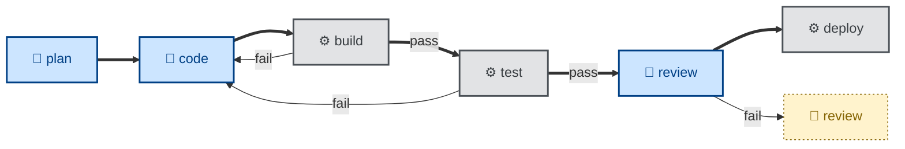
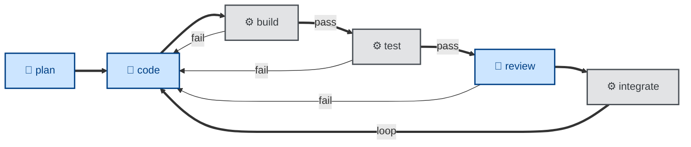

# Design notes

These are the design principles and goals that underpin this collection of agent skills.

## Predictable outcomes

The overriding objective of this project is to produce predictable, consistent, reliable outcomes from every mainstream coding model.

To achieve predictable outcomes, you need to base your agentic workflow on concrete, **verifiable success criteria**. This means giving agents clear, self-verifiable criteria for what "done" and "correct" look like.

Vague guidance — eg. "write a good spec" — leaves outcomes determined primarily by the quality of the underlying model. Concrete success criteria produce more consistent outcomes across a wider range of models — frontier and mid-tier, closed-weight and open-weight.

The strongest guardrails are **automated acceptance tests**, ie. acceptance criteria written in an executable form. A passing acceptance test is the strongest signal an agent can have that it is on the right track. And the same tests can be rerun by a subsequent deterministic gate, to verify an agent's work.

## Strong opinions

Automated acceptance tests are the main feedback loop in agentic workflows.

But for them to be effective, the success criteria need to be sufficiently concrete that an agent can evaluate its own work and course-correct if necessary.

This means **imposing opinions**. You can only check work against a definitive standard, which means you need to pick one way of doing something and encode it in the skill for that task.

Skills work best when they DO NOT offer agents a menu of options. Agent skills require a certain rigidity — clear, unambiguous, step-by-step instructions for the agent to follow, and success criteria that can be verified with a deterministic test. This rigidity is how we can steer non-deterministic models toward predictable outcomes.

## External enforcement

We steer agents with skills, and enforce their behaviors with deterministic checks.

A skill is just a prompt. It guides a model, but it cannot guarantee what the model does — no matter how well the skill is worded. Real enforcement comes from automated, deterministic checks: linters, type-checkers, and above all the test suite.

It is good practice to specify deterministic subtasks for the agent to invoke, against which the agent can evaluate its progress toward its goal. But there are no guarantees that agents will actually do this — no matter how well the underlying model has been trained and fine-tuned for the task at hand.

We can't rely on agents marking their own homework. So deterministic checks must be executed _independently of the agent_.

Wherever a skill states a rule that a machine can verify, there should be a deterministic check — run by an external process — that verifies the agent's conformance to the rule. This is particularly critical for the acceptance tests — the main quality gate in agentic workflows.

The less that validation of outcomes is dependent on judgment, the less often you will need a human-in-the-loop.

## Agentic versus automated

Automation is deterministic. Given the same set of inputs, you get the same outputs on every execution. (If you don't, it's a bug.) Agentic work, by contrast, applies judgement and throws in a bit of randomness. Outputs are inconsistent by design.

Agents should not be used where regular computation will suffice. Reserve agentic work for tasks that only large-language models have the capability — specifically, **open-ended problems** that require judgment to weigh up trade-offs, experimentation to try different paths, and reflection to evaluate one's own progress toward a goal.

A skill is worth adding wherever judgement can't be reduced to a deterministic rule.

Linting, building, packaging, deploying, migrating… these steps in the software development lifecycle are best left scripted. This is why there are no `/build` or `/deploy` skills in this collection. Those steps do not belong here. Skills are for the parts of the software development life cycle that resist automation by conventional tools.

## Agentic pipelines

An effective agentic workflow involves a pipeline of agents, each given a narrowly-scoped task defined by a skill. The output from one agent is the input to the next agent in the pipeline.

Deterministic checkpoints exist at some handoff points. These catch failure modes and either feed back to prior steps or trip circuit breakers.

Besides the deterministic checks at the handoff points, a full delivery pipeline is peppered with scripted steps, too. And humans get involved when the pipeline fails, or wherever steps cannot be fully automated.

Thus, a complete end-to-end agentic workflow is not, actually, fully agentic.

## Composable

To realize workflows like this, skills must be composable. If each skill is a small, sharp tool with well-defined input and output, an orchestrator can compose the skills into new, interesting workflows.

To achieve this, each skill must have only a **single responsibility**. It should do one job and stop at a well-defined boundary. A skill should not reach into adjacent work, even if doing so would be convenient.

An important design constraint on the skills in this collection is that no one skill does both _evaluation_ and _implementation_. A skill either analyzes and reports its findings, or it enacts a change — but never both. For example, a skill that proofreads a document (`/proof`) does not also commit the changes it makes to the document (`/commit`). The decision of whether, when, and how to commit belongs to the caller.

The following pairs of skills represent other splits between these two responsibilities:

| Evaluates and reports | Enacts the change |
| --------------------- | ----------------- |
| `/review` reviews code | `/resolve` actions the review comments |
| `/test` runs tests | `/debug` diagnoses and fixes a failure |
| `/audit` evaluates the architecture | `/refactor` iterates in code |
| `/validate` judges whether the right thing was built | `/refine` updates the requirements specification |

Keeping these two concerns apart means humans can review findings before anything changes. Having a single responsibility gives each skill a clear trigger condition, too. And each skill becomes more useful on its own. For example, you could reuse an evaluator skill to report into a CI gate, and you could feed an enacting skill findings recorded in an issue or inputted directly by a human.

## Loose coupling

For skills to be composable into different workflows, they need to be loosely coupled from one another. And for skills to be loosely coupled, they must be connected by contracts, not by handoffs.

One skill's output is the next skill's input. But no skill should name, refer to, or invoke another skill. Each does its one job, reports the result, and stops.

Deciding what runs next is the responsibility of whoever is running the workflow — the orchestrator — not the individual skills within that workflow.

This allows the skills to be composed into workflows in different ways. Coupling through contracts rather than handoffs also makes individual skills easier to maintain and to reuse.

## Well-defined inputs and outputs

Achieving loose coupling requires each skill to have well-defined inputs and outputs. Each skill must be explicit in what it consumes, whether that input is optional or required, and whether the skill requires an interactive session in which the agent is free to prompt the user for further input to help it make decisions.

Each skill must also be explicit about what output it produces, in what formats, and where the output is written. Every output should also have corresponding success criteria against which it can be evaluated.

The input/output definitions are the contract the orchestrator reads to decide where a skill can fit into a workflow, and how to connect it.

## Interactive versus non-interactive

An important part of the interface definition of an agent skill is whether the skill can be executed non-interactively.

**Non-interactive** (🤖) execution supports agentic workflows that run to completion without stopping to ask the user, taking only the initial prompt and what the environment provides for input. Non-interactive skills can be run unattended and — depending on how they fit into a workflow — in parallel.

But some skills are necessarily **interactive** (🧑). The skills may instruct the agent to block for user input: to ask questions, present options, and wait for answers.

Interactive skills should be used sparingly. They should be used only where human interaction *is* the value in the skill. An example is this collection's [`discover`](../skills/discover/SKILL.md) skill, which is a structured interview whose entire point is the dialogue.

Choosing where a workflow pauses for input is a critical design decision. Human checkpoints should be inserted where the cost of an undetected error is high or hard to reverse, or where the call is genuinely the human's to make.

If, in testing your agentic workflow, you fail to consistently achieve predictable outcomes, then you need more humans-in-the-loop. You need to add more checkpoints.

The emerging goal of the **specs-to-code** movement is for all interactive sessions to be upstream in an agentic workflow. Humans are in-the-loop only in the initial phases of the software development lifecycle. The promise of AI tools is that predictable, production-grade code can be realized via fully end-to-end agentic workflows triggered from requirements specifications inputted as executable acceptance criteria.

## Iterative and incremental

One of the risks of specs-to-code workflows is that you end up with an **agentic waterfall** process, in which large-scale code changes all land at once.

This has numerous problems. If you have humans-in-the-loop downstream to review agent output, then the poor sapiens will have to contend with sprawling pull requests — such a big bottleneck that overall delivery may not be any faster than if the reviewers had written the code themselves. Worse still are all the risks associated with the resulting **big bang** releases.

This can be resolved by enforcing **continuous integration** in agentic workflows. This involves breaking down deliverables into an incremental development plan. That up-front planning depends on a thorough spec and a considered design being in place from the start — it's a world away from vibe coding — but incremental delivery catches mistakes early, allows for course-correction when it's still easy to do, and substantially reduces the inherent risk in agentic programming.

## External drivers

Because no skill refers to or hands off to another, the workflow definition — the order the skills run in, when one follows another, the approval steps between phases — lives entirely outside the skills.

Skills are connected into workflows by matching one skill's output to another's input. This is the role of the orchestrator. An orchestrator may be a mortal sapien, manually activating each skill in their agent harness. Or it might be a deterministic script that runs the workflow, perhaps in a continuous integration system. The orchestrator might even be a God-like agent that manages all the subagents and executes the deterministic steps within the overall workflow.

The critical design constraint is that skills, and the subagents that read them, are unaware of the workflow. It means the workflow becomes something the user puts together — whether that user be a sapien, a script, or another agent.

## Global skills

The skills in this collection are optimized for the development of application software that spans multiple code repositories — and potentially multiple teams — where requirements, decisions, designs, and plans are shared concerns that sit above any single codebase.

For skills to be truly global, reusable across multiple projects, they must be **technology-agnostic** and **domain-agnostic**. Skills may, however, instruct agents to extract things like coding conventions and domain language from local artifacts — these are reference resources bundled in the code repositories on which the agent is operating, independent of the skills files. The agent can thus extract the information it needs on-demand.

Skills should specialize in the definition of individual steps of the software development _workflow_, not the encoding of _knowledge_.

For a standalone code repository — a small utility library, say — it is recommended instead to encapsulate bespoke skills and supporting reference artifacts directly in that repository. These skills do not serve that use case.

## Cohesive ecosystem

While these skills are loosely coupled to one another, they are tightly coupled to external development tools. This has proven to be necessary to encode clear, unambiguous instructions that produce predictable outcomes.

Specifically, these skills depend on version-controlled systems for tracking software requirements, technical decisions, design documentation, and implementation plans. The following are reference implementations of those dependencies:

- [**📋 Software Requirements Specification (SRS)**](https://github.com/kieranpotts/specs): Captures what the system does, in business terms.

- [**💬 Requests for Comments (RFC)**](https://github.com/kieranpotts/rfc): Records how significant technical decisions were made, and why.

- [**📐 Design Docs**](https://github.com/kieranpotts/design): Documents what the system looks like in production, and manages proposed architectural changes.

- [**🗺️ Implementation Plans**](https://github.com/kieranpotts/plans): Tracks when, and in what order, the work gets done.

The whole ecosystem runs on version control. Everything the workflow produces is kept there — not just the code, but the requirements, decisions, designs, and plans too.

This has numerous benefits:

- **One consistent process for everything.** Code, requirements, decisions, designs, and plans are all branched, committed, reviewed, and merged in (roughly) the same way. There are no separate methods and tools for "the spec" and "the code," for example.

- **Everything stays together.** Related artifacts are not scattered across different systems — wikis, trackers, a shared filesystem, and so on. All development artifacts — specs, decisions, designs, plans, and code — coexist in the same version control system.

- **Audit trails and undo operations are built-in.** Because every agent-generated artifact is kept under version control, you get auditability and rollback for free.

- **Integration with existing automation.** Continuous integration systems can apply deterministic verification to agent output.

The workflow skills in this repository have dependencies on lower-level skills defined in each repository for specifications, technical decisions, design docs, and implementation plans. The `/specify` skill, for example, drives the SRS repository's `draft-spec` → `write-spec` → `propose-spec` workflow. This produces a **hierarchy of skills**. Reusable workflow skills drive the project-specific processes defined in lower-level skills files.

The end result is that these skills fit into a broader, structured environment of tools and methods that, together, form a unified end-to-end development workflow. The trade-off is that these skills can't be easily dropped into any project — they encode a strongly opinionated workflow and are dependent on specific devtools.

## See also

- [Creating skills](./creating-skills.md)
