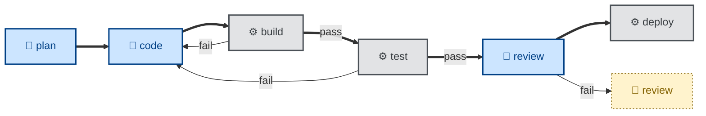
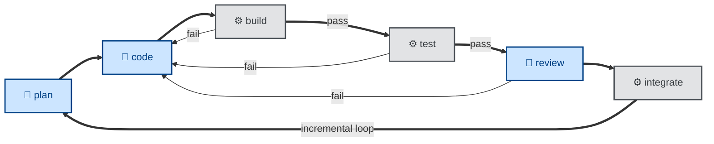

# Design notes

These notes cover the design principles and objectives that underpin this collection of agent skills. These notes also cover general best practices for designing and implementing agentic workflows.

## Predictable outcomes

The overriding objective of this project is to produce predictable outcomes from agentic software development workflows, and for those outcomes to be highly consistent across all mainstream coding models.

To achieve predictable, consistent outcomes, you need to base your agentic workflows on concrete, verifiable success criteria. This means giving agents clear, self-verifiable criteria for what "done" and "correct" look like.

Vague guidance leaves outcomes determined primarily by the quality of the underlying model. Concrete success criteria produce more consistent outcomes across a wider range of models — frontier and mid-tier, closed-weight and open-weight.

The strongest guardrails are automated acceptance tests, ie. success criteria written in an executable form. A passing acceptance test is the strongest signal an agent can have that it is on the right track. And the same tests can be rerun by a subsequent deterministic gate to verify an agent's output.

## Strong opinions

Automated acceptance tests are the main feedback loop in agentic workflows. But for them to be effective, the success criteria need to be sufficiently concrete that an agent can evaluate its own work and course-correct if necessary.

This means imposing opinions. You can only computationally verify something against a definitive standard. So you need to pick one way to do something, and encode that opinion in the skill for that particular task.

Skills work best when they DO NOT offer agents a menu of options. Agent skills require a certain rigidity — clear, unambiguous, step-by-step instructions for the agent to follow, and success criteria that can be verified with a deterministic test. This rigidity is how we can steer non-deterministic models toward predictable outcomes.

Reliability in agentic workflows comes from the quality of these constraints, not from the size or sophistication of the underlying model. A frontier model given vague, optional guidance will behave less predictably than a smaller model given a tightly specified skill and a deterministic gate to pass. Tightening the constraints is a more reliable lever than swapping in a stronger model.

## External enforcement

We steer agents with skills, and enforce their behaviors with deterministic checks.

It is good practice to encode in agent skills deterministic checks that the agent can invoke to evaluate its progress toward its goal. But there are no guarantees that agents will actually do this — no matter how well written the skill, and no matter how well the underlying model has been trained and fine-tuned for the task at hand.

A skill is just a prompt. It steers a model, but it cannot _guarantee_ what the model does. We can't rely on agents marking their own homework.

So the verification of an agent's output must be done independently of the agent. Real enforcement of agent behaviors comes from automated, deterministic checks — linters, type-checkers, and above all the test suite — run in external processes.

Wherever a skill states a rule that a machine can verify, there should be a deterministic check, run by an external process, that verifies the agent's conformance to the rule. This is particularly critical for the acceptance tests — the main quality gate in agentic workflows.

The less that validation of outcomes is dependent on judgment, and the more it is handled by deterministic checks, the more predictably your agentic workflows will behave. And, as your trust in your agentic workflows increases, you'll gain the confidence to have fewer humans in the loop.

The same principle applies where a step genuinely requires judgment rather than a deterministic check — for example, evaluating code quality or design coherence, which a linter cannot fully capture. Here, too, an agent must not be the sole judge of its own output. **The agent that writes the code must not be the one that reviews it.** Models exhibit sycophancy: an agent asked to critique its own recent work is biased toward judging it favorably, since it is, in effect, grading its own homework a second time. A fresh agent — with no investment in the prior output, and ideally no visibility into the reasoning that produced it — is far more likely to surface real defects. This is why `review`, `audit`, `test`, and `validate` are independent skills in this collection, deliberately separated from the `code` skill whose output they evaluate, and why an orchestrator should always invoke them as a distinct agent session rather than asking the implementing agent to mark its own work.

The evaluator skill should also be framed adversarially, not just structurally separated. A reviewing agent instructed to assume the work is correct and check for obvious problems will tend to agree with what it reads. A reviewing agent instructed to assume the work is broken, and to actively verify that claim — running the tests itself, exercising the behavior, inspecting actual output rather than trusting the code's account of itself — is far less prone to rubber-stamping. Passive reading is a weaker check than active verification, regardless of which agent is doing the reading.

## Agentic versus automated

An agentic workflow must consist of a mix of both agentic (🤖) and automated (⚙️) steps. Humans (🧑) enter the loop where steps cannot be reliably handled by some combination of agents and automation.

We should be clear about the definitions of automated versus agentic. **Automated** tasks are deterministic. They involve computation using the traditional, instructions-based programming model. Given a set of inputs, the outputs are entirely predictable. **Agentic** tasks, by contrast, apply judgment, make decisions, learn and adapt, and come up with novel ideas. Agents have _agency_. Give an agent the same set of inputs in different sessions, and you'll get different outputs every time.

Choosing which steps to automate, and which to hand off to agents, is a key design decision in agentic workflows.

Agents should not be used where regular computation will suffice. Use agents for tasks that only large-language models have the capability — open-ended problems that require judgment to weigh up trade-offs, experimentation to try different paths, and reflection to evaluate one's own progress toward a goal.

An agentic step, encoded in a skill file, is worth adding wherever judgment can't be reduced to a deterministic rule.

Linting, building, packaging, deploying, migrating… these steps in the software development lifecycle are best left scripted. This is why you won't find `build` or `deploy` skills in this collection. Those steps do not belong here. Agent skills are for the parts of the software development life cycle that resist automation by conventional tools.

## Entry points

An agentic workflow is not a single linear pipeline with one front door. Work can enter the lifecycle at different points, depending on what triggered it.

The most common entry points are:

- The **proactive** path, triggered by a new product requirement. Work begins by specifying the requirement ([`specify`](../skills/specify/SKILL.md)), potentially supported by an interactive discovery workshop with the customer ([`discover`](../skills/discover/SKILL.md)). From there, the work flows through design, planning, construction, and multiple evaluation steps.

- The **reactive** path, triggered by an issue — typically a bug or incident — raised in the tracker. First, the issue is triaged ([`triage`](../skills/triage/SKILL.md)), which verifies the reported issue is real and reproducible. From there, the workflow goes straight into the build loop, until the issue is resolved.

A third entry point is discovery work initiated by an agent rather than a human: an agent proactively looking for things to do, eg. scanning CI pipelines for recurring failures, triaging the open issue queue, or auditing the architecture for drift. This blurs the line between "triggered by a human requirement" and "triggered by an agent's own observation," but it still resolves into one of the two paths above — a self-discovered bug still goes through `triage`, and a self-discovered improvement still goes through `specify` or `design`.

A fourth entry point is the **scheduled** path, triggered not by an event at all but by the clock — a cron job that kicks off a workflow at a fixed interval, independent of any new requirement, issue, or agent observation. Scheduled triggers are how the agent-initiated discovery path above is usually realized in practice: nothing prompts the agent to go looking for CI failures or stale issues except a recurring schedule. The same scheduling mechanism can drive routine maintenance workflows, too — periodic dependency audits, recurring documentation reviews, and the like.

Recognizing that a workflow has multiple entry points matters for composability: each skill must be able to slot into the pipeline at the point where its trigger condition is met, not only at the front of a single fixed sequence.

## Composable pipelines

An effective agentic workflow involves a pipeline of agents (🤖) and scripts (⚙️), each given a narrowly-scoped task. The output from one agent or script is the input to the next one in the pipeline.

The scripted steps are the critical deterministic checkpoints that verify the outputs of the agentic steps. They catch failure modes and either feed back to prior steps or trip circuit breakers. Humans (🧑) are brought into the loop when the pipeline fails, or wherever steps cannot be fully handled by a combination of agents and scripts.

To realize workflows like this, the skills that specify the agentic steps, and the scripts that are executed in the automated steps, must be designed to be composable.

Composability requires each skill and each script to be a small, sharp tool with well-defined input and output. This way, an orchestrator — which itself may be an agent, a script, or a human — can compose the skills into new, interesting workflows.

One particular composition worth naming is **loop engineering**: a fully autonomous workflow whose explicit objective is to remove the human from the loop entirely — an agent system that prompts itself, discovers its own work, and keeps running with no human checkpoint in the cycle. The paper that coined the term describes a specific five-move playbook for this — [discovery](#entry-points) of work to do, [handoff](#persistence) of that work between steps, [verification](#external-enforcement) of the output, [persistence](#persistence) of results to disk, and [scheduling](#entry-points) of the next iteration — and that playbook maps cleanly onto concepts already covered elsewhere in these notes. But the skills in this collection are not committed to that one playbook. They are deliberately more general-purpose building blocks, composable into a fully autonomous loop, a human-checkpointed pipeline, or anything in between — loop engineering is the limiting case where composition pushes every human checkpoint out of the cycle, not the shape these skills are designed around. The architectural principle that makes the fully autonomous limiting case safe to leave unattended is the same one covered under [external enforcement](#external-enforcement): the agent that generates output in a loop iteration must not be the one that evaluates it, since a single self-critical agent tends to overpraise its own work.

Removing the human from each iteration also removes the moment at which costs would normally get noticed, so they accumulate silently instead. Watch for four in particular: **verification debt**, where checks get deferred or skipped and the gap compounds across iterations; **comprehension rot**, where the humans nominally supervising the loop gradually lose track of what it's actually doing; **cognitive surrender**, where the loop's judgment is trusted on decisions that still warranted a human; and **token blowout**, where per-iteration cost looks negligible but compounds into something significant over many cycles. None of these show up by inspecting a single iteration — they only become visible by looking at the loop's behavior over time, which is itself a reason to keep a [human checkpoint](#human-in-the-loop) somewhere in the cycle, even a loosely engaged one.

## Single responsibility

To achieve composable agentic workflows, each agent skill — which represents a single agentic step — should have only a single responsibility. It should do one job and stop at a well-defined boundary. A skill should not reach into adjacent work, even if doing so would be convenient.

An important design constraint on the skills in this collection is that no one skill does both _evaluation_ and _implementation_. A skill either analyzes and reports its findings, or it enacts a change — but never both. For example, a skill that proofreads a document (`proof`) does not also commit the changes it makes to the document (`commit`). The decision of whether, when, and how to commit belongs to the orchestrator.

The following pairs of skills represent other splits between these two responsibilities:

| Evaluates and reports | Enacts the change |
| --------------------- | ----------------- |
| `review` reviews code | `resolve` actions the review comments |
| `test` runs tests | `debug` diagnoses and fixes a failure |
| `audit` evaluates the architecture | `refactor` iterates in code |
| `validate` judges whether the right thing was built | `refine` updates the requirements specification |

Keeping these two concerns — evaluation and implementation — apart brings numerous benefits. Orchestrators have the option to review findings from evaluation steps before applying changes. Having a single responsibility gives each skill a clear trigger condition, too. And each skill becomes more useful on its own. For example, you could reuse an evaluator skill to report into a CI gate.

## Rules, not knowledge

A skill is better thought of as a set of rules or instructions for performing one step of the workflow, not as a store of knowledge about the project that step operates on. Keeping this distinction sharp is itself a single-responsibility concern — a skill that drifts into encoding domain knowledge has taken on a second job.

A skill may instruct an agent to go and *extract* knowledge it needs — coding conventions, domain language, architectural constraints — from reference material that lives elsewhere: bundled in the repository the agent is operating on, or in the persistence layers described above. But the skill itself should not contain that knowledge. It says how to look something up and what to do with it, not what the answer is.

This separation is what makes a skill reusable across projects in the first place. A skill that specializes in defining a workflow step stays technology-agnostic and domain-agnostic, and can run unmodified against any codebase that supplies its own reference material on demand. A skill that hard-codes project-specific knowledge stops being portable the moment it leaves the project it was written for. If a piece of bespoke knowledge genuinely belongs nowhere but a single repository, it belongs in a skill — or a reference document — local to that repository, not in this collection.

## Loose coupling

For skills to be composable into different workflows, they need to be loosely coupled from one another. And for skills to be loosely coupled, they must be connected by contracts, not by direct handoffs.

One skill's output is the input to the next skill in the pipeline. But no skill should directly refer to, invoke, or hand off to another skill. Each does its one job, reports the result, and stops.

This means the workflow definition lives externally to the skills files. The order in which skills are run, and the deterministic approval gates that are injected between the agentic steps, is the responsibility of the orchestrator — the person or thing that is running the workflow.

An orchestrator may be a human, manually invoking each skill via their agent harness. Or it might be a deterministic script, perhaps running the workflow in a continuous integration system. The orchestrator might even be a God-like agent that manages multiple subagents and executes the deterministic scripts that validate their output.

The critical design constraint is that skills, and the subagents that read them, are unaware of the workflow. The workflow becomes something the user puts together — whether that user is a human, a script, or another agent. Coupling through contracts rather than handoffs also makes individual skills easier to maintain and to reuse.

Loose coupling between skills is not the same as independence from external tooling, though, and it's worth being honest about that distinction. These skills are loosely coupled to *one another*, but they are tightly coupled to the external development tools that make their contracts enforceable in the first place — the persistence layers described above, the deterministic gates described under [external enforcement](#external-enforcement), the version control system everything runs on. That tight coupling is not an oversight to be designed away; it has proven necessary to encode clear, unambiguous instructions that produce predictable outcomes. A skill that tried to be loosely coupled to its devtools too — making no assumptions about where artifacts persist or how output gets verified — would have nothing concrete to hand off to or be checked against, which is the failure mode the rest of these notes argue against.

The trade-off is that these skills can't be dropped, unmodified, into just any project. They encode a strongly opinionated workflow, and they assume a broader, structured environment of devtools is in place to support them — not just any version control system, but one organized around the persistence layers, deterministic gates, and isolation mechanisms these notes describe. That trade-off is deliberate: predictable outcomes were never available for free, and these notes consistently choose concrete, enforceable constraints over portability wherever the two are in tension.

## Interface definitions

Achieving loose coupling requires each skill to have well-defined inputs and outputs. Each skill must be explicit in what it consumes, whether that input is optional or required, and whether the skill requires an interactive session in which the agent is free to prompt the user for further input.

Each skill must also be explicit about what output it produces, in what formats, and where the output is written.

Every output should also have corresponding success criteria against which it can be evaluated.

The input/output definitions are the contract the orchestrator reads to decide where a skill can fit into a workflow, how to connect it, and how to validate it.

## Persistence

Loose coupling and well-defined interfaces only get you so far if a step's output lives nowhere but the context window that produced it. For an orchestrator to actually hand a task off — to a different agent, a different session, or a deterministic script — the output of each step must be persisted to disk, not merely held in conversation state.

This is what makes handoff possible at all. An agent that finishes a `design` step and writes its decisions to a design doc has produced something the next agent, in a fresh session with an empty context window, can read and act on. An agent that only ever *says* its decisions, with nothing committed to a file, has produced nothing the next step can consume — the only "interface" left is the transcript itself, which is exactly the kind of direct handoff that [loose coupling](#loose-coupling) rules out.

Persisting to disk also serves a second, independent purpose: it keeps the context window clean. Agentic workflows accumulate noise — exploratory dead ends, intermediate reasoning, tool output that mattered for five minutes and then didn't. If every step's full working state has to be carried forward in-context so the next step can use it, context windows fill with noise, recall degrades, and costs climb. Writing only the *distilled* output of a step to disk — a spec, a design doc, a plan, a set of review findings — lets the next step start from a clean slate and load just what it needs.

This is why the artifacts this collection's skills produce — specifications, RFCs, design docs, delivery plans, review reports — are designed to be files committed to version control, not paragraphs left behind in a chat transcript. Version control gives persistence for free: every artifact is durable, diffable, auditable, and addressable by path, which is exactly what an orchestrator needs to wire one step's output into the next step's input.

This means the skills in this collection are only one part of a broader agentic infrastructure, not a self-contained solution. A skill like `specify` or `design` is just instructions for *producing* an artifact — it has nothing to say about *where that artifact lives* between sessions, or how the next skill in the pipeline is supposed to find it. That's the job of dedicated persistence layers, sitting outside the skills themselves: a Software Requirements Specification (SRS) repository capturing what the system does, an RFC repository recording how significant technical decisions were made and why, a design docs repository documenting what the system looks like in production, and an delivery plans repository tracking when and in what order work gets done. Skills depend on these stores existing; they don't replace them.

## Version control as the substrate

Version control specifically — not just "a disk," but a system with commits, branches, and history — is the right substrate for these persistence layers, because the whole ecosystem then runs on one consistent mechanism. Everything the workflow produces is kept there: not just the code, but the requirements, decisions, designs, and plans too. This has numerous benefits:

- **One consistent process for everything.** Code, requirements, decisions, designs, and plans are all branched, committed, reviewed, and merged using the same version control workflow. There are no separate methods and tools for "the spec" and "the code," for example.
- **Everything stays together.** Related artifacts are not scattered across different systems — wikis, trackers, a shared filesystem, and so on. All development artifacts — specs, decisions, designs, plans, and code — coexist in the same version control system.
- **Audit trails and undo operations are built-in.** Because every agent-generated artifact is kept under version control, you get auditability and rollback for free.
- **Integration with existing automation.** Continuous integration systems can apply deterministic verification to agent output.

## Isolated environments

Persisting state to a shared repository solves handoff between sequential steps. But it creates a new problem the moment more than one agent or script needs to operate on that repository concurrently — whether that's parallel subagents building independent increments, or a human still working in the same checkout while an agent runs.

Two processes writing to the same working tree at the same time will corrupt each other's work: one process's uncommitted edits become visible, half-finished, to the other; checked-out branches conflict; build artifacts and lockfiles collide. So wherever a workflow runs multiple agents or scripts against a single code repository at once, each must be given its own isolated working copy to operate on, rather than sharing one.

For most local and agentic workflows, the right tool for this is a Git worktree — a second working directory checked out from the same repository, on its own branch, without the overhead of a full clone. This lets an orchestrator spin up one worktree per parallel agent, hand each agent its own isolated copy of the codebase, and only resolve the resulting branches back together at integration time.

This isn't always necessary. In CI systems, for example, isolation is typically already provided by the platform — each job clones the repository fresh into its own ephemeral environment, so there is no shared working tree to corrupt. Worktrees matter specifically where multiple processes would otherwise share one checkout: parallel agents on a developer's machine, or multiple long-running agent sessions against the same local repository.

Whether isolation is needed at all, and which mechanism provides it — a worktree, a fresh clone, a container — is a decision for the orchestrator, not for the skills themselves. A skill operates on "the repository it's given"; it has no need to know whether that repository is the only copy in play or one of several running in parallel.

## Interactive versus non-interactive

A key design decision in the interface definition of an agent skill is whether the skill can be executed non-interactively.

Non-interactive execution supports agentic workflows that run to completion without stopping to ask the user, taking only the initial prompt and what the environment provides for input. Non-interactive skills can be run unattended. And, depending on where they fit in a workflow, non-interactive instructions may be followed by parallel subagents, too.

But some skills are necessarily interactive. They may instruct the agent to block for user input: to ask questions, present options, and wait for answers.

Interactive skills should be used sparingly. They should be used only where human interaction *is* the value in the skill. An example is this collection's [`discover`](../skills/discover/SKILL.md) skill, which is a structured interview whose entire point is the dialogue.

The emerging goal of the specs-to-code movement is for all interactive sessions to happen upstream. Humans are in-the-loop only in the initial phases of the software development lifecycle. The objective is for predictable, production-grade code to be realized from requirements specifications inputted as executable acceptance criteria, with minimal human involvement further downstream.

## Human-in-the-loop

Choosing where a workflow pauses for input is a key design decision.

Interactive steps and human checkpoints should be inserted where decisions are genuinely the human's to make, or where the cost of an undetected error is unacceptably high.

If, in testing your agentic workflow, you fail to consistently achieve predictable outcomes, then you need more humans-in-the-loop.

How frequently humans need to enter the loop varies between domains and teams. High-integrity software — code with safety, financial, or regulatory consequences — will typically require a human checkpoint at every significant step. A personal project or a low-stakes website may need none at all, relying entirely on automated checks and agent judgment to reach a workable outcome.

There is no universal ratio of human checkpoints to automated and agentic steps. The right level of human involvement is a judgment call, tuned to the cost of failure in the domain you're working in, and revisited as your confidence in your pipeline's reliability grows or falls.

## Iterative and incremental

One of the risks of fully agentic/automated specs-to-code workflows is that you end up with a waterfall process. Large-scale code changes land at once.

This has numerous problems. If you have humans-in-the-loop downstream to review agent output, then those poor humans will have to contend with large diffs to review via pull requests — a big bottleneck in delivery. Worse still are all the risks associated with the resulting big bang releases.

This can be resolved by breaking down deliverables into an incremental development plan, enabling continuous integration.

This requires big up-front planning, which itself is dependent on a complete specification and design being in place from the start. The trade-off for this extra front-loaded effort is that incremental delivery catches mistakes early, allows for course-correction when it's still easy to do, and it substantially reduces the inherent risk in agentic programming.

An incremental build also accommodates iterative design, in which the solution is continuously refined throughout the development process, responding to feedback on the experience of using, reviewing, debugging, and maintaining real working software.

The following diagram represents one possible incremental agentic workflow. A `plan` step is responsible for decomposing deliverables into small increments of work, which are subsequently integrated in a piecemeal fashion while keeping the system stable.

## Context window management

There is a second, independent reason for breaking agentic workflows into small steps, beyond the delivery-risk argument above: managing the context window.

A large language model has no working memory beyond its context window. Everything the model "knows" about the current task — the instructions, the code it has read, the tool output it has seen, its own prior reasoning — has to fit inside that one finite window, presented afresh on every inference call. There is no separate scratch memory a model consults outside of it. When the window fills up, something has to give: older content gets truncated or summarized, and whatever predictive power was packed into the specifics of that content is gone with it.

This produces a predictable failure mode, not a random one. As a context window fills, irrelevant or stale content competes with the content that actually matters for the next decision, recall of details from early in the session degrades, and the model's outputs grow less consistent — exactly the kind of variance these notes are trying to design out. A single agent session asked to specify, design, plan, and implement a large feature end-to-end will, at some point, be reasoning with a context window dominated by its own accumulated exploration rather than the task at hand. This is an architectural property of how transformer-based models process input, not a quality bar a better model or a cleverer prompt can buy your way past — bigger context windows push the threshold further out, but the same dynamic resurfaces at a larger scale.

This is the second reason this collection insists on small, narrowly-scoped steps, each handed off through a fresh context window: not only does it bound the size of a single deliverable (the [iterative and incremental](#iterative-and-incremental) argument), it also bounds the amount of accumulated noise any one agent has to reason over. A `code` step that implements one increment starts with an empty context window and loads only what that increment needs — the relevant section of the plan, the relevant files — rather than inheriting the full history of how the design was debated. Combined with [persistence](#persistence), where each step's distilled output is written to disk rather than carried forward in conversation state, this is what keeps every step's context window small enough that the model reasoning within it stays reliable. Skipping the decomposition and running a sprawling task in one long session is not just a delivery-risk problem — it is the direct cause of the context window filling with noise that these notes warn about elsewhere.

## See also

- [Creating skills](./creating-skills.md)
