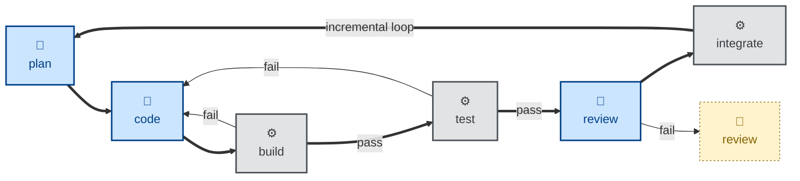

# Composable pipelines

An agentic workflow is a pipeline of autonomous agents (🤖) and conventional scripts (⚙️), each given a narrowly-scoped task. The output from one agent or script is the input to the next one in the pipeline.

The scripted steps are the critical [deterministic checkpoints](./deterministic-sensors.md) that verify the outputs of the agentic steps. They catch failure modes and either feed back to prior steps or trip circuit breakers.

Humans (🧑) are brought into the loop when the pipeline fails, or wherever steps cannot be fully handled by a combination of agents and scripts.

To realize workflows like this, the skills that specify the agentic steps, and the scripts that are executed in the automated steps, must be designed to be composable.

Composability requires each skill and each script to be a small, sharp tool with well-defined input and output. This way, an orchestrator — which itself may be an agent, a script, or a human — can compose the skills into new, interesting workflows.

This is how we engineer agentic workflows. A fully agentic workflow involves no humans-in-the-loop after an initial trigger.

An agentic workflow is not a single linear pipeline with one front door. Work can enter the lifecycle at different points, depending on what triggered it. There may be a combination of: proactive paths, triggered by new product requirements (eg. a "specify" skill); reactive paths, triggered by bugs or incidents (eg. a "triage" skill); and scheduled paths, triggered by cron jobs that kick off recurring workflows at fixed intervals (eg. an "audit" skill).
