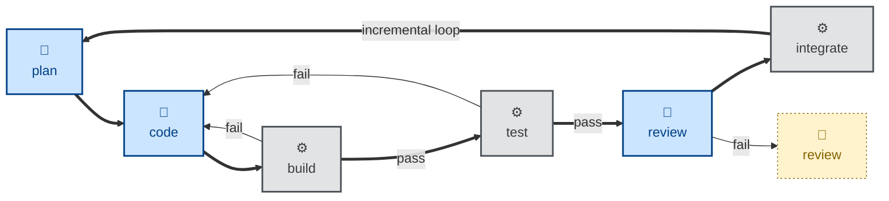

# Iterative and incremental

One of the risks of fully agentic/automated specs-to-code workflows is that you
end up with, essentially, a waterfall process. Large-scale code changes all land
at once.

This has numerous problems. If you have [humans-in-the-loop](./human-in-the-loop.md)
downstream to review agent output, then those poor humans will have to contend
with large diffs to review via pull requests — a big bottleneck in delivery.
Worse still are all the risks associated with the resulting big bang releases.

This can be resolved by breaking down deliverables into an incremental
development plan, enabling continuous integration. This is represented in the
following flow diagram, where a "plan" step is responsible for
decomposing deliverables into small increments of work, which are subsequently
integrated (in the "integrate" step) in a piecemeal fashion while keeping the
system stable.

Automated incremental build-outs like this require big up-front design, which
itself is dependent on a complete specification being in place from the start.
The trade-off for this extra front-loaded effort is that incremental delivery
catches mistakes early, allows for course-correction when it's still easy to do,
and it substantially reduces the inherent risks in agentic programming.

An incremental build also accommodates iterative design, in which the solution
is continuously refined throughout the development process, responding to
feedback on the experience of using, reviewing, debugging, and maintaining real
working software.

Building in small increments is a tried-and-tested software development method.
But it is especially important in agentic workflows, because it helps to manage
the context size. The quality of output from AI models deteriorates the closer
you get to their maximum context length (the context window). Building in small
increments is one of the most effective ways to control an agent's context
length.
