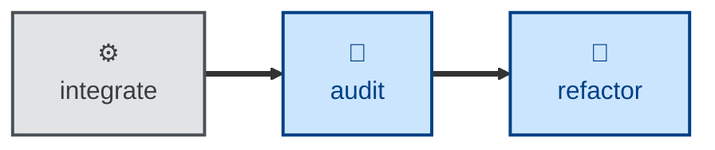

# Audit

The **audit** skill is all about evaluating the evolving architecture for
modularity, consistency, coupling, and other structural qualities.

The agent is instructed to conduct the evaluation on its own terms, with no
reference to the documented architecture and no knowledge of trade-offs
already considered. That deliberate blindness is the point. It keeps the
review unbiased so the agent is more likely to surface genuinely useful
suggestions about how the architecture could be improved.

The trade-off is a bit more noisiness in the output artifacts. The agent may
retread design trade-offs that have long been settled.

This is an evaluation skill. It does not change any code. The output is an
architectural audit report written to a store defined in the agent's context or
environment.

## Interactivity

This skill instructs the agent to run non-interactively. Therefore, the agent is
not expected to prompt for answers to its questions.

## How to invoke

> Audit this codebase.

> Do an architectural audit.

> Is the design still sound?

## Recommended models

A premium frontier reasoning model is best suited to this task.

## Suggested workflows

An architecture audit may be scheduled to run periodically, or be triggered by
a big changeset landing on the main trunk. Alternatively, it may be configured
as a preflight step in a release workflow.

It is NOT RECOMMENDED to run an audit against every commit, especially in
continuous integration workflows.

## Related skills

- **[refactor](../refactor/).** Pass the audit report generated by an agent
  following this skill as context to an agent invoking the refactor skill. The
  refactor skill instructs agents to implement any structural improvements
  proposed in the report.

- **[probe](../probe/).** While the audit skill is scoped to an evaluation of
  the static structure of the code and data of a codebase, the probe skill
  looks specifically at the security and privacy implications of the design.

- **[validate](../validate/).** The audit skill asks whether the _design_ of the
  system should evolve. The validate skills asks whether the _specification_
  of the system should evolve.
