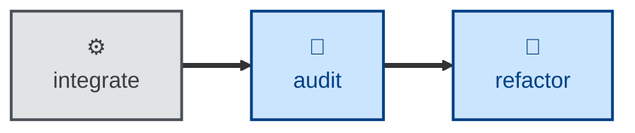

# Audit

The **audit** skill is all about **architectural review**. It evaluates the
as-built architecture for modularity, consistency, communication patterns, and
other structural qualities.

It is scoped to architecture. Security and privacy review is a separate concern,
handled by the **[probe](../probe/)** skill and tracked in the
[risk register](https://github.com/kieranpotts/risks). If an audit incidentally
notices a security weakness, it refers it there rather than reporting it as an
audit finding.

The agent is instructed to conduct the evaluation on its own terms, with no
reference to the documented architecture and no knowledge of trade-offs
already considered. That deliberate blindness is the point. It keeps the
review unbiased so the agent is more likely to surface genuinely useful
suggestions. The trade-off is a bit more noisiness in the output artifacts.
The agent may retread design trade-offs that have already been settled.

This is an evaluation skill. It does not change any code. To do that, pass the
output of this skill as input to the **[refactor](../refactor/)** skill.

This skill is a companion to **[validate](../validate/)**. Whereas **validate** asks
whether the *specification* should evolve, **audit** asks whether the *design*
should.

This skill instructs the agent to run non-interactively.

## How to invoke

> Audit the architecture.

> Is the design still sound?

> Check the codebase for structural drift.

For security review, use **[probe](../probe/)** instead.

## Recommended models

A frontier reasoning model is the right fit here. This skill's value comes from
independent, unbiased judgment about structural quality — shallow abstractions,
tangled dependencies, repeated patterns. That kind of holistic judgment really
benefits from deep reasoning.

A mid-tier model tends to default to generic, checklist-style observations,
rather than genuinely novel structural insight.

## Suggested workflows

An audit may be scheduled to run periodically, or be triggered by a big
changeset landing on the main trunk. Alternatively, it may be configured as a
preflight step in a release workflow. It is NOT RECOMMENDED to run an audit
against every commit.

The output from an audit may be used as the prompt for an agentic refactoring
step. The **refactor** skill consumes the report from an architectural review,
and implements structural improvements in response to the findings.
