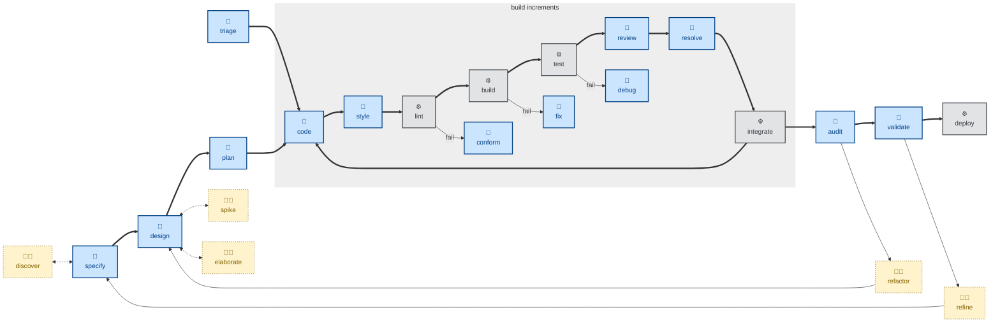

# Audit skill

The `audit` skill is all about **architectural review**. It evaluates the
as-built architecture for modularity, consistency, security, communication
patterns, and other structural qualities. The agent is instructed to conduct
the evaluation on its own terms, with no reference to the documented
architecture and no knowledge of trade-offs already considered.

That deliberate blindness is the point. It keeps the review unbiased so the
agent is more likely to surface genuinely useful suggestions. The trade-off
is a bit more noisiness. The agent may retread design trade-offs that have
already been settled.

This is an evaluation skill. It does not change any code. To do that, pass the
output of this skill as input to the [`refactor`](../refactor/) skill.

This skill is a companion to [`validate`](../validate/). Whereas `validate` asks
whether the *specification* should evolve, `audit` asks whether the *design*
should.

This skill instructs the agent to run non-interactively.

## How to invoke

- `/audit`, `/skill:audit` (prompts vary by harness).
- "Audit the architecture."
- "Is the design still sound?"
- "Check the codebase for structural drift."

## Recommended models

A frontier reasoning model is the right fit here. This skill's value comes from
independent, unbiased judgment about structural quality — shallow abstractions,
tangled dependencies, repeated patterns. That kind of holistic judgment really
benefits from deep reasoning.

A mid-tier model tends to default to generic, checklist-style observations,
rather than genuinely novel structural insight.

## Workflows

