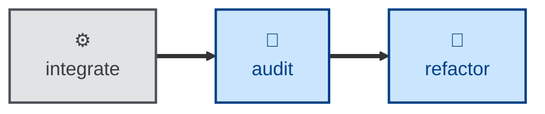

# Audit

The **audit** skill is all about evaluating the evolving architecture —
modularity, consistency, coupling, and other structural qualities.

The agent is instructed to conduct the evaluation on its own terms, with no
reference to the documented architecture and no knowledge of trade-offs
already considered. That deliberate blindness is the point. It keeps the
review unbiased so the agent is more likely to surface genuinely useful
suggestions about how the architecture could be improved.

The trade-off is a bit more noisiness in the output artifacts. The agent may
retread design trade-offs that have long been settled.

This is an evaluation skill. It does not change any code. The output is an
architectural audit report. To implement the suggestions, you can pass the
report as input to the **[refactor](../refactor/)** skill.

This skill is a companion to the **[probe](../probe/)** skill. The **audit**
skill is scoped to an evaluation of the static structure of the code and data.
The **probe** skill looks specifically at the security and privacy implications
of the design.

Another companion skill is the **[validate](../validate/)** skill. The
**audit** skill asks whether the _design_ of the system should evolve. The
**validate** skill asks whether the _specification_ of the system should evolve.

This skill instructs the agent to run non-interactively. Therefore, the agent is
not expected to prompt for answers to its questions.

## How to invoke

> Audit this codebase.

> Do an architectural audit.

> Is the design still sound?

> Check the codebase for structural drift.

## Recommended models

A premium frontier reasoning model is the best fit here. This skill's value
comes from independent, unbiased judgment about structural quality — shallow
abstractions, tangled dependencies, repeated patterns, etc. That kind of
holistic judgment really benefits from deep reasoning.

A mid-tier model tends to default to generic, checklist-style observations,
rather than genuinely novel structural insight.

## Suggested workflows

An architecture audit may be scheduled to run periodically, or be triggered by
a big changeset landing on the main trunk. Alternatively, it may be configured
as a preflight step in a release workflow.

It is NOT RECOMMENDED to run an audit against every commit, especially in
continuous integration workflows.

The audit report generated by this skill may be used as input to the
**[refactor](../refactor/)** skill, which instructs the agent to implement any
structural improvements proposed in the report.

