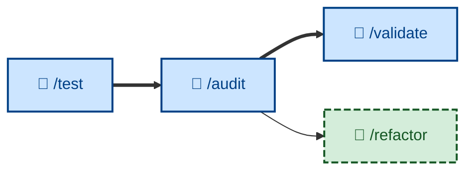

# 🤖 `/audit`

<!-- Is the evolving design still sound? against architectural principles -->

<!-- Analogous to /validate, which evaluates whether the evolving behaviors are what the user actually wants (product-facing), whereas /audit evaluates whether the evolving architecture is what the technicians actually want (development-facing). /audit is the design-level analogue of /validate. -->

<!-- both /audit and /validate hang off the end of the build loop – once an increment is built, reviewed, and tested, you step back and evaluate at the two higher levels (design fitness, product fitness) -->

<!-- /audit feeds into /refactor. While /audit does the actual evaluation of the evolving design, /refactor is responsible for putting any design improvements into action. /refactor is analogous to /refine, which serves the equivalent role in the product feedback loop. -->

Evaluate the evolving architecture – modularity, consistency, security, and the other structural qualities – once a plan's increments are complete, checking the as-built design against the structure it was meant to have. Runs non-interactively (🤖). The design-level counterpart to [`/validate`](../validate/): where `/validate` asks whether the *specification* should evolve, `/audit` asks whether the *design* should.

## What it does

Once all of a plan's increments are built, reviewed, and tested, `/audit` steps back from the per-increment build loop and evaluates the architecture as a whole, comparing the as-built design against the structure it was meant to have. The outcome is a prioritized report of architectural findings, citing specific files and lines.

It runs non-interactively and is **evaluation only**: it changes no code. Acting on a finding is [`/refactor`](../refactor/)'s job, which updates the design and the design docs. The loop is `audit → refactor → design`.

This is not low-level code review of a diff – that is [`/review`](../review/), inside the build loop. `/audit` evaluates the architecture, not a single change.

## How to invoke

Invoke `/audit` once a plan's increments are all complete and have cleared [`/test`](../test/). It evaluates the whole as-built design, so it takes no per-increment argument.

- `/audit`, `/skill:audit` (prompt varies by agent harness).
- "Audit the architecture."
- "Is the design still sound?"
- "Check the codebase for structural drift."
