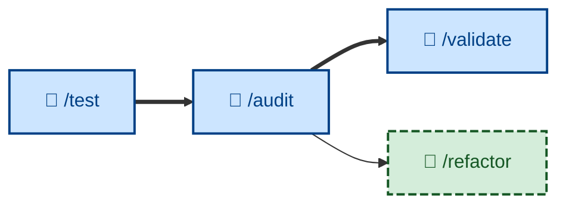

# 🤖 `/audit`

Evaluate the evolving architecture – modularity, consistency, security, and the other structural qualities – once a plan's increments are complete, checking the as-built design against the structure it was meant to have. Runs non-interactively (🤖). The design-level counterpart to [`/validate`](../validate/): where `/validate` asks whether the *specification* should evolve, `/audit` asks whether the *design* should.



## What it does

After all of a plan's increments are built, reviewed, and tested, `/audit` steps back from the per-increment build loop and looks at the architecture as a whole. It reads the intended structure (ADRs, architecture and design docs) first, then walks the codebase applying the deletion test – *if this module were removed, where would its complexity go?* – and a catalog of structural smells: shallow abstractions, tangled dependencies, single-caller wrappers, repeated-but-unabstracted patterns, inverted dependencies, names that don't match content. Findings are prioritized by impact ÷ effort and bounded to the top 5–10.

It runs non-interactively and is **evaluation only**: it produces a prioritized report citing specific files and lines, but changes no code. Acting on a finding is [`/refactor`](../refactor/)'s job, which updates the design and the design docs. The loop is `audit → refactor → design`.

This is not low-level code review of a diff – that is [`/review`](../review/), inside the build loop. `/audit` evaluates the architecture, not a single change.

## How to invoke

Invoke `/audit` once a plan's increments are all complete and have cleared [`/test`](../test/):

```
/audit
```

It evaluates the whole as-built design against its intended structure, so it takes no per-increment argument. Supplying or pointing it at the architecture documentation sharpens the intended-vs-actual comparison.

## Examples

Given a completed feature whose increments introduced a `NotificationManager` that every other module now imports directly, `/audit` reads the design docs (which intended notifications to flow through an event bus), applies the deletion test, and reports the manager as a shallow, widely-depended-on module that has caused the design to drift from its intended event-driven shape. It cites the files, proposes the direction for [`/refactor`](../refactor/) – "route notifications through the existing event bus; delete the manager" – and rates the effort.

Where the as-built design still matches its intended structure, `/audit` says so and recommends no refactoring – "leave it" is a valid finding.
