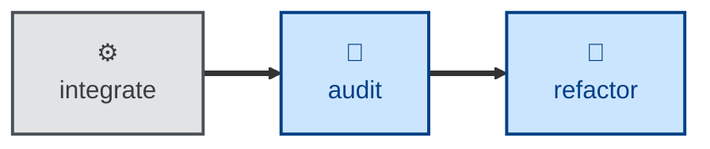

# Audit

The audit skill evaluates the evolving architecture of a codebase for
modularity, consistency, coupling, and the placement of its structural
boundaries.

The agent is instructed to conduct the evaluation on its own terms, with no
reference to the documented architecture and no knowledge of trade-offs
already considered. That deliberate blindness is the point. It keeps the
review unbiased, so the agent is more likely to surface genuinely useful
suggestions about how the architecture could be improved.

The trade-off is a bit more noise in the output. The agent may retread design
trade-offs that have long been settled.

This is an evaluation skill. It changes no code. The output is a single
architectural audit report, written to a store the agent resolves from its
context or environment.

## Interactivity

This skill instructs the agent to run non-interactively. It never prompts for
answers, so it is safe to use in away-from-keyboard and continuous integration
workflows.

## How to invoke

> Audit this codebase.

> Do an architectural audit.

> Is the design still sound?

You may name the target codebase as a path or a repository URL, and pin the
audit to a particular commit. Left unsaid, the agent audits the current
repository at its checked-out revision.

## Recommended models

A premium frontier reasoning model is best suited to this task. Judging
whether a module earns its keep, or whether a boundary sits in the right
place, is open-ended analysis rather than mechanical transformation.

## Suggested workflows

An architecture audit may be scheduled to run periodically, or be triggered by
a big changeset landing on the main trunk. Alternatively, it may be configured
as a preflight step in a release workflow.

It is NOT RECOMMENDED to run an audit against every commit, especially in
continuous integration workflows.

## Related skills

- [**refactor**](../refactor/) \
  Pass the audit report to a coding agent as the context for a refactor.

- [**probe**](../probe/) \
  Audit is scoped to the static structure of code and data; probe looks
  specifically at the security and privacy implications of the design.

- [**validate**](../validate/) \
  Audit asks whether the _design_ of the system should evolve. Validate asks
  whether the _specification_ of the system should evolve.
