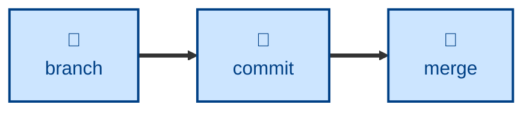

# Branch skill

The `branch` skill is all about **git branching strategy**. It codifies a
trunk-based branch model: permanent fast-forward-only trunks (`dev` → `test` →
`ready`), short-lived `temp/*` branches for single-focus changes, and long-lived
`epic/*` branches for large multi-contributor work, all governed by naming rules
and a validation regex.

Use it when creating a new branch, naming a feature or fix branch, or checking
branch names before push. It tells you which branch type fits the work, what to
name it, and whether a proposed name is well-formed.

It opens the git-workflow chain: `branch` starts the work,
[`commit`](../commit/) records it, [`merge`](../merge/) integrates it, and
[`release`](../release/) ships it.

This skill instructs the agent to run non-interactively.

## How to invoke

- `/branch`, `/skill:branch` (prompts vary by harness).
- "What should I call this branch?"
- "Create a branch for this work."
- "Is this branch name valid?"

## Recommended models

This is a rule-lookup task — apply a naming convention and a validation regex. A
small, fast model is sufficient; no extended reasoning is needed.

## Suggested workflows

Create the branch before any work begins. Commits then accumulate on it, and
when the change is complete it is merged back into a trunk. The name is validated
up front, so a malformed branch name never reaches a push.
