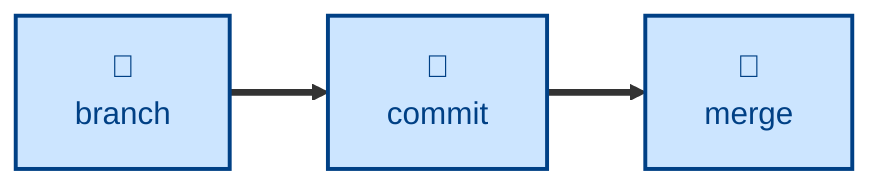

# Branch

The **branch** skill encapsulates the rules for a Git branching strategy defined in
[TS-9: Version Control](https://github.com/kieranpotts/standards/tree/latest/dev/src/009).

It codifies a trunk-based branch model consisting of three fast-forwarded trunks
(`dev` → `test` → `ready`), short-lived `temp/*` branches, and long-lived
`epic/*` branches.

The agent is instructed to classify the work, form a name for it, validate that
name against a regex, cut the branch from `dev`, and stop there. Committing,
merging, and releasing are left to the caller.

## Interactivity

This skill instructs the agent to run non-interactively, so it is safe in
away-from-keyboard and CI workflows. The agent may prompt only to establish
where a target repository lives; on any other uncertainty it stops with an
error rather than guessing.

## How to invoke

> What should I call this branch?

> Create a branch for this work.

> Is this branch name valid?

Pass an issue or tracking identifier if you want it prefixed to the branch
description.

## Recommended models

A small, fast model is sufficient for this task. The naming rules are
mechanical and the validation step is a regex.

## Suggested workflows

Run this at the start of a piece of work, once it is clear the change is too
large to land directly on `dev`.

## Related skills

- [**commit**](../commit/) \
  Creates the revisions that land on the branches this skill defines.

- [**merge**](../merge/) \
  Integrates work between the divergent branches this skill creates, and
  deletes them afterwards.

- [**release**](../release/) \
  Cuts release branches from the trunks this skill defines.

## References

- [TS-9: Version Control](https://github.com/kieranpotts/standards/tree/latest/dev/src/009) \
  The technical standard this skill encodes.
