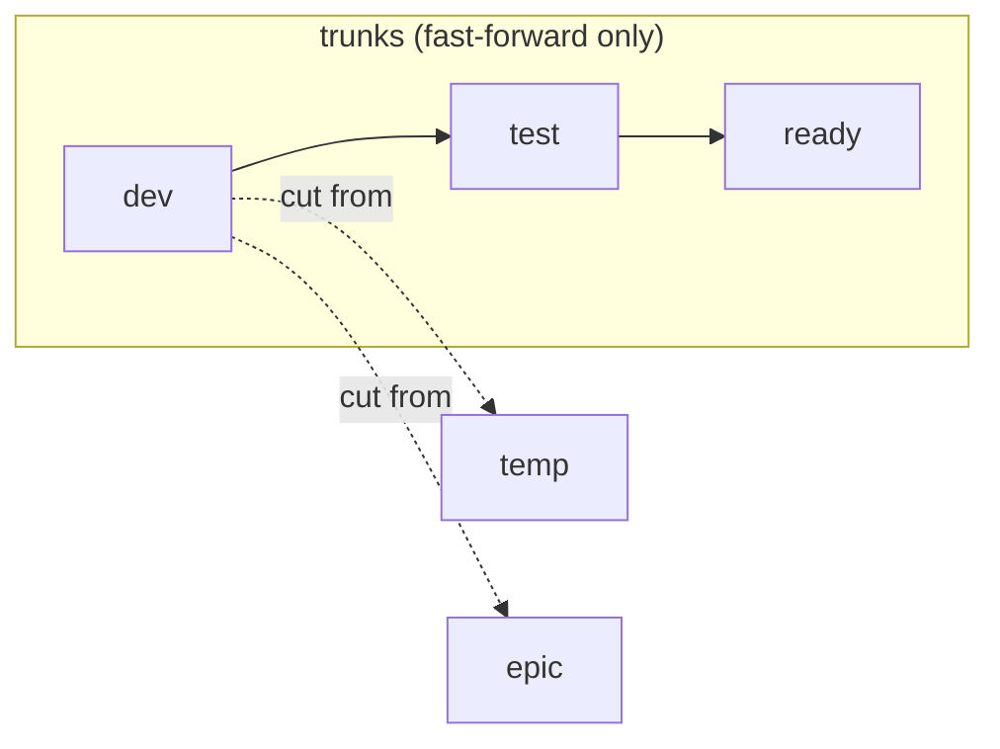

# Branch

Use this skill when creating a new branch, or validating branch names before
push. It names and validates branches against the trunk model below; it does not
merge, cut releases, or author commit messages.

**Branch model at-a-glance**:



## Interface

**Input**: A request to create or name a branch, or one or more existing branch
names to validate. REQUIRED. The project's branch model (trunk names, `temp/*`
and `epic/*` conventions) and the naming regex supply what is checked against.

**Interactive**: TODO -  Whether the skill runs non-interactively to completion,
or is necessarily interactive — blocking to ask questions, present options, and
wait for answers.

**Output**: A correctly-named branch created from the right base, or a pass/fail
verdict on the supplied names with the specific rule each one violates. This
skill names and validates branches and stops; it does not merge, cut releases,
or author commit messages.

##  Rules

-  **Allowed branches:**

    *Permanent trunks:*

    ```
    dev
    test
    ready
    ```

    *Short-lived temporary branches:*

    ```
    temp/[<id>-]<description>
    ```

    *Long-lived epic branches:*

    ```
    epic/[<id>-]<description>
    ```

    Validation regex (for all branch types):

    ```
    ^(dev|test|ready|temp/[a-z0-9]+(-[a-z0-9]+)*|epic/[a-z0-9]+(-[a-z0-9]+)*)$
    ```

-   **Naming rules:**

    - Branch names MUST be full lowercase.

    - `temp/*` and `epic/*` branch names MUST use hyphen-delimited descriptions
      (kebab-case).

    - Branch names MUST NOT contain underscores or spaces.

    - The OPTIONAL `<id>` typically corresponds to an issue number or tracking
      system identifier. Include it if known.

    - Temporary and epic branch names SHOULD NOT exceed 50 characters total, and
      MUST NOT exceed 72.

-   **Trunk branches:**

    Trunks are permanent, append-only, and immutable. There are up to three
    trunks:

    - `dev`: The primary integration trunk. All work originates here. This is
      the only REQUIRED branch. Most projects SHOULD use `dev` as their default
      branch.

    - `test`: OPTIONAL QA trunk. Fast-forwarded to stable commits on `dev` to
      trigger comprehensive testing (integration tests, system tests,
      performance tests).

    - `ready`: OPTIONAL production-grade trunk. Fast-forwarded to passing
      commits on `test`. It MUST remain shippable at all times, enabling
      continuous delivery.

-   **Temporary branches:**

    Temporary branches (`temp/*`) are short-lived and capture single-focused
    changes spanning a small number of commits. Commonly associated with an
    issue/bug. Follow these rules:

    - MUST be cut from `dev`, never from `test`, `ready`, or release branches.

    - Valid use cases: bugs and other issues that span multiple atomic commits;
      experiments, proofs-of-concept, and technical spikes; backup of
      in-progress work.

    - One logical change per temporary branch. Multiple orthogonal changes
      SHOULD NOT be combined into a single temporary branch.

    - MUST use the rebase-up strategy to keep synchronized with `dev`, so the
      unique commits of temporary branches stay at the tip.

    - MUST be reintegrated with `dev` using fast-forward merge.

    - MUST be deleted after integration; the commit history is preserved in
      `dev`.

-   **Epic branches:**

    Epic branches (`epic/*`) are long-lived branches for multi-developer
    coordination on complex changes. Rules:

    - MUST be cut from `dev`, like temporary branches.

    - Valid use cases: large coordinated features spanning weeks/months, and
      which can't easily be continuously integrated into the `dev` trunk or
      toggled off; major refactoring and replatforming initiatives;
      cross-cutting concerns; long-running research work; other highly
      disruptive or volatile changes.

    - MUST use the merge-down strategy: synchronize by merging `dev` into the
      epic branch (never rebase). This is safer for long-lived branches with
      multiple contributors since it preserves the history of the branch.

    - MUST be reintegrated with `dev` using the squash-merge strategy. One fresh
      commit hits the trunk.

    - MUST be deleted after integration into `dev`. A fresh epic branch MAY be
      recreated if further long-running development work is required.

-   **General practices:**

    - All changes MUST originate on `dev` and flow forward through `test` →
      `ready` → release.

    - Trunk branches are fixed-forward only. If a problem is discovered
      downstream, the fix MUST be committed to `dev` and flow forward from there
      — no direct commits to downstream trunks.

    - Stale `temp/*` and `epic/*` branches with no commits in ~90 days SHOULD be
      reviewed periodically and either deleted or revived.

## Examples

Trunk branches:

```
dev
test
ready
```

Temporary branches:

```
temp/42-add-search-endpoint
temp/178-fix-auth-timeout
temp/TS-504-migrate-user-schema
temp/update-dependencies
```

Epic branches:

```
epic/billing-v2-rewrite
epic/PRODUCT-187-auth-overhaul
epic/infra-migrate-kubernetes
epic/major-ui-redesign
```

##  Success criteria

-   **The branch name MUST validate.**

    It MUST match
    `^(dev|test|ready|temp/[a-z0-9]+(-[a-z0-9]+)*|epic/[a-z0-9]+(-[a-z0-9]+)*)$`
    — one of the three trunks, or a `temp/` or `epic/` branch with a kebab-case
    description.

-   **The name MUST be well-formed.**

    It MUST be full lowercase, hyphen-delimited, with no underscores or spaces,
    and within the length budget (≤50 characters RECOMMENDED, ≤72 MUST) for
    `temp/*` and `epic/*` branches.

-   **The branch type MUST fit the work.**

    `temp/*` MUST be used for a short, single-focus change; `epic/*` for
    long-lived, multi-contributor work that cannot be continuously integrated. A
    change of one or two commits needs no branch beyond `dev`.

-   **`temp/*` and `epic/*` branches MUST be cut from `dev`.**

    They MUST NOT be cut from `test`, `ready`, or a release branch.

-   **Changes MUST flow forward only.**

    Work MUST originate on `dev` and flow through `test` → `ready`; a fix MUST
    NOT be committed directly to a downstream trunk.
