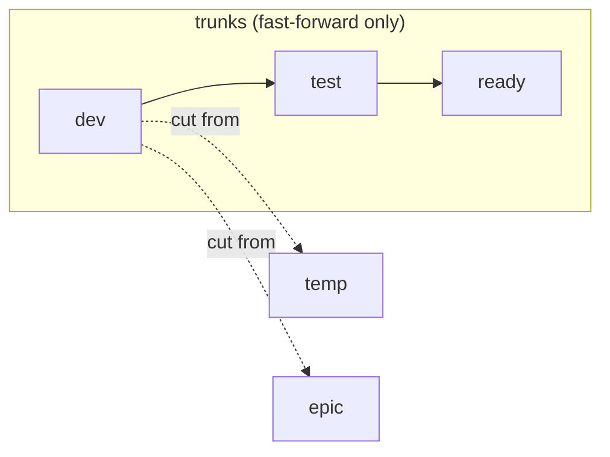

# Branches

Use this skill when creating a new branch, or validating branch names before push.

Do NOT use this skill for commit message conventions or PR titles.

Do NOT use this skill for preparing or tagging releases.

Do NOT use this skill for integrating changes (merging) between divergent branches.

**Branch model at-a-glance**:



##  Rules

-  **Allowed branches:**

    *Permanent trunks:*

    ```
    dev
    test
    ready
    ```

    *Short-lived temporary branches:*

    ```
    temp/[<id>-]<description>
    ```

    *Long-lived epic branches:*

    ```
    epic/[<id>-]<description>
    ```

    Validation regex (for all branch types):

    ```
    ^(dev|test|ready|temp/[a-z0-9]+(-[a-z0-9]+)*|epic/[a-z0-9]+(-[a-z0-9]+)*)$
    ```

-   **Naming rules:**

    - Branch names MUST be full lowercase.

    - `temp/*` and `epic/*` branch names MUST use hyphen-delimited descriptions (kebab-case).

    - No underscores or spaces in branch names.

    - The OPTIONAL `<id>` typically corresponds to an issue number or tracking system identifier. Include it if known.

    - Temporary and epic branch names SHOULD NOT exceed 50 characters total, and MUST NOT exceed 72.

-   **Trunk branches:**

    Trunks are permanent, append-only, and immutable. There are up to three trunks:

    - `dev`: The primary integration trunk. All work originates here. This is the only REQUIRED branch. Most projects should use `dev` as their default branch.

    - `test`: OPTIONAL QA trunk. Fast-forwarded to stable commits on `dev` to trigger comprehensive testing (integration tests, system tests, performance tests).

    - `ready`: OPTIONAL production-grade trunk. Fast-forwarded to passing commits on `test`. Always shippable, enabling continuous delivery.

-   **Temporary branches:**

    Temporary branches (`temp/*`) are short-lived and capture single-focused changes spanning a small number of commits. Commonly associated with an issue/bug. Follow these rules:

    - Cut from `dev`, never from `test`, `ready`, or release branches.

    - Valid use cases: bugs and other issues that span multiple atomic commits; experiments, proofs-of-concept, and technical spikes; backup of in-progress work.

    - One logical change per temporary branch. Multiple orthogonal changes SHOULD NOT be combined into a single temporary branch.

    - Use rebase-up strategy to keep synchronized with `dev`, so the unique commits of temporary branches stay at the tip.

    - Reintegrate with `dev` using fast-forward merge.

    - Delete after integration. The commit history is preserved in `dev`.

-   **Epic branches:**

    Epic branches (`epic/*`) are long-lived branches for multi-developer coordination on complex changes. Rules:

    - Cut from `dev`, like temporary branches.

    - Valid use cases: large coordinated features spanning weeks/months, and which can't easily be continuously integrated into the `dev` trunk or toggled off; major refactoring and replatforming initiatives; cross-cutting concerns; long-running research work; other highly disruptive or volatile changes.

    - Use merge-down strategy: synchronize by merging `dev` into the epic branch (never rebase). This is safer for long-lived branches with multiple contributors since it preserves the history of the branch.

    - Reintegrate with `dev` using squash-merge strategy. One fresh commit hits the trunk.

    - Delete after integration into `dev`. Recreate a fresh epic branch is further long-running development work required.

-   **General practices:**

    - All changes originate on `dev` and flow forward through `test` → `ready` → release.

    - Trunk branches are fixed-forward only. If a problem is discovered downstream, the fix MUST be committed to `dev` and flow forward from there - no direct commits to downstream trunks.

    - Periodically review stale `temp/*` and `epic/*` branches with no commits in ~90 days and delete or revive them.

## Examples

Trunk branches:

```
dev
test
ready
```

Temporary branches:

```
temp/42-add-search-endpoint
temp/178-fix-auth-timeout
temp/TS-504-migrate-user-schema
temp/update-dependencies
```

Epic branches:

```
epic/billing-v2-rewrite
epic/PRODUCT-187-auth-overhaul
epic/infra-migrate-kubernetes
epic/major-ui-redesign
```

##  Success criteria

-   **The branch name validates.**

    It matches `^(dev|test|ready|temp/[a-z0-9]+(-[a-z0-9]+)*|epic/[a-z0-9]+(-[a-z0-9]+)*)$` — one of the three trunks, or a `temp/` or `epic/` branch with a kebab-case description.

-   **The name is well-formed.**

    Full lowercase, hyphen-delimited, no underscores or spaces, and within the length budget (≤50 characters RECOMMENDED, ≤72 MUST) for `temp/*` and `epic/*` branches.

-   **The branch type fits the work.**

    `temp/*` for a short, single-focus change; `epic/*` for long-lived, multi-contributor work that cannot be continuously integrated. A change of one or two commits needs no branch beyond `dev`.

-   **`temp/*` and `epic/*` branches are cut from `dev`.**

    Never from `test`, `ready`, or a release branch.

-   **Changes flow forward only.**

    Work originates on `dev` and flows through `test` → `ready`; no fix is committed directly to a downstream trunk.
