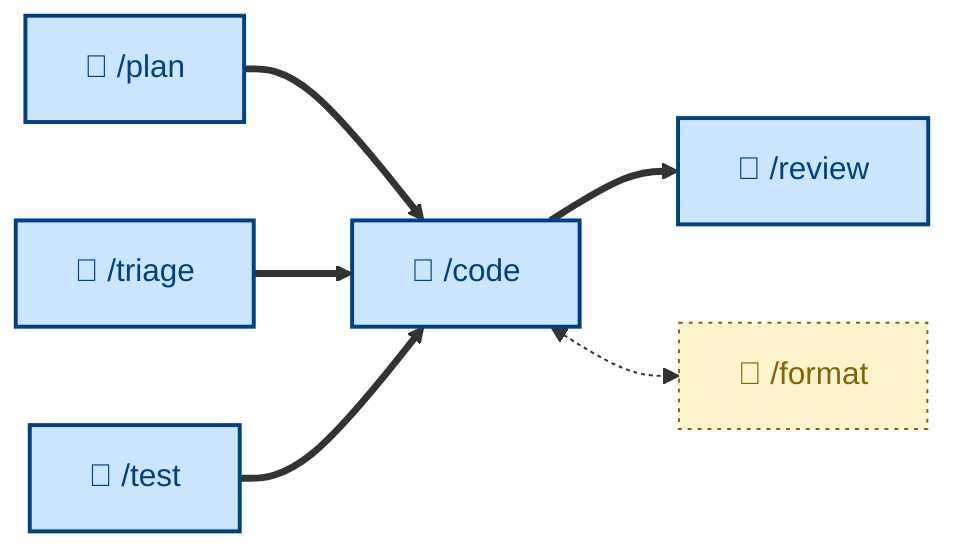

# 🤖 `/code`

<!-- 1 unit of work, taken from the issue tracker (issue created from approved plan. Outcome: PR for review. -->

Write code, verified by tests, for one discrete increment – turning one already-designed step from a plan into working, tested code, test-driven by default and scope-locked to that single step. Runs non-interactively (🤖). Use when implementing one numbered plan step, or any small standalone change whose design is already obvious.

## What it does

`/code` implements exactly one plan step per session, test-driven by default (red → green → refactor) and scope-locked to that single step. The outcome is one committed, tested change with a clean reviewable diff.

Its discipline is mostly about restraint: no speculative abstractions, no "while I'm here" cleanups, no bundling of multiple steps. Unrelated bugs and tempting refactors are noted and queued, not done.

## How to invoke

It takes one numbered step from a plan (or an obvious small standalone change). One step in, one committed-and-tested diff out. After the step's tests pass, the next step starts in a fresh session.

- `/code`, `/skill:code` (prompt varies by agent harness).
- "Implement step 3 of the plan."
- "Code this up."
- "Build this change, test-first."
