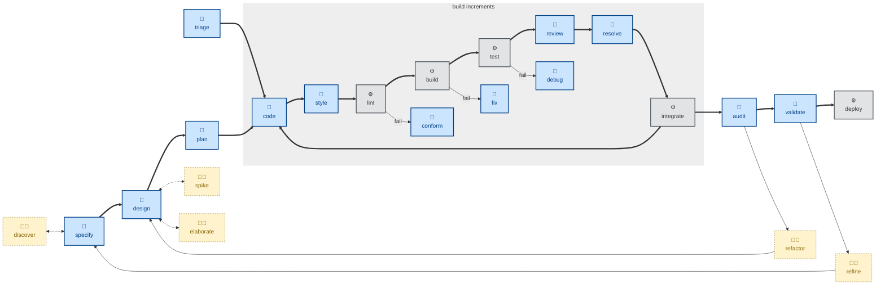

# 🤖 `code`

This skill implements changes in software code and configuration, following the test-driven development (TDD) methodology (red → green → refactor).

The outcome is one small change with accompanying unit tests, and integration tests where appropriate.

It is RECOMMENDED to execute this step in small increments toward delivery of a larger feature, refactor, performance enhancement, or other outcome. This will produce a small, clean diff for review.

This skill instructs the agent to run non-interactively (🤖).

## How to invoke

- `/code`, `/skill:code` (prompts vary by harness).
- "Implement step 3 of the plan."
- "Code this up."
- "Build this change, test-first."

## Recommended models

Implementation of a single, already-scoped step benefits from a strong coding-tuned model, but the design decisions have already been made upstream, so a mid-tier coding model is usually enough. Reserve frontier reasoning models for steps with subtle algorithmic or concurrency complexity.
