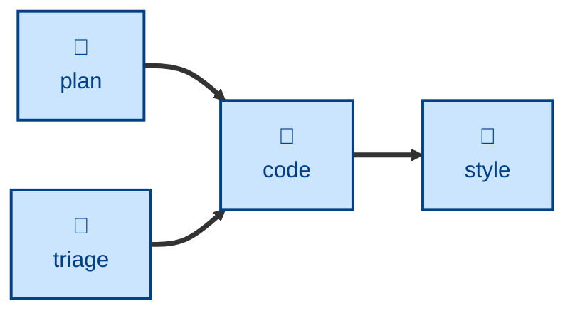

# Code

The **code** skill is all about writing code, verified by tests, for one small
increment. The agent is instructed to implement one small change in software
code and configuration following the red → green → refactor cycle. Unit tests,
and also integration tests where appropriate, are written alongside the code.

It is RECOMMENDED to run this step in small increments toward delivery of a
larger feature, refactor, performance enhancement, or other outcome. Each pass
yields a small, clean diff for review.

## Interactivity

This skill instructs the agent to run non-interactively.

## How to invoke

> Implement step 3 of the plan.

> Code this up.

> Build this change, test-first.

## Recommended models

A mid-tier coding model is sufficient for this task.

## Suggested workflows

## Related skills

- **[plan](../plan/)** can be used to decompose a requirements specification
  into a pipeline of small changes, which can then be delivered individually
  using the code skill.

- **[triage](../triage/)** is an alterative trigger for code changes.

- **[style](../style/)** can be used to normalize code presentation after
  code edits are made.
