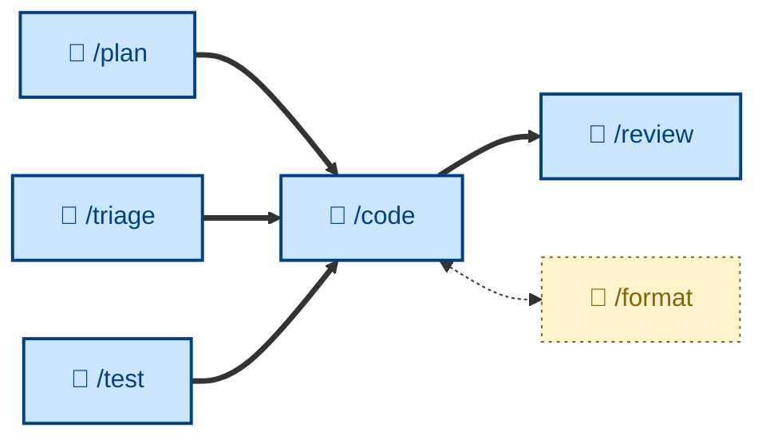

# 🤖 `/code`

Write code, verified by tests, for one discrete increment – turning one already-designed step from a plan into working, tested code, test-driven by default and scope-locked to that single step. Runs non-interactively (🤖). Use when implementing one numbered plan step, or any small standalone change whose design is already obvious.



## What it does

`/code` implements exactly one plan step per session. It restates the step's scope first (so out-of-scope work is named and deferred), sets up a fast pass/fail test loop, then works red → green → refactor one cycle at a time – the smallest failing test, the simplest code to pass it, then a structural tidy-up while green. It prefers real dependencies over mocks, matches the surrounding code's idioms, reviews its own diff as the reviewer would, and ends with one conventional commit.

Its discipline is mostly about restraint: no speculative abstractions, no defensive checks at internal boundaries, no comments that merely narrate, no "while I'm here" cleanups, and no bundling of multiple steps. Unrelated bugs and tempting refactors are noted and queued, not done.

## How to invoke

```
/code
```

It takes one numbered step from a plan (or an obvious small standalone change). It has no arguments – one step in, one committed-and-tested diff out. After the step's tests pass, the next step starts in a fresh session.

## Examples

Given a step "validate the idempotency-key header on POST /orders", `/code` writes a failing test asserting a 400 when the header is missing, watches it fail for the right reason, adds the minimal guard to pass it, leaves the guard inline (no abstraction on first use), and commits `step: validate idempotency-key header on POST /orders` with the body noting the lookup itself is the next step.

If the step turns out too big, it stops and sends it back to be split rather than merging half a step. If it spots an unrelated bug, it files a note and leaves it for its own change.
