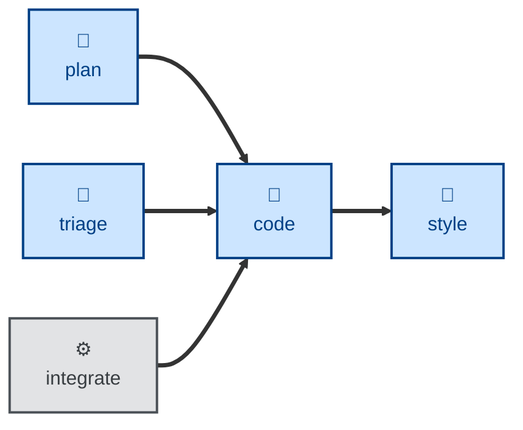

# Code

The **code** skill is all about writing code, verified by tests, for one small
increment. It implements one change in software code and configuration
following the red → green → refactor cycle, producing a single small change
with accompanying unit tests, and integration tests where appropriate.

It is RECOMMENDED to run this step in small increments toward delivery of a
larger feature, refactor, performance enhancement, or other outcome. Each pass
yields a small, clean diff for review.

This skill instructs the agent to run non-interactively.

## How to invoke

> Implement step 3 of the plan.

> Code this up.

> Build this change, test-first.

## Recommended models

Implementation of a single, already-scoped step benefits from a strong
coding-tuned model, but the design decisions have already been made upstream, so
a mid-tier coding model is usually enough. Reserve frontier reasoning models for
steps with subtle algorithmic or concurrency complexity.

## Suggested workflows

**code** is the first step of the build-increments loop, fed by a step from
**[plan](../plan/)** or a brief from **[triage](../triage/)**. Each increment then
flows through style, lint, build, test, review, resolve, and integrate — and the
loop returns to **code** for the next increment.
