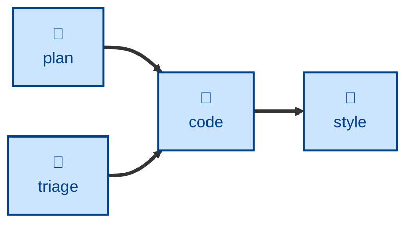

# Code

The **code** skill writes the code and the tests for one small, already-designed
step of work, and commits it as a single reviewable diff.

The agent is instructed to quote the step's scope, establish a fast test
feedback loop, then work red → green → refactor in single cycles — one test,
one implementation, repeat — writing unit tests and, where appropriate,
integration tests alongside the code. It reviews its own diff against the
quoted step before committing, and stops at the commit: it does not push,
open a review, or start the next step.

It is RECOMMENDED to run this repeatedly, in small increments, toward a larger
feature, refactor, or performance goal. Each pass yields one small, clean diff
for review.

## Interactivity

This skill instructs the agent to run non-interactively, so it is suitable for
away-from-keyboard and continuous integration workflows. The agent may prompt
only to establish where an artifact lives or how to reach it; it must never ask
about the substance of the work. If the step is ambiguous, too large, or still
needs designing, the agent stops and reports rather than guessing.

## How to invoke

> Implement step 3 of the plan.

> Code this up.

> Build this change, test-first.

## Recommended models

A mid-tier coding model is sufficient. The design decisions have already been
made upstream, so this task is disciplined execution — test-first cycles, style
matching, scope policing — rather than open-ended reasoning.

## Suggested workflows

Run this once per planned step. Running it against work that has not been
decomposed is the main anti-pattern: the skill will stop rather than design
the step for you.

## Related skills

- [**plan**](../plan/) \
  Decomposes a requirements specification into a pipeline of small changes.
  Each of those changes is one invocation of this skill.

- [**triage**](../triage/) \
  An alternative upstream trigger, producing small scoped fixes rather than
  planned steps.

- [**style**](../style/) \
  Normalizes code presentation after the edits are made.
