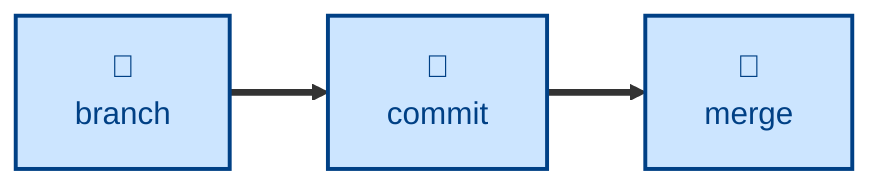

# Commit skill

The `commit` skill is all about **commit message conventions**. It defines a
fixed subject-line format — `<type>: <description>` with an optional
` - <flag>` suffix — a set of allowed commit types and flags with precise
semantics for each, and a validation regex. It enforces atomic commits and, for
direct commits to `dev` or `temp/*`, a matching `CHANGELOG.md` entry under
`[Unreleased]`.

Use it when composing a commit message, validating a branch's messages before
push, or troubleshooting a failed commit-validation CI job. Note: this
convention is deliberately **not** Conventional Commits — scopes like
`feature(parser):` fail validation; the colon comes immediately after the type.

It records the work opened by [`branch`](../branch/), ahead of integration by
[`merge`](../merge/).

This skill instructs the agent to run non-interactively.

## How to invoke

- `/commit`, `/skill:commit` (prompts vary by harness).
- "Write a commit message for this."
- "Is this commit message valid?"
- "Why did commit validation fail in CI?"

## Recommended models

A small, fast model is sufficient. Composing or validating a commit message
against a fixed format and a set of allowed types is pattern-matching, not
judgment.

## Suggested workflows

Commits accumulate on the branch opened by `branch`, each one atomic and
conventionally formatted, until the change is complete and ready for `merge`.

## References

- [This GitHub
  action](https://github.com/kieranpotts/actions/tree/dev/validate-commit-messages)
  is used to validate commit messages against the conventions described in TS-9
  and this skill.
