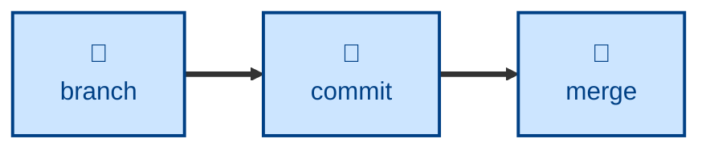

# Commit

The **commit** skill encapsulates the rules for creating revisions in Git defined in
[TS-9: Version Control](https://github.com/kieranpotts/standards/tree/latest/dev/src/009).

The skill defines a fixed subject-line format — `<type>: <description>` with an
optional ` - <flag>` suffix. The `<type>` is derived from an allowed list of
commit types, each with precise semantics.

## Interactivity

This skill instructs the agent to run non-interactively.

## How to invoke

> Write a commit message for this.

> Is this commit message valid?

> Why did commit validation fail in CI?

## Recommended models

A small, fast model is sufficient for this task.

## Suggested workflows

## Related skills

- **[branch](../branch/)**
- **[merge](../merge/)**
- **[release](../release/)**

## References

- [This GitHub action](https://github.com/kieranpotts/actions/tree/dev/validate-commit-messages)
  is used to validate commit messages against the conventions described in TS-9
  and this skill.

- [These pre-commit hooks](https://github.com/kieranpotts/pre-commit-hooks)
  also validate commit messages against the same conventions.
