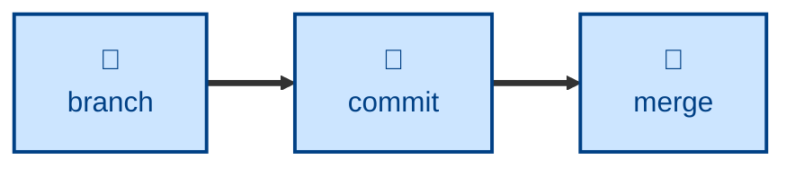

# Commit

The commit skill encapsulates the rules for creating revisions in Git defined
in [TS-9: Version Control](https://kieranpotts.com/standards/009).

It instructs the agent to compose a commit message in a fixed subject-line
format — `<type>: <description>`, with an optional ` - <flag>` suffix — where
the type comes from a closed vocabulary, each entry with precise semantics.
The agent also writes the matching changelog entry where the project keeps a
changelog and the commit lands on a trunk or short-lived branch.

The skill stops at composing and validating. It does not stage, commit, amend,
or push, so the user keeps the final say over what enters history.

## Interactivity

This skill instructs the agent to run non-interactively. It never blocks for
user input, so it is safe in away-from-keyboard workflows and in CI. Where it
cannot determine its inputs, it stops with an error rather than asking.

## How to invoke

> Write a commit message for this.

> Is this commit message valid?

> Why did commit validation fail in CI?

## Recommended models

A small, fast model is sufficient. The work is a constrained transformation
against a fixed vocabulary and a regex, not open-ended reasoning. The one
judgment call — picking the right type for the changeset — is covered by the
skill's own disambiguation notes.

## Suggested workflows

Run it once a change is complete and staged for review, before handing the
message to Git. Running it mid-change wastes effort, since the changeset is
still moving.

## Related skills

- [**branch**](../branch/) \
  Defines the branching model that commits land on, including which branches
  make a changelog entry due.

- [**merge**](../merge/) \
  Integrates commits between divergent branches, consuming the history this
  skill helps compose.

- [**release**](../release/) \
  Cuts release branches from the committed history, and turns changelog
  entries into release notes.

## References

- [Validate commit messages action](https://github.com/kieranpotts/actions/tree/dev/validate-commit-messages) \
  The GitHub action that validates commit messages against these conventions.

- [Pre-commit hooks](https://github.com/kieranpotts/pre-commit-hooks) \
  Validate commit messages against the same conventions, locally.
