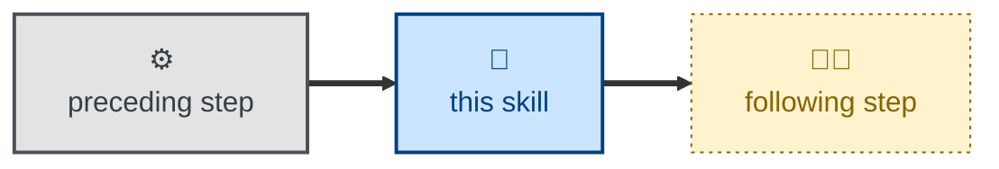

# Skill name

Short introduction, restating the purpose of the skill.

Explain, for humans, what instructions are given to agents by this skill.

## Interactivity

State whether the skill instructs the agent to run interactively or
non-interactively. If interactive, state what information the agent may
prompt for. If non-interactive, be explicit that the skill can be used in
away-from-keyboard workflows.

## How to invoke

Examples of phrases that are expected to invoke the skill. Describe any
arguments to adjust behavior.

> Audit the architecture.

> Do a security review.

> Reconcile the design docs.

## Examples

Provide examples of input and typical output. OPTIONAL.

## Recommended models

State the class of model the task warrants, and why. For example, a premium
frontier reasoning model for open-ended analysis, or a small, fast model for a
mechanical transformation.

## Suggested workflows

Describe when the skill is best run, and what it typically runs before or
after. Note any anti-patterns, such as running it on every commit. OPTIONAL.

Optionally, include a Mermaid diagram of the surrounding sequence, using the
shared node classes. Scripted steps use the `scripted` class and the ⚙️ emoji.
Steps an agent can run on its own (non-interactively) are `agentic` with 🤖.
And steps where the agent interacts with a human (🤖🧑) or a human works alone
(🧑) are `anthropic`:

## Related skills

List sibling skills that this skill naturally pairs with, or hands-off to.
OPTIONAL.

- [**skill-name**](../skill-name/) \
  One or two sentences explaining how the two skills relate.

## References

Link to external material the skill encodes or depends on, eg. standards, GitHub
actions, pre-commit hooks, upstream documentation. OPTIONAL.
