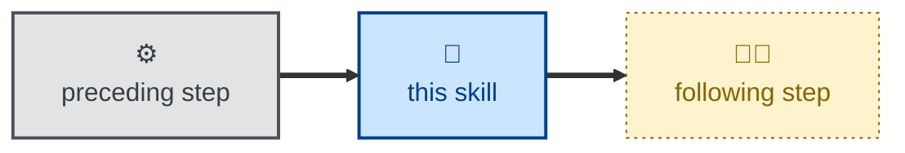

# Skill name

Short introduction, restating the purpose of the skill.

Explain, for humans, what instructions are given to agents by this skill.

## Interactivity

State whether the skill instructs the agent to run interactively or
non-interactively, and — if interactive — what the agent will prompt for.

## How to invoke

Examples of phrases that are expected to invoke the skill. Describe any
arguments to adjust behavior.

> Audit the architecture.

> Do a security review.

> Reconcile the design docs.

## Examples

Provide examples of input and typical output. OPTIONAL.

## Recommended models

State the class of model the task warrants, and why — eg. a premium frontier
reasoning model for open-ended analysis, or a small, fast model for a
mechanical transformation.

## Suggested workflows

Describe when the skill is best run, and what it typically runs before or
after. Note any anti-patterns, such as running it on every commit. OPTIONAL.

Include a Mermaid diagram of the surrounding sequence, using the shared node
classes. Scripted steps are ⚙️ `scripted`, steps the agent runs on its own are
🤖 `agentic`, and steps where the agent works with a human are 🤖🧑
`anthropic`:

## Related skills

List sibling skills this one naturally pairs with, and why — eg. what feeds
this skill, what it hands off to, or what it's a companion or alternative to.
OPTIONAL.

Format each entry as a bullet, with a blank line between entries. Bold the
skill link and put the trailing period inside the bold:

- **[skill-name](../skill-name/).** One or two sentences explaining how the
  two skills relate.

## References

Link to external material the skill encodes or depends on — standards, GitHub
actions, pre-commit hooks, upstream documentation. OPTIONAL.
