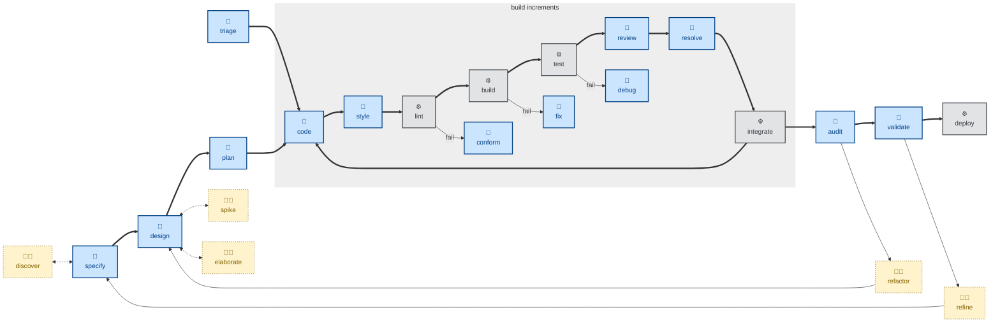

# 🤖 `debug`

Use this skill for bug diagnosis. Use it when something is broken, throwing, failing, or has regressed in performance, and the cause is not obvious from reading the code.

The skill instructs agents to take a disciplined approach to bug diagnosis. It runs a fixed loop: reproduce → minimize → hypothesize → instrument → fix → regression-test. The whole skill turns on building a fast, deterministic, agent-runnable pass/fail signal for the bug *before* attempting a fix.

The outcome is a verified fix with a regression test, the diagnostic instrumentation removed, and the underlying cause documented.

This skill instructs the agent to run non-interactively (🤖). But the agent fails to build a reliable feedback loop, it is instructed to stop and say what it needs, rather than guessing.

## How to invoke

- `/debug`, `/skill:debug` (prompts vary by harness).
- "Debug this."
- "Diagnose this failure."
- "Something is broken / throwing / failing."
- "This got slower — find out why."

## References

- [Original source — mattpocock/skills `diagnose`](https://github.com/mattpocock/skills/blob/main/skills/engineering/diagnose/SKILL.md)
