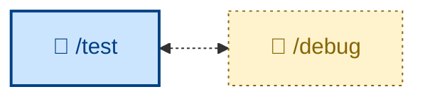

# 🤖 `/debug`

Diagnose and fix unexpected behaviors and runtime issues observed in testing, through a disciplined diagnosis loop: reproduce → minimize → hypothesize → instrument → fix → regression-test. Runs non-interactively (🤖). Use when something is broken, throwing, failing, or has regressed in performance, and the cause is not obvious from reading the code.

## What it does

`/debug` runs a disciplined diagnosis loop for hard bugs and performance regressions: reproduce → minimize → hypothesize → instrument → fix → regression-test. The whole skill turns on building a fast, deterministic, agent-runnable pass/fail signal for the bug *before* attempting a fix. The outcome is a verified fix with a regression test, the diagnostic instrumentation removed, and the real cause recorded for the next person.

It is non-interactive, though it checkpoints its hypothesis ranking with the user when they're around. If no reliable feedback loop can be built, it stops and says what it needs rather than guessing.

## How to invoke

Describe the bug or regression – the symptom, where it shows up, any repro you have. For performance work, give it a numerical baseline and threshold.

- `/debug`, `/skill:debug` (prompt varies by agent harness).
- "Debug this."
- "Diagnose this failure."
- "Something is broken / throwing / failing."
- "This got slower – find out why."

## References

- [Original source — mattpocock/skills `diagnose`](https://github.com/mattpocock/skills/blob/main/skills/engineering/diagnose/SKILL.md): The skill this one is adapted from. Read when the user asks for the original phrasing, additional context, or related Pocock skills.
