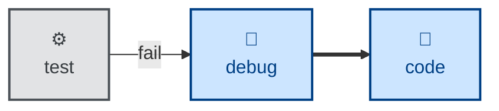

# Debug

The **debug** skill is all about diagnosing and fixing unexpected behaviors and
runtime issues. Use it when something is broken, throwing, failing, or has
regressed in performance, and the cause is not obvious from reading the code.

It runs a fixed loop: reproduce → minimize → hypothesize → instrument → fix →
regression-test. The whole skill turns on building a fast, deterministic,
agent-runnable pass/fail signal for the bug *before* attempting a fix. The
outcome is a verified fix with a regression test, the diagnostic instrumentation
removed, and the underlying cause documented.

Unlike **[fix](../fix/)**, which resolves an already-diagnosed tool failure,
**debug** is for failures whose cause must first be found.

This skill instructs the agent to run non-interactively. But if the agent cannot
build a reliable feedback loop, it is instructed to stop and say what it needs,
rather than guessing.

## How to invoke

> Debug this.

> Diagnose this failure.

> Something is broken / throwing / failing.

> This got slower — find out why.

## Recommended models

Debugging hard, non-obvious failures is a hypothesis-driven investigation, and
that calls for a frontier reasoning or extended-thinking model. The skill's
value is in generating and discriminating between competing explanations under
uncertainty — shallow pattern-matching tends to fixate on the first plausible
cause.

## Suggested workflows

**debug** is the failure branch off the build loop's test step. Once the fix and
its regression test are green, the corrected increment rejoins the loop back at
**[code](../code/)**.

## References

- [Original source — mattpocock/skills
  `diagnose`](https://github.com/mattpocock/skills/blob/main/skills/engineering/diagnose/SKILL.md)
