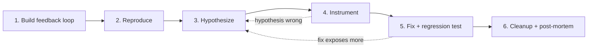

# Debug

Use this skill for hard bugs and performance regressions - any defect where the cause is not immediately obvious from reading the code.

Do NOT use this skill for trivial fixes where the cause and fix are both obvious from the stack trace. Do NOT use it for refactoring or design changes (use [`refactor`](../refactor/SKILL.md) or [`design`](../design/SKILL.md)).

Skip phases below ONLY when explicitly justified, and state the justification. When exploring the codebase, use the project's domain glossary and check any ADRs (architecture decision records) in the area being touched.

The six phases:



## Instructions

1.  **Build a feedback loop.**

    This is the skill. Everything else is mechanical. With a fast, deterministic, agent-runnable pass/fail signal for the bug, bisection, hypothesis-testing, and instrumentation all just consume that signal. Without one, no amount of staring at code will save you. Spend disproportionate effort here. Be aggressive. Be creative. Refuse to give up.

    Try construction methods in roughly this order:

    1. *Failing test* at whatever seam reaches the bug - unit, integration, e2e.
    2. *Curl / HTTP script* against a running dev server.
    3. *CLI invocation* with a fixture input, diffing stdout against a known-good snapshot.
    4. *Headless browser script* (Playwright / Puppeteer) - drives the UI, asserts on DOM/console/network.
    5. *Replay a captured trace*. Save a real network request / payload / event log to disk; replay it through the code path in isolation.
    6. *Throwaway harness*. Spin up a minimal subset of the system (one service, mocked deps) that exercises the bug code path with a single function call.
    7. *Property / fuzz loop*. If the bug is "sometimes wrong output", run 1000 random inputs and look for the failure mode.
    8. *Bisection harness*. If the bug appeared between two known states (commit, dataset, version), automate "boot at state X, check, repeat" so you can `git bisect run` it.
    9. *Differential loop*. Run the same input through old-version vs new-version (or two configs) and diff outputs.
    10. *Human-in-the-loop bash script*. Last resort. If a human must click, drive *them* with a structured script so the loop is still automated. Captured output feeds back to you.

    Then iterate on the loop itself - treat it as a product:

    - Can it be faster? (Cache setup, skip unrelated init, narrow test scope.)
    - Can the signal be sharper? (Assert on the specific symptom, not "didn't crash".)
    - Can it be more deterministic? (Pin time, seed RNG, isolate filesystem, freeze network.)

    A 30-second flaky loop is barely better than no loop. A 2-second deterministic loop is a debugging superpower.

    Do NOT proceed to step 2 until you have a loop you believe in.

2.  **Reproduce.**

    Run the loop. Watch the bug appear. Confirm:

    - [ ] The loop produces the failure mode the *user* described - not a different failure that happens to be nearby. Wrong bug = wrong fix.
    - [ ] The failure is reproducible across multiple runs (or, for non-deterministic bugs, at a high enough rate to debug against).
    - [ ] You have captured the exact symptom (error message, wrong output, slow timing) so later phases can verify the fix actually addresses it.

    Do NOT proceed until you reproduce the bug.

3.  **Hypothesize.**

    Generate *3-5 ranked hypotheses* before testing any of them. Single-hypothesis generation anchors on the first plausible idea.

    Each hypothesis MUST be falsifiable. State the prediction it makes:

    > "If <X> is the cause, then <changing Y> will make the bug disappear / <changing Z> will make it worse."

    If you cannot state the prediction, the hypothesis is a vibe - discard or sharpen it.

    Show the ranked list to the user before testing. They often have domain knowledge that re-ranks instantly ("we just deployed a change to #3"), or know hypotheses they've already ruled out. Cheap checkpoint, big time saver. Do not block on it - proceed with your ranking if the user is AFK.

4.  **Instrument.**

    Each probe MUST map to a specific prediction from step 3. Change one variable at a time.

    Tool preference:

    1. *Debugger / REPL inspection* if the environment supports it. One breakpoint beats ten logs.
    2. *Targeted logs* at the boundaries that distinguish hypotheses.
    3. Never "log everything and grep".

    Tag every debug log with a unique prefix, eg. `[DEBUG-a4f2]`. Cleanup at the end becomes a single grep. Untagged logs survive; tagged logs die.

    For performance regressions, logs are usually wrong. Instead: establish a baseline measurement (timing harness, `performance.now()`, profiler, query plan), then bisect. Measure first, fix second.

5.  **Fix and regression-test.**

    Write the regression test *before* the fix - but only if there is a correct seam for it.

    A correct seam is one where the test exercises the *real bug pattern* as it occurs at the call site. If the only available seam is too shallow (eg. a single-caller test when the bug needs multiple callers, or a unit test that can't replicate the chain that triggered the bug), a regression test there gives false confidence.

    If no correct seam exists, that itself is the finding. Note it - the codebase architecture is preventing the bug from being locked down - and flag it in the post-mortem.

    If a correct seam exists:

    1. Turn the minimized repro into a failing test at that seam.
    2. Watch it fail.
    3. Apply the fix.
    4. Watch it pass.
    5. Re-run the step-1 feedback loop against the original (un-minimized) scenario.

6.  **Clean up and post-mortem.**

    Required before declaring done:

    - [ ] Original repro no longer reproduces (re-run the step-1 loop).
    - [ ] Regression test passes (or absence of seam is documented).
    - [ ] All `[DEBUG-...]` instrumentation removed (grep the prefix to confirm).
    - [ ] Throwaway prototypes deleted (or moved to a clearly-marked debug location).
    - [ ] The hypothesis that turned out correct is stated in the commit / PR message - so the next debugger learns.

    Then ask: what would have prevented this bug? If the answer involves architectural change (no good test seam, tangled callers, hidden coupling), make a recommendation - *after* the fix is in, not before. You have more information now than when you started.

## Rules

-   **The feedback loop is the skill.**

    Build the right loop and the bug is 90% fixed. Without one, you are guessing. Treat loop construction as the primary task, not a setup step.

-   **For non-deterministic bugs, raise the reproduction rate.**

    The goal is not a clean repro but a *higher* reproduction rate. Loop the trigger 100×, parallelize, add stress, narrow timing windows, inject sleeps. A 50%-flake bug is debuggable; 1% is not - keep raising the rate until it is debuggable.

-   **If you genuinely cannot build a loop, stop and say so explicitly.**

    List what you tried. Ask the user for one of:

    - Access to an environment that reproduces it.
    - A captured artifact (HAR file, log dump, core dump, screen recording with timestamps).
    - Permission to add temporary production instrumentation.

    Do NOT proceed to hypothesize without a loop.

-   **Generate hypotheses in a ranked set before testing any.**

    Single-hypothesis generation anchors on the first plausible idea. Always produce 3-5 alternatives so the leading candidate is chosen by comparison, not by default.

-   **One variable at a time when instrumenting.**

    Changing two things at once turns a successful test into ambiguous evidence.

-   **Tag all debug instrumentation with a unique prefix.**

    eg. `[DEBUG-a4f2]`. Makes cleanup deterministic - a single grep finds every probe to remove.

-   **For performance work, measure before you change.**

    Establish a baseline with a profiler, timing harness, query plan, or `performance.now()`. Then bisect. Logs are the wrong tool for performance.

-   **State the correct hypothesis in the commit or PR message.**

    The next person debugging this area benefits from knowing what the real cause was - not just what the fix is.

## Examples

**Hypothesis format**:

```
1. Likely (~50%): The cache key omits the tenant ID, so tenant A's
   response is returned for tenant B. If true, hard-coding tenant ID
   into the key in `cache.ts:42` will fix the symptom.

2. Possible (~25%): The auth middleware is short-circuiting on the
   second request because the session token has already been consumed.
   If true, replaying with a fresh token each iteration of the loop
   will make the bug disappear.

3. Possible (~15%): A race between the worker and the writer. If true,
   inserting a 50ms sleep in the worker should suppress the bug.

4. Unlikely (~10%): Upstream API is returning stale data. If true,
   bypassing the upstream call and feeding a fixture should still
   reproduce the bug (it should NOT, if this is the cause).
```

**Tagged debug log**:

```ts
console.log(`[DEBUG-a4f2] cache key for tenant=${tenantId}: ${key}`)
```

Cleanup: `grep -r '\[DEBUG-a4f2\]' src/` returns zero hits before commit.

## Edge cases

-   **Performance regression, not a functional bug**: skip "watch it crash" - the bug is a measurement. Replace step 2's symptom capture with a numerical baseline + threshold, and the step-1 loop becomes a benchmark, not a test.

-   **Heisenbug that disappears under instrumentation**: the probe itself is changing timing. Switch to a sampling profiler, post-hoc log analysis, or hardware-level tracing rather than synchronous logging.

-   **Bug only reproduces in production**: do not skip the loop. Capture a production artifact (HAR, request log, db snapshot) and replay it locally. If that is impossible, get explicit permission before adding production instrumentation, and tag it the same way (`[DEBUG-...]`) for guaranteed cleanup.

-   **The user's reported symptom is not the real bug**: in step 2, if the loop fails to reproduce the *user's* described symptom but reproduces something nearby, stop and check in with the user before chasing the wrong bug.

## Success criteria

-   **A feedback loop exists and is recorded.**

    The exact command, script, or test that reproduces the bug is committed or pasted into the PR/commit message. A future debugger can re-run it.

-   **The original repro no longer reproduces.**

    Re-running the loop after the fix shows the bug is gone.

-   **A regression test exists, or its absence is documented.**

    The test passes after the fix and fails when the fix is reverted. If no correct seam was available, that finding is recorded.

-   **All tagged instrumentation has been removed.**

    `grep` for the debug prefix returns zero hits in the committed code.

-   **The correct hypothesis is stated in the commit or PR message.**

    Future readers learn what the real cause was, not just what the fix changed.

## References

- [Original source — mattpocock/skills `diagnose`](https://github.com/mattpocock/skills/blob/main/skills/engineering/diagnose/SKILL.md): The skill this one is adapted from. Read when the user asks for the original phrasing, additional context, or related Pocock skills.

- [`test`](../test/SKILL.md): Use when the regression test needs to be placed in the project's broader test strategy.

- [`refactor`](../refactor/SKILL.md): Use when the post-mortem identifies an architectural change that would have prevented the bug.
