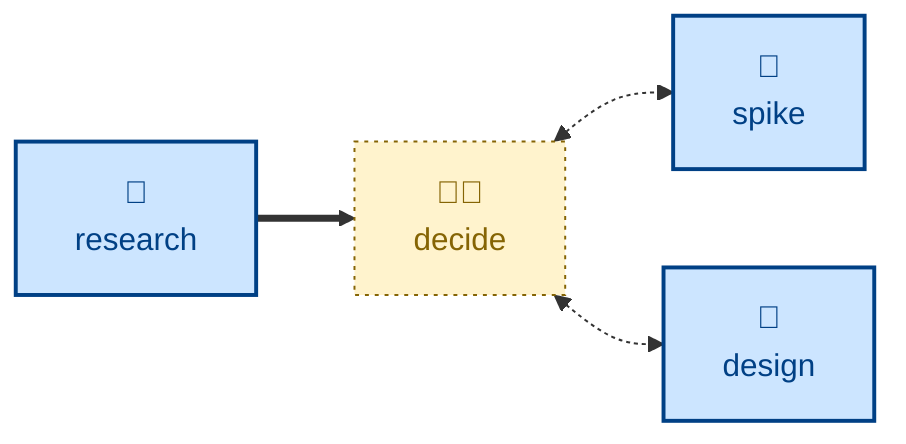
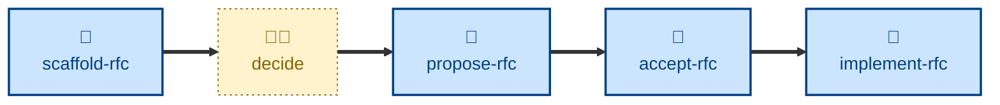

# Decide

The **decide** skill is all about framing a technical decision and writing it
up as an RFC — a proposal whose purpose is to be argued with before the
decision is settled.

It covers decisions about architecture, process, technology, and tooling: the
ones that are expensive to reverse, cross team boundaries, or set a precedent
others will follow.

The agent works through the decision in order: what exactly is being decided,
why it needs deciding now, how things stand today, which facts are actually
established versus assumed, what the genuine alternatives are, and what each
one costs. It ends with a recommendation *and* the conditions under which that
recommendation would change — which is what separates a request for comments
from a decision already taken.

The output is the RFC document itself, written against the target project's
template. Landing it — cutting the branch, opening the pull request, moving it
through `DRAFT` → `PROPOSED` → `ACCEPTED` → `IMPLEMENTED` — is handled
separately by the workflow skills in the
[kieranpotts/rfc](https://github.com/kieranpotts/rfc) repository.

This skill is interactive. The agent is expected to interview the user —
about motivation, constraints, candidate options, and stakeholders — rather
than guessing at them.

## How to invoke

> Write an RFC for this.

> Draft an RFC proposing we move to trunk-based development.

> We need to decide whether to adopt pnpm across the TypeScript services.

> Help me make the case for replacing the audit log.

## Recommended models

A frontier reasoning model, ideally with extended thinking enabled. The hard
part of an RFC is not the prose — it is enumerating alternatives that are
genuinely competitive, and being honest about the downsides of the option you
favor. Weaker models tend to produce advocacy: one real option, two
strawmen, and no stated cost.

## Suggested workflows

The following flow diagram represents one possible way to compose this skill
with others in agentic workflows.

Where the decision turns on facts the team does not yet hold, the
**[research](../research/)** skill establishes them first. Where it turns on
whether something will actually work, the **[spike](../spike/)** skill answers
that with throwaway code. For decisions that are architectural in nature, the
**[design](../design/)** skill supplies the trade-off analysis, which
**decide** then frames for stakeholder review.

Once the RFC document is drafted, it is handed to the workflow skills in the
RFC repository, which take it from a draft pull request through to a numbered,
implemented decision on `main`.

An RFC records a decision while its outcome is still open. To record a
decision that has already been made, write an architecture decision record via
the **[design](../design/)** skill instead.

## Related skills

- **[research](../research/):** establishes facts the decision is currently
  missing.

- **[spike](../spike/):** answers, with throwaway code, whether something will
  actually work.

- **[design](../design/):** supplies the architectural trade-off analysis this
  skill frames for stakeholder review.
