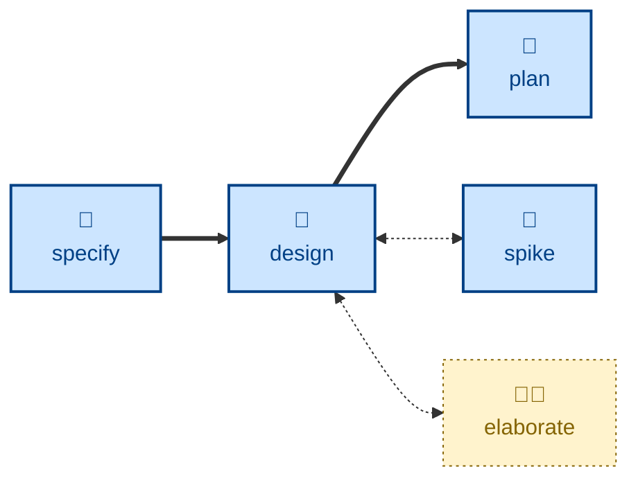
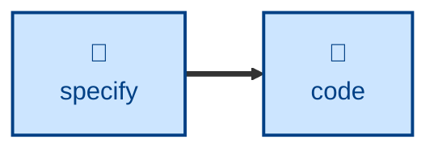

# Design

The **design** skill is all about exploring architectural options and their
trade-offs.

The agent takes a software requirements specification (SRS), or a proposed
set of changes to one, and enumerates design options for each significant
architectural decision required to realize a solution.

For each possible solution, the agent evaluates it against nine qualities:
completeness, correctness, performance, reliability, experience, habitability,
cohesiveness, changeability, and simplicity.

The outcome is one recommended option, with well-articulated reasoning, for each
major architectural decision, captured in a durable architectural decision
record (ADR) in a design docs repository.

The proposed design changes may be further refined using the **spike** and
**elaborate** skills. The **[spike](../spike/)** skill will implement throwaway
code to answer feasibility questions in the proposed solution. The
**[elaborate](../elaborate/)** skill is an interactive session used to
stress-test a draft design.

This skill instructs the agent to run non-interactively. Therefore, the agent is
not expected to prompt for answers to its questions.

## How to invoke

> Design this feature.

> What are the options for building this?

> Work out the architecture for this change.

## Recommended models

This is squarely a job for a frontier reasoning model, ideally with extended
thinking enabled. Enumerating real alternatives and weighing them against
competing design qualities (performance vs. simplicity, changeability vs.
completeness) requires the kind of deliberate, multi-step reasoning that
separates frontier models from mid-tier ones.

## Suggested workflows

The following flow diagram represents one possible way to compose this skill
with others in agentic workflows.

The **[specify](../specify/)** skill captures changes to software requirement
specifications (SRS), a set of problems that the **[design](../design/)** skill
proposes a solution to. The resulting design docs can be fed into the
**[plan](../plan/)** skill, which will decompose the design into a set of
incremental delivery steps, supporting continuous integration.

Optionally, design work may be supported by the **[spike](../spike/)** skill
(to answer feasibility questions) and/or the **[elaborate](../elaborate/)**
skill (to stress-test the draft design).

For trivial changes, the user may skip straight from specifying requirements
(**[specify](../specify/)**) to implementing them (**[code](../code/)**). This
**design** step is really only required when there are genuine architectural
trade-offs to consider.

## Related skills

- **[specify](../specify/):** supplies the requirements this skill proposes a
  solution to.

- **[plan](../plan/):** decomposes the resulting design into incremental
  delivery steps.

- **[spike](../spike/):** answers feasibility questions the design turns on.

- **[elaborate](../elaborate/):** stress-tests a draft design before it's
  decomposed.

