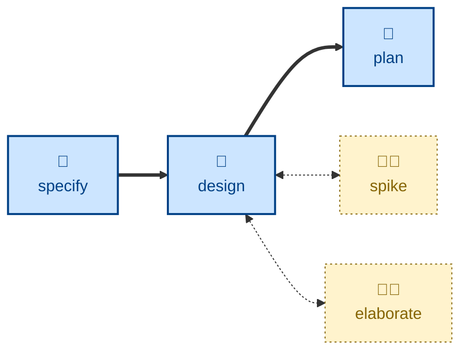

# Design

The **design** skill is all about **architectural decision making**. It takes a
formal software requirements specification (SRS) — something more substantial
than a vague product requirements document (PRD) written in business language —
and enumerates design options for each significant architectural decision
required to realize a solution.

For each option, the agent evaluates it against nine design qualities:
completeness, correctness, performance, reliability, experience, habitability,
cohesiveness, changeability, and simplicity. The outcome is a recommended
option, with well-articulated reasoning, for each major architectural decision,
captured in a durable architectural decision record (ADR).

For trivial changes, the user may skip straight from specifying requirements
(**[specify](../specify/)**) to implementing them (**[code](../code/)**). This step
is required when there are genuine architectural trade-offs to consider. To
answer an open question the design turns on, reach for **[spike](../spike/)**; to
stress-test a draft, **[elaborate](../elaborate/)**.

This skill instructs the agent to run non-interactively where possible, but to
prompt to clarify unclear constraints.

## How to invoke

> Design this feature.

> What are the options for building this?

> Work out the architecture for this change.

## Recommended models

This is squarely a job for a frontier reasoning model, ideally with extended
thinking enabled. Enumerating real alternatives and weighing them against
competing design qualities (performance vs. simplicity, changeability vs.
completeness) requires the kind of deliberate, multi-step reasoning that
separates frontier models from mid-tier ones.

## Suggested workflows

**design** takes an approved specification and produces the ADRs that
**[plan](../plan/)** then decomposes. Along the way it can call out to
**[spike](../spike/)** to answer feasibility questions and to
**[elaborate](../elaborate/)** to stress-test the draft.
