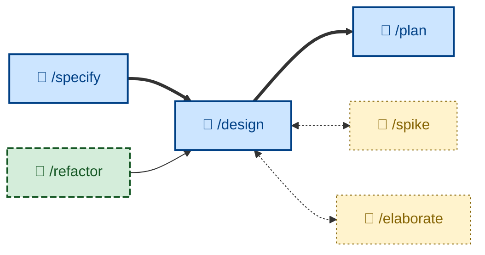

# 🤖 `/design`

<!-- Input: approved spec. Output: design docs (PR - user expected to review.) -->

Explore architectural options and their trade-offs for a change, evaluate them against nine design qualities, and recommend one with reasoning. Gated on an approved specification. Runs non-interactively (🤖). Use when a change has architecturally significant decisions, before planning or implementation.

## What it does

`/design` is the SDLC phase between an approved specification and planning. It enumerates genuine architectural alternatives for each significant decision, evaluates them against nine design qualities (completeness, correctness, performance, reliability, experience, habitability, cohesiveness, changeability, simplicity), and recommends one with reasons. The outcome is a durable decision record (typically an ADR) capturing the chosen option and the rejected alternatives.

It is gated on an approved (`ACCEPTED`) specification and refuses to begin without one. It is non-interactive but will stop to clarify unclear constraints, and asks the user to break genuine ties rather than flipping a coin.

## How to invoke

Invoke it once the specification is approved and the change has a non-trivial design decision – new boundaries, a data-flow change, a new dependency, a persistence or concurrency choice, a public API. Trivial changes skip it and go straight to implementation.

- `/design`, `/skill:design` (prompt varies by agent harness).
- "Design this feature."
- "What are the options for building this?"
- "Work out the architecture for this change."
