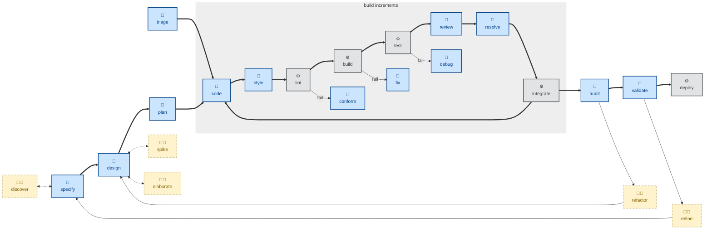

# 🤖 `design`

This skill is all about architectural decision making.

This skill takes a formal software requirements specification (SRS) — something more substantial than a vague product requirements document (PRD) written in business language — and enumerates design options for each significant architectural decision required to realize a solution.

For each option, the agent is instructed to evaluate it against nine design qualities: completeness, correctness, performance, reliability, experience, habitability, cohesiveness, changeability, and simplicity.

The outcome is the agent recommending one option, with well-articulated reasoning, for each major architectural decision. This is captured in a durable architectural decision record (ADR).

For trivial changes, the user may strip straight from specifying requirements ([`specify`](../specify/)) to implementing the necessary changes ([`code`](../code/)). This step is required when there are genuine architectural trade-offs to be considered in the design.

This skill instructs agents to run non-interactively (🤖) if possible, but to prompt to clarify unclear constraints.

## How to invoke

- `/design`, `/skill:design` (prompts vary by harness).
- "Design this feature."
- "What are the options for building this?"
- "Work out the architecture for this change."
