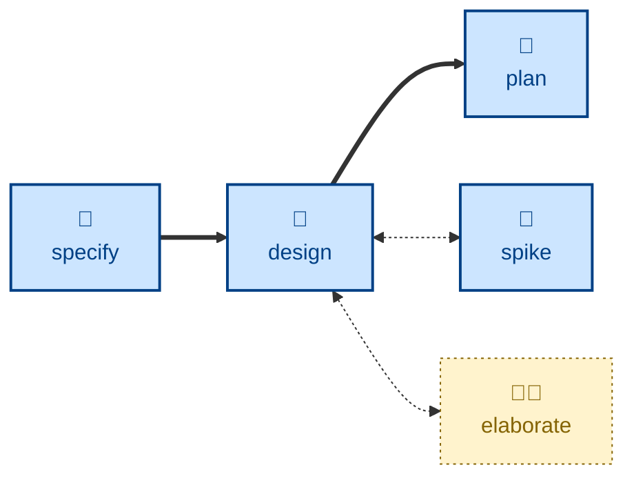

# Design

The **design** skill is all about exploring architectural options and their
trade-offs.

The agent takes an approved software requirements specification, or a proposed
set of changes to one, and enumerates design options for each architecturally
significant decision needed to realize a solution. Each option is evaluated
against nine qualities: completeness, correctness, performance, reliability,
experience, habitability, cohesiveness, changeability, and simplicity.

The outcome is one recommended option per decision, with well-articulated
reasoning, captured in whatever decision store the project already keeps. The
agent is told to stop there: it does not write the requirements, decompose the
design into delivery steps, or touch the software itself.

## Interactivity

This skill instructs the agent to run non-interactively, so it suits
away-from-keyboard workflows. It does not prompt for answers about the
substance of the design; where the requirements are unclear or unapproved, it
stops with an error instead of guessing. The one thing it may have to ask
about is where the specification and decision stores live, if neither the
session context nor the project's own convention files settle it.

## How to invoke

> Design this feature.

> What are the options for building this?

> Work out the architecture for this change.

## Recommended models

A frontier reasoning model, ideally with extended thinking enabled. The task
is open-ended comparative analysis — enumerating alternatives that are not
given, and weighing qualities against one another — which smaller models tend
to collapse into a single confident recommendation.

## Suggested workflows

Run this once the specification is approved and before any delivery planning.
It is not a per-commit activity: reach for it when a change carries decisions
that would be expensive to reverse.

## Related skills

- [**specify**](../specify/) \
  Supplies the approved requirements that this skill proposes a solution to.
  Design is gated on its output.

- [**plan**](../plan/) \
  Decomposes the resulting design into incremental delivery steps, picking up
  where this skill stops.

- [**elaborate**](../elaborate/) \
  Stress-tests a draft design — its ambiguous terms and unstated assumptions —
  before it is decomposed.

- [**spike**](../spike/) \
  Answers feasibility questions the design turns on, feeding evidence back
  into the evaluation.
