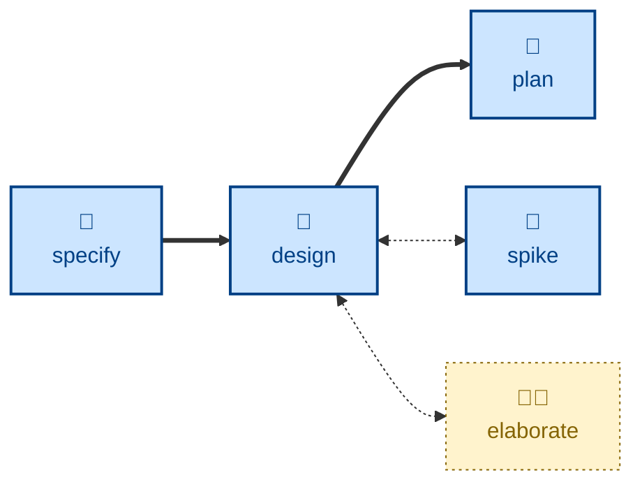

# Design

The **design** skill is all about exploring architectural options and their
trade-offs.

The agent takes a software requirements specification (SRS), or a proposed
set of changes to one, and enumerates design options for each significant
architectural decision required to realize a solution.

For each possible solution, the agent evaluates it against nine qualities:
completeness, correctness, performance, reliability, experience, habitability,
cohesiveness, changeability, and simplicity.

The outcome is one recommended option, with well-articulated reasoning, for each
major architectural decision.

## Interactivity

This skill instructs the agent to run non-interactively. Therefore, the agent is
not expected to prompt for answers to its questions.

## How to invoke

> Design this feature.

> What are the options for building this?

> Work out the architecture for this change.

## Recommended models

A frontier reasoning model, ideally with extended thinking enabled, is best
suited to this task.

## Suggested workflows

## Related skills

- **[specify](../specify/)** supplies the requirements that this skill proposes a solution to.
- **[plan](../plan/)** decomposes the resulting design into incremental delivery steps.
- **[elaborate](../elaborate/):** stress-tests a draft design before it's decomposed.
- **[spike](../spike/)** answers feasibility questions the design turns on.
