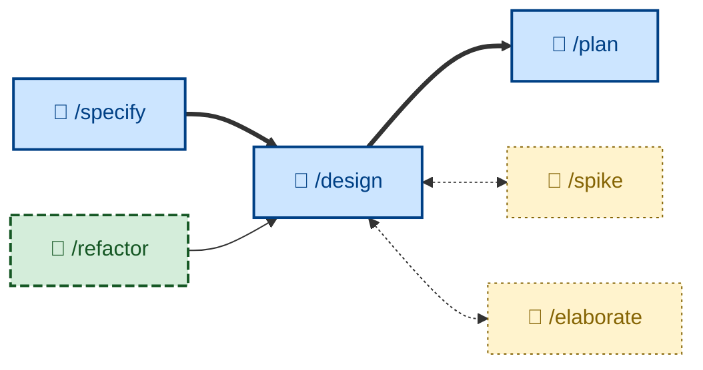

# 🤖 `/design`

Explore architectural options and their trade-offs for a change, evaluate them against nine design qualities, and recommend one with reasoning. Gated on an approved specification. Runs non-interactively (🤖). Use when a change has architecturally significant decisions, before planning or implementation.



## What it does

`/design` is the SDLC phase between an approved specification and planning. It first checks its entry gate – the upstream specification must be `ACCEPTED`, not merely drafted or proposed – and stops if it isn't. Then it gathers constraints (functional ACs, NFRs, existing system shape, budget), identifies the architecturally significant decision points (the expensive-to-reverse ones), enumerates 2–4 genuine alternatives per decision (always including a simplest/do-nothing option), and evaluates each against the nine qualities: completeness, correctness, performance, reliability, experience, habitability, cohesiveness, changeability, simplicity. It names the qualities that dominate the domain, recommends one option for stated reasons, and captures the choice durably (typically an ADR).

It is non-interactive but will stop to clarify unclear constraints, and asks the user to break genuine ties rather than flipping a coin. It favours deep modules and the boring option when qualities are close, and documents the rejected alternatives because the "why not" is often the more useful record.

## How to invoke

```
/design
```

Invoke it once the specification is approved and the change has a non-trivial design decision – new boundaries, a data-flow change, a new dependency, a persistence or concurrency choice, a public API. Trivial changes skip it and go straight to implementation. No arguments.

## Examples

For job dispatch from API to workers (~50 jobs/sec, p95 < 200ms, Postgres already in the stack), `/design` weighs Postgres `LISTEN/NOTIFY` against Redis Streams and SQS, measures ~30ms p95 for the Postgres option in a spike, and recommends it – optimizing habitability and simplicity while meeting the NFRs – recording the decision, its consequences, and the throughput threshold at which to revisit, as an ADR.

If the specification is still `PROPOSED`, `/design` stops at the gate and sends the user to approve it first, rather than designing against acceptance criteria that may still change.
