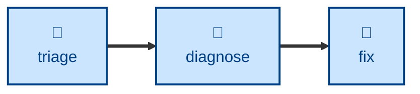

# Diagnose

The **diagnose** skill is all about finding the cause of unexpected behaviors
and runtime issues. Use it when something is broken, throwing, failing, or has
regressed in performance, yet the tests are passing and the cause is not obvious
from reading the code.

This skill instructs the agent to run a fixed loop: reproduce → minimize →
hypothesize → instrument → converge → hand over. The whole skill turns on
building a fast, deterministic, agent-runnable pass/fail signal for the bug
_before_ forming any hypothesis about it.

The skill is evaluation only. It stops at a confirmed cause and applies no
remedy. The outcome is a handover with a suggested remedy and a failing
regression test, left deliberately red. The **[fix](../fix/)** skill ma
be used to do the actual repair.

## Interactivity

This skill instructs the agent to run non-interactively. If the agent cannot
build a reliable feedback loop, it is instructed to stop rather than guessing
a solution.

## How to invoke

> Diagnose this.

> Debug this failure.

> Something is broken / throwing / failing — find out why.

> This got slower — find out why.

## Recommended models

A frontier reasoning or extended-thinking model is best suited to this task.

## Suggested workflows

## Related skills

- **[triage](../triage/).** Establishes that a reported bug is real before
  anyone spends time on it.

- **[fix](../fix/).** Applies the remedy once this skill has confirmed the
  cause, and turns the red regression test green.

## References

- [Matt Pocock's `diagnose` skill](https://github.com/mattpocock/skills/blob/main/skills/engineering/diagnose/SKILL.md)
  was the original source for this skill.
