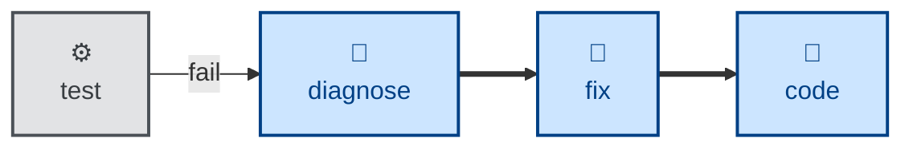

# Diagnose

The **diagnose** skill is all about finding the cause of unexpected behaviors
and runtime issues. Use it when something is broken, throwing, failing, or has
regressed in performance, and the cause is not obvious from reading the code.

It runs a fixed loop: reproduce → minimize → hypothesize → instrument →
converge → hand over. The whole skill turns on building a fast, deterministic,
agent-runnable pass/fail signal for the bug *before* forming any hypothesis
about it.

## What it does

The skill is evaluation only. It stops at a confirmed cause and applies no
remedy — repairing the code is **[fix](../fix/)**'s job.

The outcome is a handover carrying the repro command, the ranked hypotheses
with one confirmed and the rest shown as eliminated, the observed causal chain,
a suggested remedy, and — the load-bearing part — a **failing regression test**
left deliberately red. That test is the proof of the diagnosis and the contract
with whoever applies the fix: they make it green, then confirm it goes red
again when the fix is reverted.

Diagnostic instrumentation is tagged (`[DEBUG-a4f2]`) and removed before
handover, along with any experimental behavior changes made to test a
prediction. What survives is knowledge, not a diff.

Splitting diagnosis from repair costs one handoff. It buys three things: a
diagnosis that can be reviewed *as a diagnosis* before anyone touches the
code; a cause that can feed a triage queue, a decision, or a human, not only
an immediate fix; and honest model routing, since finding a cause and applying
a known remedy need different amounts of model.

## Interactivity

This skill instructs the agent to run non-interactively. But if the agent
cannot build a reliable feedback loop, it is instructed to stop and say what it
needs, rather than guessing.

## How to invoke

> Diagnose this.

> Debug this failure.

> Something is broken / throwing / failing — find out why.

> This got slower — find out why.

## Recommended models

A frontier reasoning or extended-thinking model is best suited to this task.

## Suggested workflows

A test failure whose cause is not obvious hands off to **diagnose**, which
hands a confirmed cause plus a red test to **[fix](../fix/)**. The increment
rejoins the build loop at **[code](../code/)** once the test is green.

**[triage](../triage/)** sits upstream of this, where a bug arrives from
outside: triage establishes that the report is real and reproducible,
**diagnose** establishes why.

## Related skills

- **[triage](../triage/)** establishes that a reported bug is real before
  anyone spends time on why.

- **[fix](../fix/)** applies the remedy once this skill has confirmed the
  cause, and turns the red regression test green.

- **[test](../test/)** verifies the system against its requirements, and hands
  its genuine failures here.

## References

- [mattpocock/skills: `diagnose`](https://github.com/mattpocock/skills/blob/main/skills/engineering/diagnose/SKILL.md). This was the original source for this skill.
