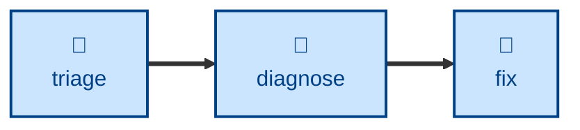

# Diagnose

The **diagnose** skill finds the cause of unexpected behaviors and runtime
issues. Use it when something is broken, throwing, failing, or has regressed in
performance, yet the cause is not obvious from reading the code.

This skill instructs the agent to work a fixed loop: build a feedback loop →
reproduce → hypothesize → instrument → converge on one cause → capture a
failing regression test → hand over. The whole thing turns on building a fast,
deterministic, agent-runnable pass/fail signal for the bug _before_ forming any
hypothesis about it.

The skill is evaluation only. It stops at a confirmed cause and applies no
remedy. The outcome is a handover — the symptom, the repro command, the ranked
hypotheses with one confirmed and the rest eliminated, the causal chain, and a
suggested remedy — plus a regression test left deliberately red.

## Interactivity

This skill instructs the agent to run non-interactively, so it suits
away-from-keyboard workflows, including unattended and CI runs. The agent may
prompt only to establish where an artifact lives or how to reach it. If it
cannot build a reliable feedback loop, it is instructed to stop and report what
it needs, rather than guessing at a cause.

## How to invoke

> Diagnose this.

> Debug this failure.

> Something is broken / throwing / failing — find out why.

> This got slower — find out why.

## Recommended models

A frontier reasoning or extended-thinking model. Ranking competing hypotheses
and reasoning about what evidence would falsify each of them is open-ended
analysis, and a weaker model tends to anchor on the first plausible cause.

## Suggested workflows

Best run once a bug report has been confirmed as real and reproducible, and
before any repair is attempted. It is deliberately slow work, so it is not
something to run on every commit — reach for it when the cause resists a
reading of the code.

## Related skills

- [**triage**](../triage/) \
  Establishes that a reported bug is real and reproducible before anyone
  spends time on it. Run it first, and hand its reproduction to this skill.

- [**fix**](../fix/) \
  Applies the remedy once this skill has confirmed the cause, and turns the
  red regression test green.

## References

- [Matt Pocock's `diagnose` skill](https://github.com/mattpocock/skills/blob/main/skills/engineering/diagnose/SKILL.md)
  was the original source for this skill.
